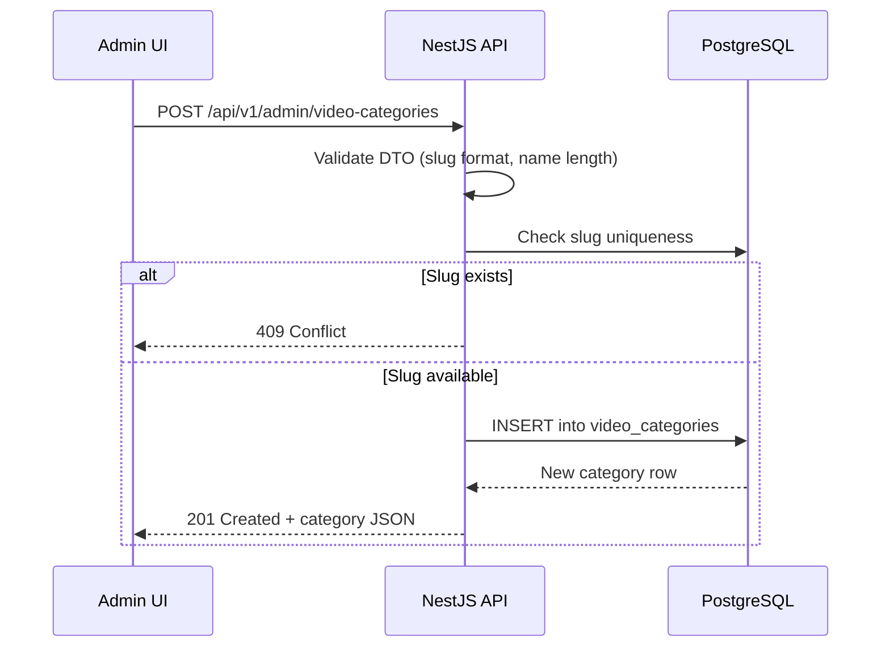
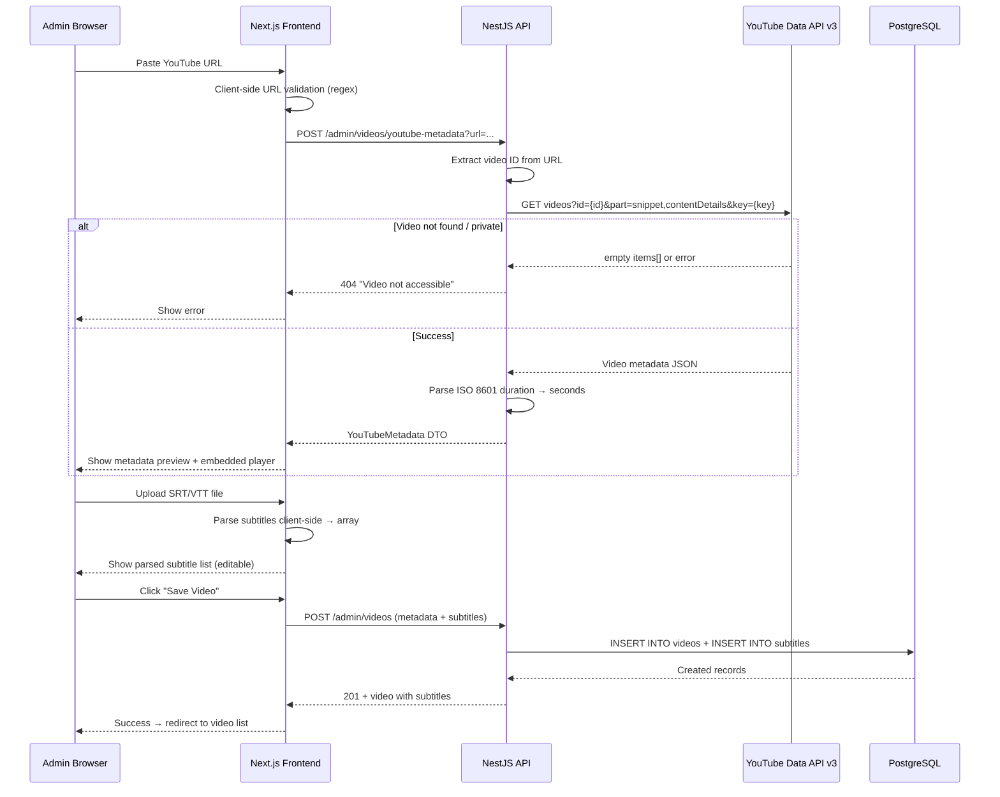
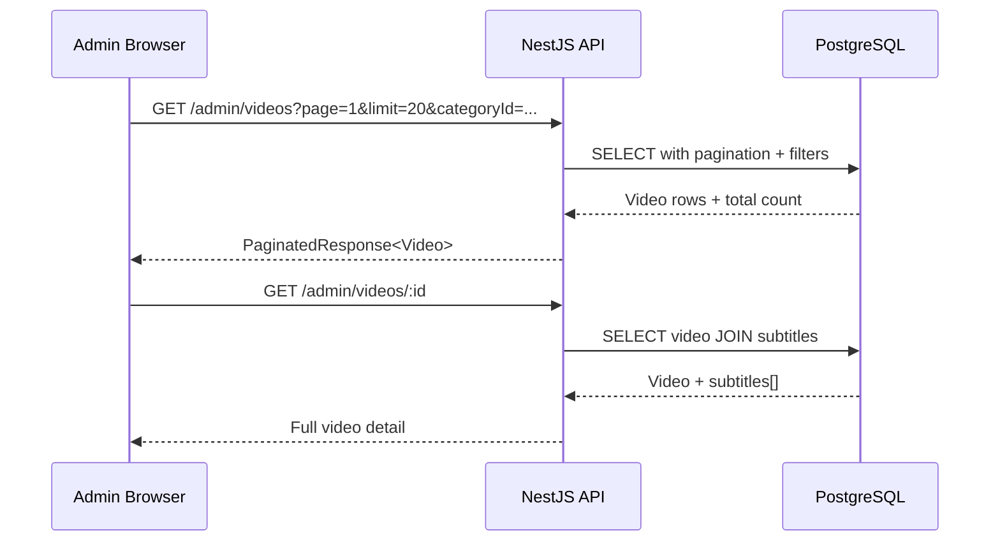
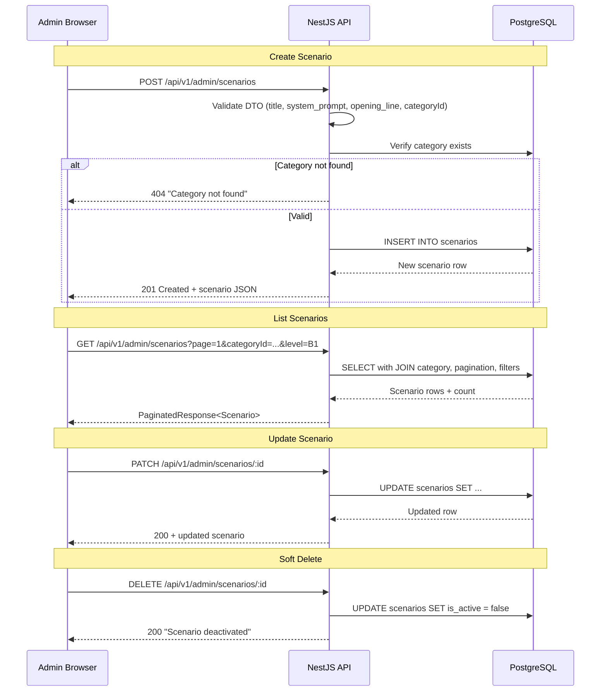

# Admin Panel — Implementation Guide (Video CRUD & Scenario CRUD)

> **Audience:** Developer implementing Phase 1 of the English Learning Platform.
> **Last updated:** 2026-05-04

---

> ⚠️ **PREREQUISITE — DO NOT START THIS GUIDE UNTIL:**
>
> All features described in [`auth-implementation-guide.md`](./auth-implementation-guide.md) have been **fully implemented and verified**:
> - Auth module (register, login, refresh, logout) is working end-to-end.
> - JWT guards (`JwtAuthGuard`, `RolesGuard`) are registered globally in `AppModule`.
> - Admin seed user exists in the database.
> - Admin layout (sidebar + header) renders correctly on the frontend.
> - The `@Roles('admin')` decorator is operational and blocks non-admin users.
>
> **If any of these are incomplete, stop and finish the auth guide first.**

---

## Table of Contents

1. [Feature 1 — Video Category CRUD](#feature-1--video-category-crud)
2. [Feature 2 — Video CRUD with YouTube Import](#feature-2--video-crud-with-youtube-import)
3. [Feature 3 — Scenario CRUD](#feature-3--scenario-crud)
4. [Shared Infrastructure](#shared-infrastructure)
5. [Environment Variables](#environment-variables)
6. [File Index](#file-index)

---

## Shared Infrastructure

Before implementing either feature, establish shared utilities used by both Video and Scenario CRUD.

### Pagination DTO (Backend)

All list endpoints use a consistent pagination contract.

```ts
// apps/api/src/common/dto/pagination-query.dto.ts

import { Type } from 'class-transformer';
import { IsInt, IsOptional, Max, Min } from 'class-validator';
import { ApiPropertyOptional } from '@nestjs/swagger';

export class PaginationQueryDto {
  @ApiPropertyOptional({ default: 1 })
  @IsOptional()
  @Type(() => Number)
  @IsInt()
  @Min(1)
  readonly page: number = 1;

  @ApiPropertyOptional({ default: 20 })
  @IsOptional()
  @Type(() => Number)
  @IsInt()
  @Min(1)
  @Max(100)
  readonly limit: number = 20;
}
```

```ts
// apps/api/src/common/dto/paginated-response.dto.ts

export class PaginatedResponseDto<T> {
  readonly data: T[];
  readonly meta: {
    readonly total: number;
    readonly page: number;
    readonly limit: number;
    readonly totalPages: number;
  };

  constructor(data: T[], total: number, page: number, limit: number) {
    this.data = data;
    this.meta = {
      total,
      page,
      limit,
      totalPages: Math.ceil(total / limit),
    };
  }
}
```

### Shared Zod Schemas (packages/shared)

```ts
// packages/shared/src/schemas/admin.schema.ts

import { z } from 'zod';
import { DifficultyLevel } from '../enums';

// ─── Video Category ───────────────────────────────────────
export const CreateVideoCategorySchema = z.object({
  name: z.string().min(2).max(100).trim(),
  slug: z
    .string()
    .min(2)
    .max(100)
    .regex(/^[a-z0-9]+(?:-[a-z0-9]+)*$/, 'Slug must be URL-safe (lowercase, hyphens only)'),
  displayOrder: z.number().int().min(0).default(0),
});

export const UpdateVideoCategorySchema = CreateVideoCategorySchema.partial();

export type CreateVideoCategoryDto = z.infer<typeof CreateVideoCategorySchema>;
export type UpdateVideoCategoryDto = z.infer<typeof UpdateVideoCategorySchema>;

// ─── Video ────────────────────────────────────────────────
export const CreateVideoSchema = z.object({
  youtubeUrl: z
    .string()
    .url('Must be a valid URL')
    .refine(
      (url) => {
        const regex =
          /^(?:https?:\/\/)?(?:www\.)?(?:youtube\.com\/(?:watch\?v=|embed\/|shorts\/)|youtu\.be\/)([a-zA-Z0-9_-]{11})/;
        return regex.test(url);
      },
      { message: 'Must be a valid YouTube video URL' },
    ),
  categoryId: z.string().uuid(),
  level: z.nativeEnum(DifficultyLevel).nullable().optional(),
  subtitles: z
    .array(
      z.object({
        index: z.number().int().min(0),
        startMs: z.number().int().min(0),
        endMs: z.number().int().min(0),
        text: z.string().min(1),
        translation: z.string().nullable().optional(),
      }),
    )
    .min(1, 'At least one subtitle is required'),
});

export const UpdateVideoSchema = z.object({
  title: z.string().min(1).max(255).trim().optional(),
  description: z.string().nullable().optional(),
  categoryId: z.string().uuid().optional(),
  level: z.nativeEnum(DifficultyLevel).nullable().optional(),
  isActive: z.boolean().optional(),
});

export type CreateVideoDto = z.infer<typeof CreateVideoSchema>;
export type UpdateVideoDto = z.infer<typeof UpdateVideoSchema>;

// ─── YouTube Metadata ─────────────────────────────────────
export const YouTubeMetadataSchema = z.object({
  youtubeId: z.string().length(11),
  title: z.string(),
  description: z.string().nullable(),
  thumbnailUrl: z.string().url().nullable(),
  durationSec: z.number().int().min(0),
  channelName: z.string(),
  publishedAt: z.string().datetime().nullable(),
});

export type YouTubeMetadata = z.infer<typeof YouTubeMetadataSchema>;

// ─── Scenario Category ────────────────────────────────────
export const CreateScenarioCategorySchema = z.object({
  name: z.string().min(2).max(100).trim(),
  slug: z
    .string()
    .min(2)
    .max(100)
    .regex(/^[a-z0-9]+(?:-[a-z0-9]+)*$/, 'Slug must be URL-safe (lowercase, hyphens only)'),
  displayOrder: z.number().int().min(0).default(0),
});

export const UpdateScenarioCategorySchema = CreateScenarioCategorySchema.partial();

export type CreateScenarioCategoryDto = z.infer<typeof CreateScenarioCategorySchema>;
export type UpdateScenarioCategoryDto = z.infer<typeof UpdateScenarioCategorySchema>;

// ─── Scenario ─────────────────────────────────────────────
export const CreateScenarioSchema = z.object({
  title: z.string().min(2).max(255).trim(),
  description: z.string().nullable().optional(),
  systemPrompt: z.string().min(10, 'System prompt must be at least 10 characters'),
  openingLine: z.string().min(1, 'Opening line is required'),
  categoryId: z.string().uuid(),
  level: z.nativeEnum(DifficultyLevel).nullable().optional(),
});

export const UpdateScenarioSchema = z.object({
  title: z.string().min(2).max(255).trim().optional(),
  description: z.string().nullable().optional(),
  systemPrompt: z.string().min(10).optional(),
  openingLine: z.string().min(1).optional(),
  categoryId: z.string().uuid().optional(),
  level: z.nativeEnum(DifficultyLevel).nullable().optional(),
  isActive: z.boolean().optional(),
});

export type CreateScenarioDto = z.infer<typeof CreateScenarioSchema>;
export type UpdateScenarioDto = z.infer<typeof UpdateScenarioSchema>;
```

Update the barrel export:

```ts
// packages/shared/src/index.ts

export * from './schemas/auth.schema';
export * from './schemas/admin.schema';
export * from './enums';
```

---

## Feature 1 — Video Category CRUD

Categories organize videos into browsable groups (e.g., "Daily Conversation", "Business English", "TED Talks").

### Step 1 — Requirement Analysis

**Functional requirements:**
- Admin can create a category with a unique slug, display name, and sort order.
- Admin can list all categories (ordered by `display_order`).
- Admin can update a category's name, slug, or display order.
- Admin can delete a category only if it has no associated videos.

**Edge cases:**
- Slug uniqueness conflict → return 409 Conflict.
- Deleting a category that has videos → return 400 Bad Request with explanation.
- Display order ties are allowed; sort secondarily by `name ASC`.

### Step 2 — Knowledge Prerequisites

- TypeORM entity decorators, unique constraints, and cascade options.
- NestJS module/controller/service pattern.
- `class-validator` decorators for DTO fields.
- URL-safe slug validation regex.

### Step 3 — System Flow



### Step 4 — Recommended Solution

**Approach A — Separate admin controller per resource:**
Each resource (categories, videos, scenarios) gets its own controller with an `/admin/` prefix. Clean separation of concerns.

**Approach B — Single admin controller for all resources:**
One large controller handles all admin endpoints. Fewer files but violates single responsibility.

**Recommendation: Approach A.** Each resource has its own module containing controller + service + entity. This aligns with NestJS modular architecture and the project's `CLAUDE.md` guidelines. It enables independent testing and future extraction.

### Step 5 — Implementation Code

#### Entity

```ts
// apps/api/src/video-categories/entities/video-category.entity.ts

import {
  Column,
  CreateDateColumn,
  Entity,
  OneToMany,
  PrimaryGeneratedColumn,
} from 'typeorm';
import { Video } from '../../videos/entities/video.entity';

@Entity('video_categories')
export class VideoCategory {
  @PrimaryGeneratedColumn('uuid')
  id: string;

  @Column({ type: 'varchar', length: 100, unique: true })
  slug: string;

  @Column({ type: 'varchar', length: 100 })
  name: string;

  @Column({ type: 'integer', name: 'display_order', default: 0 })
  displayOrder: number;

  @CreateDateColumn({ type: 'timestamptz', name: 'created_at' })
  createdAt: Date;

  @OneToMany(() => Video, (video) => video.category)
  videos: Video[];
}
```

#### DTOs

```ts
// apps/api/src/video-categories/dto/create-video-category.dto.ts

import { ApiProperty, ApiPropertyOptional } from '@nestjs/swagger';
import { IsInt, IsOptional, IsString, Matches, MaxLength, Min, MinLength } from 'class-validator';

export class CreateVideoCategoryRequestDto {
  @ApiProperty({ example: 'daily-conversation' })
  @IsString()
  @MinLength(2)
  @MaxLength(100)
  @Matches(/^[a-z0-9]+(?:-[a-z0-9]+)*$/, {
    message: 'Slug must be URL-safe (lowercase letters, numbers, and hyphens only)',
  })
  readonly slug: string;

  @ApiProperty({ example: 'Daily Conversation' })
  @IsString()
  @MinLength(2)
  @MaxLength(100)
  readonly name: string;

  @ApiPropertyOptional({ example: 0 })
  @IsOptional()
  @IsInt()
  @Min(0)
  readonly displayOrder?: number;
}
```

```ts
// apps/api/src/video-categories/dto/update-video-category.dto.ts

import { PartialType } from '@nestjs/swagger';
import { CreateVideoCategoryRequestDto } from './create-video-category.dto';

export class UpdateVideoCategoryRequestDto extends PartialType(CreateVideoCategoryRequestDto) {}
```

#### Service

```ts
// apps/api/src/video-categories/video-categories.service.ts

import {
  BadRequestException,
  ConflictException,
  Injectable,
  Logger,
  NotFoundException,
} from '@nestjs/common';
import { InjectRepository } from '@nestjs/typeorm';
import { Repository } from 'typeorm';
import { VideoCategory } from './entities/video-category.entity';
import { CreateVideoCategoryRequestDto } from './dto/create-video-category.dto';
import { UpdateVideoCategoryRequestDto } from './dto/update-video-category.dto';

@Injectable()
export class VideoCategoriesService {
  private readonly logger = new Logger(VideoCategoriesService.name);

  constructor(
    @InjectRepository(VideoCategory)
    private readonly categoryRepository: Repository<VideoCategory>,
  ) {}

  async create(dto: CreateVideoCategoryRequestDto): Promise<VideoCategory> {
    const existing = await this.categoryRepository.findOne({
      where: { slug: dto.slug },
    });
    if (existing) {
      throw new ConflictException(`Category with slug "${dto.slug}" already exists`);
    }

    const category = this.categoryRepository.create({
      slug: dto.slug,
      name: dto.name,
      displayOrder: dto.displayOrder ?? 0,
    });

    return this.categoryRepository.save(category);
  }

  async findAll(): Promise<VideoCategory[]> {
    return this.categoryRepository.find({
      order: { displayOrder: 'ASC', name: 'ASC' },
    });
  }

  async findOne(id: string): Promise<VideoCategory> {
    const category = await this.categoryRepository.findOne({ where: { id } });
    if (!category) {
      throw new NotFoundException(`Video category ${id} not found`);
    }
    return category;
  }

  async update(id: string, dto: UpdateVideoCategoryRequestDto): Promise<VideoCategory> {
    const category = await this.findOne(id);

    if (dto.slug && dto.slug !== category.slug) {
      const conflict = await this.categoryRepository.findOne({
        where: { slug: dto.slug },
      });
      if (conflict) {
        throw new ConflictException(`Category with slug "${dto.slug}" already exists`);
      }
    }

    Object.assign(category, dto);
    return this.categoryRepository.save(category);
  }

  async remove(id: string): Promise<void> {
    const category = await this.categoryRepository.findOne({
      where: { id },
      relations: ['videos'],
    });

    if (!category) {
      throw new NotFoundException(`Video category ${id} not found`);
    }

    if (category.videos && category.videos.length > 0) {
      throw new BadRequestException(
        `Cannot delete category "${category.name}" because it has ${category.videos.length} associated video(s). Move or delete them first.`,
      );
    }

    await this.categoryRepository.remove(category);
  }
}
```

#### Controller

```ts
// apps/api/src/video-categories/video-categories.controller.ts

import {
  Body,
  Controller,
  Delete,
  Get,
  HttpCode,
  HttpStatus,
  Param,
  ParseUUIDPipe,
  Patch,
  Post,
  UseGuards,
} from '@nestjs/common';
import { ApiBearerAuth, ApiOperation, ApiResponse, ApiTags } from '@nestjs/swagger';
import { Roles } from '../auth/decorators/roles.decorator';
import { Role } from '@english-platform/shared';
import { VideoCategoriesService } from './video-categories.service';
import { CreateVideoCategoryRequestDto } from './dto/create-video-category.dto';
import { UpdateVideoCategoryRequestDto } from './dto/update-video-category.dto';

@ApiTags('Admin - Video Categories')
@ApiBearerAuth()
@Controller('admin/video-categories')
@Roles(Role.ADMIN)
export class VideoCategoriesController {
  constructor(private readonly categoriesService: VideoCategoriesService) {}

  @Post()
  @HttpCode(HttpStatus.CREATED)
  @ApiOperation({ summary: 'Create a video category' })
  @ApiResponse({ status: 201, description: 'Category created' })
  @ApiResponse({ status: 409, description: 'Slug conflict' })
  create(@Body() dto: CreateVideoCategoryRequestDto) {
    return this.categoriesService.create(dto);
  }

  @Get()
  @ApiOperation({ summary: 'List all video categories' })
  findAll() {
    return this.categoriesService.findAll();
  }

  @Get(':id')
  @ApiOperation({ summary: 'Get a video category by ID' })
  findOne(@Param('id', ParseUUIDPipe) id: string) {
    return this.categoriesService.findOne(id);
  }

  @Patch(':id')
  @ApiOperation({ summary: 'Update a video category' })
  update(
    @Param('id', ParseUUIDPipe) id: string,
    @Body() dto: UpdateVideoCategoryRequestDto,
  ) {
    return this.categoriesService.update(id, dto);
  }

  @Delete(':id')
  @HttpCode(HttpStatus.NO_CONTENT)
  @ApiOperation({ summary: 'Delete a video category (only if empty)' })
  @ApiResponse({ status: 204, description: 'Category deleted' })
  @ApiResponse({ status: 400, description: 'Category has videos' })
  async remove(@Param('id', ParseUUIDPipe) id: string) {
    await this.categoriesService.remove(id);
  }
}
```

#### Module

```ts
// apps/api/src/video-categories/video-categories.module.ts

import { Module } from '@nestjs/common';
import { TypeOrmModule } from '@nestjs/typeorm';
import { VideoCategory } from './entities/video-category.entity';
import { VideoCategoriesService } from './video-categories.service';
import { VideoCategoriesController } from './video-categories.controller';

@Module({
  imports: [TypeOrmModule.forFeature([VideoCategory])],
  controllers: [VideoCategoriesController],
  providers: [VideoCategoriesService],
  exports: [VideoCategoriesService],
})
export class VideoCategoriesModule {}
```

#### Frontend — Category Management Page

```tsx
// apps/web/app/admin/(dashboard)/video-categories/page.tsx

'use client';

import { useState } from 'react';
import { useQuery, useMutation, useQueryClient } from '@tanstack/react-query';
import { apiClient } from '@/lib/api-client';
import { Button } from '@/components/ui/button';
import { Input } from '@/components/ui/input';
import { Label } from '@/components/ui/label';
import {
  Dialog,
  DialogContent,
  DialogHeader,
  DialogTitle,
} from '@/components/ui/dialog';
import { Card, CardContent, CardHeader, CardTitle } from '@/components/ui/card';
import { Pencil, Trash2, Plus } from 'lucide-react';
import { toast } from 'sonner';

interface VideoCategory {
  id: string;
  slug: string;
  name: string;
  displayOrder: number;
  createdAt: string;
}

function useCategoriesQuery() {
  return useQuery<VideoCategory[]>({
    queryKey: ['admin', 'video-categories'],
    queryFn: async () => {
      const { data } = await apiClient.get('/admin/video-categories');
      return data;
    },
  });
}

export default function VideoCategoriesPage() {
  const queryClient = useQueryClient();
  const { data: categories, isLoading } = useCategoriesQuery();
  const [dialogOpen, setDialogOpen] = useState(false);
  const [editingCategory, setEditingCategory] = useState<VideoCategory | null>(null);

  const createMutation = useMutation({
    mutationFn: (body: { name: string; slug: string; displayOrder: number }) =>
      apiClient.post('/admin/video-categories', body),
    onSuccess: () => {
      queryClient.invalidateQueries({ queryKey: ['admin', 'video-categories'] });
      setDialogOpen(false);
      toast.success('Category created');
    },
    onError: () => toast.error('Failed to create category'),
  });

  const updateMutation = useMutation({
    mutationFn: ({ id, ...body }: { id: string; name?: string; slug?: string; displayOrder?: number }) =>
      apiClient.patch(`/admin/video-categories/${id}`, body),
    onSuccess: () => {
      queryClient.invalidateQueries({ queryKey: ['admin', 'video-categories'] });
      setDialogOpen(false);
      setEditingCategory(null);
      toast.success('Category updated');
    },
    onError: () => toast.error('Failed to update category'),
  });

  const deleteMutation = useMutation({
    mutationFn: (id: string) => apiClient.delete(`/admin/video-categories/${id}`),
    onSuccess: () => {
      queryClient.invalidateQueries({ queryKey: ['admin', 'video-categories'] });
      toast.success('Category deleted');
    },
    onError: () => toast.error('Cannot delete category (may have associated videos)'),
  });

  const handleSubmit = (e: React.FormEvent<HTMLFormElement>) => {
    e.preventDefault();
    const formData = new FormData(e.currentTarget);
    const payload = {
      name: formData.get('name') as string,
      slug: formData.get('slug') as string,
      displayOrder: Number(formData.get('displayOrder') || 0),
    };

    if (editingCategory) {
      updateMutation.mutate({ id: editingCategory.id, ...payload });
    } else {
      createMutation.mutate(payload);
    }
  };

  const openCreate = () => {
    setEditingCategory(null);
    setDialogOpen(true);
  };

  const openEdit = (cat: VideoCategory) => {
    setEditingCategory(cat);
    setDialogOpen(true);
  };

  const handleDelete = (cat: VideoCategory) => {
    if (window.confirm(`Delete category "${cat.name}"? This cannot be undone.`)) {
      deleteMutation.mutate(cat.id);
    }
  };

  if (isLoading) {
    return <p style={{ color: 'var(--color-secondary)' }}>Loading categories…</p>;
  }

  return (
    <div>
      <div className="flex items-center justify-between mb-6">
        <h1 className="text-2xl font-bold tracking-tight" style={{ color: 'var(--color-primary)' }}>
          Video Categories
        </h1>
        <Button onClick={openCreate} style={{ backgroundColor: 'var(--color-tertiary)', color: 'var(--color-on-primary)' }}>
          <Plus className="h-4 w-4 mr-2" />
          Add Category
        </Button>
      </div>

      <div className="grid gap-3">
        {categories?.map((cat) => (
          <Card key={cat.id}>
            <CardContent className="flex items-center justify-between py-3 px-4">
              <div>
                <p className="font-medium" style={{ color: 'var(--color-primary)' }}>{cat.name}</p>
                <p className="text-sm" style={{ color: 'var(--color-secondary)' }}>
                  /{cat.slug} · Order: {cat.displayOrder}
                </p>
              </div>
              <div className="flex gap-2">
                <Button variant="ghost" size="icon" onClick={() => openEdit(cat)}>
                  <Pencil className="h-4 w-4" />
                </Button>
                <Button variant="ghost" size="icon" onClick={() => handleDelete(cat)}>
                  <Trash2 className="h-4 w-4 text-red-500" />
                </Button>
              </div>
            </CardContent>
          </Card>
        ))}
        {categories?.length === 0 && (
          <p style={{ color: 'var(--color-secondary)' }}>No categories yet. Create one to get started.</p>
        )}
      </div>

      <Dialog open={dialogOpen} onOpenChange={setDialogOpen}>
        <DialogContent className="sm:max-w-[420px]">
          <DialogHeader>
            <DialogTitle>{editingCategory ? 'Edit Category' : 'Create Category'}</DialogTitle>
          </DialogHeader>
          <form onSubmit={handleSubmit} className="space-y-4 mt-2">
            <div className="space-y-2">
              <Label htmlFor="cat-name">Name</Label>
              <Input id="cat-name" name="name" defaultValue={editingCategory?.name ?? ''} required minLength={2} />
            </div>
            <div className="space-y-2">
              <Label htmlFor="cat-slug">Slug</Label>
              <Input id="cat-slug" name="slug" defaultValue={editingCategory?.slug ?? ''} required minLength={2} pattern="^[a-z0-9]+(?:-[a-z0-9]+)*$" />
              <p className="text-xs" style={{ color: 'var(--color-secondary)' }}>Lowercase letters, numbers, and hyphens only</p>
            </div>
            <div className="space-y-2">
              <Label htmlFor="cat-order">Display Order</Label>
              <Input id="cat-order" name="displayOrder" type="number" defaultValue={editingCategory?.displayOrder ?? 0} min={0} />
            </div>
            <Button type="submit" className="w-full" disabled={createMutation.isPending || updateMutation.isPending}
              style={{ backgroundColor: 'var(--color-tertiary)', color: 'var(--color-on-primary)' }}>
              {editingCategory ? 'Save Changes' : 'Create Category'}
            </Button>
          </form>
        </DialogContent>
      </Dialog>
    </div>
  );
}
```

---

## Feature 2 — Video CRUD with YouTube Import

This feature allows admins to import YouTube videos by pasting a URL, validate and extract metadata via the YouTube Data API, require subtitle import, preview the video, and save everything to the database.

### Step 1 — Requirement Analysis

**Functional requirements:**

| Operation | Description |
|-----------|-------------|
| **Create** | Admin pastes a YouTube URL → system validates URL → calls YouTube Data API to extract metadata (title, description, thumbnail, duration, channel, published date) → admin reviews metadata + previews video → admin imports subtitles (SRT/VTT upload or manual entry) → save to DB |
| **Read** | Paginated list view with thumbnail, title, category, level, status, created date. Detail view shows all metadata + embedded player + subtitle list |
| **Update** | Edit title, description, category, level, active status. "Re-import" button to refresh metadata from YouTube |
| **Delete** | Soft delete (set `is_active = false`) with confirmation dialog |

**Edge cases:**
- Invalid YouTube URL → client-side + server-side validation error.
- Video is private/unavailable → YouTube API returns error → show "Video not accessible".
- YouTube API quota exceeded → catch 403, show retry message, log warning.
- Duplicate `youtube_id` → return 409 Conflict.
- Network failure during API call → return 502 Bad Gateway with explanation.
- Subtitles with overlapping time ranges → validate `startMs < endMs` and no overlap.

### Step 2 — Knowledge Prerequisites

| Topic | Why |
|-------|-----|
| **YouTube Data API v3** | Used to fetch video metadata (snippet, contentDetails). Requires an API key. Returns title, description, thumbnails, duration (ISO 8601), channel title, publish date. |
| **oEmbed** | Simpler alternative that returns title + thumbnail + embed HTML. No API key required but lacks duration, channel name, and publish date. |
| **YouTube URL parsing** | Multiple valid formats: `youtube.com/watch?v=`, `youtu.be/`, `youtube.com/embed/`, `youtube.com/shorts/`. All contain an 11-character video ID. |
| **ISO 8601 duration parsing** | YouTube returns duration as `PT4M13S`. Must parse to seconds. |
| **IFrame embedding** | Use `https://www.youtube.com/embed/{videoId}` with appropriate parameters (`rel=0`, `modestbranding=1`). |
| **SRT/VTT parsing** | Subtitle files have timestamps (`HH:MM:SS,mmm --> HH:MM:SS,mmm`) and text. Parse into `{ index, startMs, endMs, text }`. |
| **TypeORM cascade operations** | Subtitles cascade-delete with their parent video. |
| **class-validator** | DTO validation for all incoming data. |
| **@nestjs/swagger** | API documentation for all endpoints. |

### Step 3 — System Flow

#### Create Video Flow



#### List / Detail Flow



### Step 4 — Recommended Solution

#### YouTube metadata extraction — Approach comparison

| Approach | Pros | Cons |
|----------|------|------|
| **YouTube Data API v3** | Rich metadata (title, description, thumbnail, duration, channel, publish date). Server-side API key stays secure. Reliable structured JSON. | Requires API key. 10,000 quota units/day (each `videos.list` call = 1 unit). Adds a Google Cloud dependency. |
| **oEmbed** | No API key needed. Simple HTTP call. Returns title + thumbnail + embed HTML. | Missing: duration, channel name, publish date, description. Insufficient for our requirements. |
| **Store only URL, render on demand** | Zero API dependency. Fastest to implement. | No metadata at all in DB. Can't display thumbnails in lists. Can't validate if video exists/is public. Admin has no preview of what they're importing. |

**Recommendation: YouTube Data API v3.**

Justification:
1. Our requirements demand duration, channel name, and publish date — oEmbed cannot provide these.
2. We need to validate that a video is publicly accessible before saving — only the Data API can confirm this.
3. The 10,000 unit daily quota is generous for admin operations (each metadata fetch = 1 unit; we'd need to import 10,000 videos/day to hit the limit).
4. The API key is server-side only, stored as an environment variable — no security concern.
5. Storing metadata enables rich list views with thumbnails and filtering without additional API calls.

**Fallback:** If the YouTube API is unavailable (quota exceeded or network error), the system returns a clear error message. Admin can retry later. We do NOT fall back to oEmbed because partial data would create inconsistencies.

### Step 5 — Implementation Code

#### Backend

##### YouTube Service

```ts
// apps/api/src/videos/youtube.service.ts

import {
  BadRequestException,
  Injectable,
  Logger,
  ServiceUnavailableException,
} from '@nestjs/common';
import { ConfigService } from '@nestjs/config';

export interface YouTubeVideoMetadata {
  readonly youtubeId: string;
  readonly title: string;
  readonly description: string | null;
  readonly thumbnailUrl: string | null;
  readonly durationSec: number;
  readonly channelName: string;
  readonly publishedAt: string | null;
}

@Injectable()
export class YouTubeService {
  private readonly logger = new Logger(YouTubeService.name);
  private readonly apiKey: string;
  private readonly apiBaseUrl = 'https://www.googleapis.com/youtube/v3';

  constructor(private readonly configService: ConfigService) {
    this.apiKey = this.configService.get<string>('YOUTUBE_API_KEY', '');
  }

  extractVideoId(url: string): string {
    const patterns = [
      /(?:youtube\.com\/watch\?v=)([a-zA-Z0-9_-]{11})/,
      /(?:youtu\.be\/)([a-zA-Z0-9_-]{11})/,
      /(?:youtube\.com\/embed\/)([a-zA-Z0-9_-]{11})/,
      /(?:youtube\.com\/shorts\/)([a-zA-Z0-9_-]{11})/,
    ];

    for (const pattern of patterns) {
      const match = url.match(pattern);
      if (match) return match[1];
    }

    throw new BadRequestException('Invalid YouTube URL. Could not extract video ID.');
  }

  async fetchMetadata(url: string): Promise<YouTubeVideoMetadata> {
    const videoId = this.extractVideoId(url);

    if (!this.apiKey) {
      throw new ServiceUnavailableException(
        'YouTube API key is not configured. Set YOUTUBE_API_KEY in environment variables.',
      );
    }

    const apiUrl = `${this.apiBaseUrl}/videos?id=${videoId}&part=snippet,contentDetails&key=${this.apiKey}`;

    let response: Response;
    try {
      response = await fetch(apiUrl);
    } catch (error) {
      this.logger.error(`YouTube API network error: ${error}`);
      throw new ServiceUnavailableException('Failed to reach YouTube API. Please try again later.');
    }

    if (response.status === 403) {
      this.logger.warn('YouTube API quota exceeded');
      throw new ServiceUnavailableException(
        'YouTube API quota exceeded. Please try again tomorrow or contact an administrator.',
      );
    }

    if (!response.ok) {
      this.logger.error(`YouTube API error: ${response.status} ${response.statusText}`);
      throw new ServiceUnavailableException(`YouTube API returned status ${response.status}`);
    }

    const json = await response.json();
    const items = json.items as Array<Record<string, any>>;

    if (!items || items.length === 0) {
      throw new BadRequestException(
        'Video not found or not publicly accessible. Please check the URL and ensure the video is public.',
      );
    }

    const item = items[0];
    const snippet = item.snippet;
    const contentDetails = item.contentDetails;

    const thumbnailUrl =
      snippet.thumbnails?.maxres?.url ??
      snippet.thumbnails?.high?.url ??
      snippet.thumbnails?.medium?.url ??
      snippet.thumbnails?.default?.url ??
      null;

    return {
      youtubeId: videoId,
      title: snippet.title,
      description: snippet.description || null,
      thumbnailUrl,
      durationSec: this.parseIsoDuration(contentDetails.duration),
      channelName: snippet.channelTitle,
      publishedAt: snippet.publishedAt || null,
    };
  }

  private parseIsoDuration(iso: string): number {
    const match = iso.match(/PT(?:(\d+)H)?(?:(\d+)M)?(?:(\d+)S)?/);
    if (!match) return 0;
    const hours = parseInt(match[1] || '0', 10);
    const minutes = parseInt(match[2] || '0', 10);
    const seconds = parseInt(match[3] || '0', 10);
    return hours * 3600 + minutes * 60 + seconds;
  }
}
```

##### Video Entity

```ts
// apps/api/src/videos/entities/video.entity.ts

import {
  Column,
  CreateDateColumn,
  Entity,
  JoinColumn,
  ManyToOne,
  OneToMany,
  PrimaryGeneratedColumn,
  UpdateDateColumn,
} from 'typeorm';
import { DifficultyLevel } from '@english-platform/shared';
import { VideoCategory } from '../../video-categories/entities/video-category.entity';
import { Subtitle } from './subtitle.entity';

@Entity('videos')
export class Video {
  @PrimaryGeneratedColumn('uuid')
  id: string;

  @Column({ type: 'uuid', name: 'category_id' })
  categoryId: string;

  @ManyToOne(() => VideoCategory, (cat) => cat.videos)
  @JoinColumn({ name: 'category_id' })
  category: VideoCategory;

  @Column({ type: 'varchar', length: 255 })
  title: string;

  @Column({ type: 'text', nullable: true })
  description: string | null;

  @Column({ type: 'varchar', length: 50, name: 'youtube_id', unique: true })
  youtubeId: string;

  @Column({ type: 'varchar', length: 500, name: 'thumbnail_url', nullable: true })
  thumbnailUrl: string | null;

  @Column({ type: 'integer', name: 'duration_sec' })
  durationSec: number;

  @Column({ type: 'varchar', length: 200, name: 'channel_name', nullable: true })
  channelName: string | null;

  @Column({
    type: 'enum',
    enum: DifficultyLevel,
    nullable: true,
  })
  level: DifficultyLevel | null;

  @Column({ type: 'boolean', name: 'is_active', default: true })
  isActive: boolean;

  @Column({ type: 'timestamptz', name: 'published_at', nullable: true })
  publishedAt: Date | null;

  @CreateDateColumn({ type: 'timestamptz', name: 'created_at' })
  createdAt: Date;

  @UpdateDateColumn({ type: 'timestamptz', name: 'updated_at' })
  updatedAt: Date;

  @OneToMany(() => Subtitle, (sub) => sub.video, { cascade: true })
  subtitles: Subtitle[];
}
```

##### Subtitle Entity

```ts
// apps/api/src/videos/entities/subtitle.entity.ts

import {
  Column,
  CreateDateColumn,
  Entity,
  JoinColumn,
  ManyToOne,
  PrimaryGeneratedColumn,
} from 'typeorm';
import { Video } from './video.entity';

@Entity('subtitles')
export class Subtitle {
  @PrimaryGeneratedColumn('uuid')
  id: string;

  @Column({ type: 'uuid', name: 'video_id' })
  videoId: string;

  @ManyToOne(() => Video, (video) => video.subtitles, { onDelete: 'CASCADE' })
  @JoinColumn({ name: 'video_id' })
  video: Video;

  @Column({ type: 'integer' })
  index: number;

  @Column({ type: 'integer', name: 'start_ms' })
  startMs: number;

  @Column({ type: 'integer', name: 'end_ms' })
  endMs: number;

  @Column({ type: 'text' })
  text: string;

  @Column({ type: 'text', nullable: true })
  translation: string | null;

  @CreateDateColumn({ type: 'timestamptz', name: 'created_at' })
  createdAt: Date;
}
```

##### Video DTOs

```ts
// apps/api/src/videos/dto/create-video.dto.ts

import { ApiProperty, ApiPropertyOptional } from '@nestjs/swagger';
import {
  ArrayMinSize,
  IsArray,
  IsEnum,
  IsInt,
  IsOptional,
  IsString,
  IsUUID,
  Matches,
  Min,
  MinLength,
  ValidateNested,
} from 'class-validator';
import { Type } from 'class-transformer';
import { DifficultyLevel } from '@english-platform/shared';

export class SubtitleItemDto {
  @ApiProperty({ example: 0 })
  @IsInt()
  @Min(0)
  readonly index: number;

  @ApiProperty({ example: 1240 })
  @IsInt()
  @Min(0)
  readonly startMs: number;

  @ApiProperty({ example: 3980 })
  @IsInt()
  @Min(0)
  readonly endMs: number;

  @ApiProperty({ example: 'Hello there.' })
  @IsString()
  @MinLength(1)
  readonly text: string;

  @ApiPropertyOptional({ example: null })
  @IsOptional()
  @IsString()
  readonly translation?: string | null;
}

export class CreateVideoRequestDto {
  @ApiProperty({ example: 'https://www.youtube.com/watch?v=dQw4w9WgXcQ' })
  @IsString()
  @Matches(
    /^(?:https?:\/\/)?(?:www\.)?(?:youtube\.com\/(?:watch\?v=|embed\/|shorts\/)|youtu\.be\/)([a-zA-Z0-9_-]{11})/,
    { message: 'Must be a valid YouTube video URL' },
  )
  readonly youtubeUrl: string;

  @ApiProperty({ example: '550e8400-e29b-41d4-a716-446655440000' })
  @IsUUID()
  readonly categoryId: string;

  @ApiPropertyOptional({ enum: DifficultyLevel })
  @IsOptional()
  @IsEnum(DifficultyLevel)
  readonly level?: DifficultyLevel | null;

  @ApiProperty({ type: [SubtitleItemDto] })
  @IsArray()
  @ArrayMinSize(1, { message: 'At least one subtitle is required' })
  @ValidateNested({ each: true })
  @Type(() => SubtitleItemDto)
  readonly subtitles: SubtitleItemDto[];
}
```

```ts
// apps/api/src/videos/dto/update-video.dto.ts

import { ApiPropertyOptional } from '@nestjs/swagger';
import {
  IsBoolean,
  IsEnum,
  IsOptional,
  IsString,
  IsUUID,
  MaxLength,
  MinLength,
} from 'class-validator';
import { DifficultyLevel } from '@english-platform/shared';

export class UpdateVideoRequestDto {
  @ApiPropertyOptional({ example: 'Updated Title' })
  @IsOptional()
  @IsString()
  @MinLength(1)
  @MaxLength(255)
  readonly title?: string;

  @ApiPropertyOptional()
  @IsOptional()
  @IsString()
  readonly description?: string | null;

  @ApiPropertyOptional()
  @IsOptional()
  @IsUUID()
  readonly categoryId?: string;

  @ApiPropertyOptional({ enum: DifficultyLevel })
  @IsOptional()
  @IsEnum(DifficultyLevel)
  readonly level?: DifficultyLevel | null;

  @ApiPropertyOptional()
  @IsOptional()
  @IsBoolean()
  readonly isActive?: boolean;
}
```

```ts
// apps/api/src/videos/dto/video-query.dto.ts

import { ApiPropertyOptional } from '@nestjs/swagger';
import { IsEnum, IsOptional, IsUUID } from 'class-validator';
import { DifficultyLevel } from '@english-platform/shared';
import { PaginationQueryDto } from '../../common/dto/pagination-query.dto';

export class VideoQueryDto extends PaginationQueryDto {
  @ApiPropertyOptional()
  @IsOptional()
  @IsUUID()
  readonly categoryId?: string;

  @ApiPropertyOptional({ enum: DifficultyLevel })
  @IsOptional()
  @IsEnum(DifficultyLevel)
  readonly level?: DifficultyLevel;

  @ApiPropertyOptional()
  @IsOptional()
  readonly search?: string;
}
```

##### Video Service

```ts
// apps/api/src/videos/videos.service.ts

import {
  ConflictException,
  Injectable,
  Logger,
  NotFoundException,
} from '@nestjs/common';
import { InjectRepository } from '@nestjs/typeorm';
import { Repository } from 'typeorm';
import { Video } from './entities/video.entity';
import { Subtitle } from './entities/subtitle.entity';
import { YouTubeService, YouTubeVideoMetadata } from './youtube.service';
import { CreateVideoRequestDto } from './dto/create-video.dto';
import { UpdateVideoRequestDto } from './dto/update-video.dto';
import { VideoQueryDto } from './dto/video-query.dto';
import { PaginatedResponseDto } from '../common/dto/paginated-response.dto';

@Injectable()
export class VideosService {
  private readonly logger = new Logger(VideosService.name);

  constructor(
    @InjectRepository(Video)
    private readonly videoRepository: Repository<Video>,
    @InjectRepository(Subtitle)
    private readonly subtitleRepository: Repository<Subtitle>,
    private readonly youtubeService: YouTubeService,
  ) {}

  async fetchYouTubeMetadata(url: string): Promise<YouTubeVideoMetadata> {
    return this.youtubeService.fetchMetadata(url);
  }

  async create(dto: CreateVideoRequestDto): Promise<Video> {
    const metadata = await this.youtubeService.fetchMetadata(dto.youtubeUrl);

    const existing = await this.videoRepository.findOne({
      where: { youtubeId: metadata.youtubeId },
    });
    if (existing) {
      throw new ConflictException(
        `Video with YouTube ID "${metadata.youtubeId}" already exists`,
      );
    }

    const video = this.videoRepository.create({
      youtubeId: metadata.youtubeId,
      title: metadata.title,
      description: metadata.description,
      thumbnailUrl: metadata.thumbnailUrl,
      durationSec: metadata.durationSec,
      channelName: metadata.channelName,
      publishedAt: metadata.publishedAt ? new Date(metadata.publishedAt) : null,
      categoryId: dto.categoryId,
      level: dto.level ?? null,
    });

    const savedVideo = await this.videoRepository.save(video);

    const subtitles = dto.subtitles.map((sub) =>
      this.subtitleRepository.create({
        videoId: savedVideo.id,
        index: sub.index,
        startMs: sub.startMs,
        endMs: sub.endMs,
        text: sub.text,
        translation: sub.translation ?? null,
      }),
    );

    await this.subtitleRepository.save(subtitles);

    return this.findOne(savedVideo.id);
  }

  async findAll(query: VideoQueryDto): Promise<PaginatedResponseDto<Video>> {
    const qb = this.videoRepository
      .createQueryBuilder('video')
      .leftJoinAndSelect('video.category', 'category')
      .orderBy('video.createdAt', 'DESC');

    if (query.categoryId) {
      qb.andWhere('video.categoryId = :categoryId', { categoryId: query.categoryId });
    }

    if (query.level) {
      qb.andWhere('video.level = :level', { level: query.level });
    }

    if (query.search) {
      qb.andWhere('video.title ILIKE :search', { search: `%${query.search}%` });
    }

    const total = await qb.getCount();
    const skip = (query.page - 1) * query.limit;
    const videos = await qb.skip(skip).take(query.limit).getMany();

    return new PaginatedResponseDto(videos, total, query.page, query.limit);
  }

  async findOne(id: string): Promise<Video> {
    const video = await this.videoRepository.findOne({
      where: { id },
      relations: ['category', 'subtitles'],
      order: { subtitles: { index: 'ASC' } },
    });

    if (!video) {
      throw new NotFoundException(`Video ${id} not found`);
    }

    return video;
  }

  async update(id: string, dto: UpdateVideoRequestDto): Promise<Video> {
    const video = await this.findOne(id);
    Object.assign(video, dto);
    await this.videoRepository.save(video);
    return this.findOne(id);
  }

  async refreshMetadata(id: string): Promise<Video> {
    const video = await this.findOne(id);
    const metadata = await this.youtubeService.fetchMetadata(
      `https://www.youtube.com/watch?v=${video.youtubeId}`,
    );

    video.title = metadata.title;
    video.description = metadata.description;
    video.thumbnailUrl = metadata.thumbnailUrl;
    video.durationSec = metadata.durationSec;
    video.channelName = metadata.channelName;
    video.publishedAt = metadata.publishedAt ? new Date(metadata.publishedAt) : null;

    await this.videoRepository.save(video);
    return this.findOne(id);
  }

  async softDelete(id: string): Promise<void> {
    const video = await this.findOne(id);
    video.isActive = false;
    await this.videoRepository.save(video);
  }
}
```

##### Video Controller

```ts
// apps/api/src/videos/videos.controller.ts

import {
  Body,
  Controller,
  Delete,
  Get,
  HttpCode,
  HttpStatus,
  Param,
  ParseUUIDPipe,
  Patch,
  Post,
  Query,
} from '@nestjs/common';
import { ApiBearerAuth, ApiOperation, ApiQuery, ApiResponse, ApiTags } from '@nestjs/swagger';
import { Roles } from '../auth/decorators/roles.decorator';
import { Role } from '@english-platform/shared';
import { VideosService } from './videos.service';
import { CreateVideoRequestDto } from './dto/create-video.dto';
import { UpdateVideoRequestDto } from './dto/update-video.dto';
import { VideoQueryDto } from './dto/video-query.dto';

@ApiTags('Admin - Videos')
@ApiBearerAuth()
@Controller('admin/videos')
@Roles(Role.ADMIN)
export class VideosController {
  constructor(private readonly videosService: VideosService) {}

  @Post('youtube-metadata')
  @HttpCode(HttpStatus.OK)
  @ApiOperation({ summary: 'Fetch YouTube video metadata by URL' })
  @ApiResponse({ status: 200, description: 'Metadata extracted successfully' })
  @ApiResponse({ status: 400, description: 'Invalid URL or video not accessible' })
  @ApiResponse({ status: 503, description: 'YouTube API unavailable' })
  fetchYouTubeMetadata(@Query('url') url: string) {
    return this.videosService.fetchYouTubeMetadata(url);
  }

  @Post()
  @HttpCode(HttpStatus.CREATED)
  @ApiOperation({ summary: 'Create a video with subtitles' })
  @ApiResponse({ status: 201, description: 'Video created' })
  @ApiResponse({ status: 409, description: 'YouTube ID already exists' })
  create(@Body() dto: CreateVideoRequestDto) {
    return this.videosService.create(dto);
  }

  @Get()
  @ApiOperation({ summary: 'List videos with pagination and filters' })
  findAll(@Query() query: VideoQueryDto) {
    return this.videosService.findAll(query);
  }

  @Get(':id')
  @ApiOperation({ summary: 'Get video detail with subtitles' })
  findOne(@Param('id', ParseUUIDPipe) id: string) {
    return this.videosService.findOne(id);
  }

  @Patch(':id')
  @ApiOperation({ summary: 'Update video metadata' })
  update(
    @Param('id', ParseUUIDPipe) id: string,
    @Body() dto: UpdateVideoRequestDto,
  ) {
    return this.videosService.update(id, dto);
  }

  @Post(':id/refresh-metadata')
  @HttpCode(HttpStatus.OK)
  @ApiOperation({ summary: 'Re-import metadata from YouTube' })
  refreshMetadata(@Param('id', ParseUUIDPipe) id: string) {
    return this.videosService.refreshMetadata(id);
  }

  @Delete(':id')
  @HttpCode(HttpStatus.OK)
  @ApiOperation({ summary: 'Soft delete a video (set is_active = false)' })
  async remove(@Param('id', ParseUUIDPipe) id: string) {
    await this.videosService.softDelete(id);
    return { message: 'Video deactivated' };
  }
}
```

##### Video Module

```ts
// apps/api/src/videos/videos.module.ts

import { Module } from '@nestjs/common';
import { TypeOrmModule } from '@nestjs/typeorm';
import { Video } from './entities/video.entity';
import { Subtitle } from './entities/subtitle.entity';
import { VideosService } from './videos.service';
import { VideosController } from './videos.controller';
import { YouTubeService } from './youtube.service';

@Module({
  imports: [TypeOrmModule.forFeature([Video, Subtitle])],
  controllers: [VideosController],
  providers: [VideosService, YouTubeService],
  exports: [VideosService],
})
export class VideosModule {}
```

##### Update AppModule

Add both new modules to the root module:

```ts
// apps/api/src/app.module.ts — add these imports

import { VideoCategoriesModule } from './video-categories/video-categories.module';
import { VideosModule } from './videos/videos.module';
import { ScenarioCategoriesModule } from './scenario-categories/scenario-categories.module';
import { ScenariosModule } from './scenarios/scenarios.module';

@Module({
  imports: [
    // ... existing imports (ConfigModule, TypeOrmModule, AuthModule, UsersModule)
    VideoCategoriesModule,
    VideosModule,
    ScenarioCategoriesModule,
    ScenariosModule,
  ],
  // ... existing providers
})
export class AppModule {}
```

#### Frontend

##### SRT/VTT Parser Utility

```ts
// apps/web/lib/subtitle-parser.ts

export interface ParsedSubtitle {
  index: number;
  startMs: number;
  endMs: number;
  text: string;
}

function timeToMs(timeStr: string): number {
  const normalized = timeStr.replace(',', '.');
  const parts = normalized.split(':');
  if (parts.length === 3) {
    const hours = parseFloat(parts[0]);
    const minutes = parseFloat(parts[1]);
    const seconds = parseFloat(parts[2]);
    return Math.round((hours * 3600 + minutes * 60 + seconds) * 1000);
  }
  if (parts.length === 2) {
    const minutes = parseFloat(parts[0]);
    const seconds = parseFloat(parts[1]);
    return Math.round((minutes * 60 + seconds) * 1000);
  }
  return 0;
}

export function parseSrt(content: string): ParsedSubtitle[] {
  const blocks = content
    .replace(/\r\n/g, '\n')
    .replace(/\r/g, '\n')
    .trim()
    .split(/\n\n+/);

  const subtitles: ParsedSubtitle[] = [];

  for (let i = 0; i < blocks.length; i++) {
    const lines = blocks[i].split('\n').filter((l) => l.trim() !== '');
    if (lines.length < 2) continue;

    const timeLine = lines.find((l) => l.includes('-->'));
    if (!timeLine) continue;

    const [startStr, endStr] = timeLine.split('-->').map((s) => s.trim());
    const textLines = lines.slice(lines.indexOf(timeLine) + 1);
    const text = textLines.join(' ').replace(/<[^>]*>/g, '').trim();

    if (text) {
      subtitles.push({
        index: subtitles.length,
        startMs: timeToMs(startStr),
        endMs: timeToMs(endStr),
        text,
      });
    }
  }

  return subtitles;
}

export function parseVtt(content: string): ParsedSubtitle[] {
  const withoutHeader = content.replace(/^WEBVTT[^\n]*\n/, '').trim();
  return parseSrt(withoutHeader);
}

export function parseSubtitleFile(content: string, filename: string): ParsedSubtitle[] {
  const ext = filename.toLowerCase().split('.').pop();
  if (ext === 'vtt') return parseVtt(content);
  return parseSrt(content);
}
```

##### Video List Page

```tsx
// apps/web/app/admin/(dashboard)/videos/page.tsx

'use client';

import { useState } from 'react';
import { useQuery, useMutation, useQueryClient } from '@tanstack/react-query';
import { apiClient } from '@/lib/api-client';
import { Button } from '@/components/ui/button';
import { Input } from '@/components/ui/input';
import { Badge } from '@/components/ui/badge';
import { Card, CardContent } from '@/components/ui/card';
import {
  Dialog,
  DialogContent,
  DialogHeader,
  DialogTitle,
  DialogDescription,
} from '@/components/ui/dialog';
import { Plus, Search, Trash2, RefreshCw, Eye } from 'lucide-react';
import { toast } from 'sonner';
import Link from 'next/link';

interface VideoListItem {
  id: string;
  title: string;
  youtubeId: string;
  thumbnailUrl: string | null;
  durationSec: number;
  level: string | null;
  isActive: boolean;
  createdAt: string;
  category: { id: string; name: string } | null;
}

interface PaginatedVideos {
  data: VideoListItem[];
  meta: { total: number; page: number; limit: number; totalPages: number };
}

function formatDuration(seconds: number): string {
  const m = Math.floor(seconds / 60);
  const s = seconds % 60;
  return `${m}:${s.toString().padStart(2, '0')}`;
}

export default function AdminVideosPage() {
  const queryClient = useQueryClient();
  const [page, setPage] = useState(1);
  const [search, setSearch] = useState('');
  const [deleteTarget, setDeleteTarget] = useState<VideoListItem | null>(null);

  const { data, isLoading } = useQuery<PaginatedVideos>({
    queryKey: ['admin', 'videos', { page, search }],
    queryFn: async () => {
      const params = new URLSearchParams({ page: String(page), limit: '20' });
      if (search) params.set('search', search);
      const { data } = await apiClient.get(`/admin/videos?${params}`);
      return data;
    },
  });

  const deleteMutation = useMutation({
    mutationFn: (id: string) => apiClient.delete(`/admin/videos/${id}`),
    onSuccess: () => {
      queryClient.invalidateQueries({ queryKey: ['admin', 'videos'] });
      setDeleteTarget(null);
      toast.success('Video deactivated');
    },
    onError: () => toast.error('Failed to delete video'),
  });

  return (
    <div>
      <div className="flex items-center justify-between mb-6">
        <h1 className="text-2xl font-bold tracking-tight" style={{ color: 'var(--color-primary)' }}>
          Videos
        </h1>
        <Link href="/admin/videos/create">
          <Button style={{ backgroundColor: 'var(--color-tertiary)', color: 'var(--color-on-primary)' }}>
            <Plus className="h-4 w-4 mr-2" />
            Import Video
          </Button>
        </Link>
      </div>

      <div className="mb-4">
        <div className="relative max-w-sm">
          <Search className="absolute left-3 top-1/2 -translate-y-1/2 h-4 w-4" style={{ color: 'var(--color-secondary)' }} />
          <Input
            placeholder="Search videos…"
            className="pl-10"
            value={search}
            onChange={(e) => { setSearch(e.target.value); setPage(1); }}
          />
        </div>
      </div>

      {isLoading && <p style={{ color: 'var(--color-secondary)' }}>Loading…</p>}

      <div className="grid gap-3">
        {data?.data.map((video) => (
          <Card key={video.id} className={!video.isActive ? 'opacity-50' : ''}>
            <CardContent className="flex items-center gap-4 py-3 px-4">
              {video.thumbnailUrl ? (
                
              ) : (
                <div className="h-16 w-28 bg-gray-200 rounded flex items-center justify-center text-xs" style={{ color: 'var(--color-secondary)' }}>
                  No thumb
                </div>
              )}
              <div className="flex-1 min-w-0">
                <p className="font-medium truncate" style={{ color: 'var(--color-primary)' }}>{video.title}</p>
                <div className="flex items-center gap-2 mt-1 text-sm" style={{ color: 'var(--color-secondary)' }}>
                  <span>{formatDuration(video.durationSec)}</span>
                  {video.category && <span>· {video.category.name}</span>}
                  {video.level && <Badge variant="outline">{video.level}</Badge>}
                  {!video.isActive && <Badge variant="destructive">Inactive</Badge>}
                </div>
              </div>
              <div className="flex gap-1">
                <Link href={`/admin/videos/${video.id}`}>
                  <Button variant="ghost" size="icon"><Eye className="h-4 w-4" /></Button>
                </Link>
                <Button variant="ghost" size="icon" onClick={() => setDeleteTarget(video)}>
                  <Trash2 className="h-4 w-4 text-red-500" />
                </Button>
              </div>
            </CardContent>
          </Card>
        ))}
      </div>

      {data && data.meta.totalPages > 1 && (
        <div className="flex justify-center gap-2 mt-6">
          <Button variant="outline" disabled={page <= 1} onClick={() => setPage((p) => p - 1)}>Previous</Button>
          <span className="flex items-center text-sm" style={{ color: 'var(--color-secondary)' }}>
            Page {data.meta.page} of {data.meta.totalPages}
          </span>
          <Button variant="outline" disabled={page >= data.meta.totalPages} onClick={() => setPage((p) => p + 1)}>Next</Button>
        </div>
      )}

      <Dialog open={!!deleteTarget} onOpenChange={(open) => { if (!open) setDeleteTarget(null); }}>
        <DialogContent>
          <DialogHeader>
            <DialogTitle>Deactivate Video</DialogTitle>
            <DialogDescription>
              This will hide &quot;{deleteTarget?.title}&quot; from learners. You can reactivate it later.
            </DialogDescription>
          </DialogHeader>
          <div className="flex justify-end gap-2 mt-4">
            <Button variant="outline" onClick={() => setDeleteTarget(null)}>Cancel</Button>
            <Button
              variant="destructive"
              disabled={deleteMutation.isPending}
              onClick={() => deleteTarget && deleteMutation.mutate(deleteTarget.id)}
            >
              {deleteMutation.isPending ? 'Deactivating…' : 'Deactivate'}
            </Button>
          </div>
        </DialogContent>
      </Dialog>
    </div>
  );
}
```

##### Video Create Page (YouTube Import Wizard)

```tsx
// apps/web/app/admin/(dashboard)/videos/create/page.tsx

'use client';

import { useState, useCallback } from 'react';
import { useMutation, useQuery } from '@tanstack/react-query';
import { apiClient } from '@/lib/api-client';
import { parseSubtitleFile, type ParsedSubtitle } from '@/lib/subtitle-parser';
import { Button } from '@/components/ui/button';
import { Input } from '@/components/ui/input';
import { Label } from '@/components/ui/label';
import { Card, CardContent, CardHeader, CardTitle } from '@/components/ui/card';
import {
  Select,
  SelectContent,
  SelectItem,
  SelectTrigger,
  SelectValue,
} from '@/components/ui/select';
import { Badge } from '@/components/ui/badge';
import { ArrowLeft, Upload, Loader2, CheckCircle, AlertCircle } from 'lucide-react';
import { toast } from 'sonner';
import { useRouter } from 'next/navigation';
import Link from 'next/link';

interface YouTubeMetadata {
  youtubeId: string;
  title: string;
  description: string | null;
  thumbnailUrl: string | null;
  durationSec: number;
  channelName: string;
  publishedAt: string | null;
}

interface VideoCategory {
  id: string;
  name: string;
  slug: string;
}

const DIFFICULTY_LEVELS = ['A1', 'A2', 'B1', 'B2', 'C1', 'C2'] as const;

type WizardStep = 'url' | 'metadata' | 'subtitles' | 'review';

export default function CreateVideoPage() {
  const router = useRouter();
  const [step, setStep] = useState<WizardStep>('url');
  const [youtubeUrl, setYoutubeUrl] = useState('');
  const [metadata, setMetadata] = useState<YouTubeMetadata | null>(null);
  const [categoryId, setCategoryId] = useState('');
  const [level, setLevel] = useState<string>('');
  const [subtitles, setSubtitles] = useState<ParsedSubtitle[]>([]);

  const { data: categories } = useQuery<VideoCategory[]>({
    queryKey: ['admin', 'video-categories'],
    queryFn: async () => {
      const { data } = await apiClient.get('/admin/video-categories');
      return data;
    },
  });

  const metadataMutation = useMutation({
    mutationFn: async (url: string) => {
      const { data } = await apiClient.post<YouTubeMetadata>(
        `/admin/videos/youtube-metadata?url=${encodeURIComponent(url)}`,
      );
      return data;
    },
    onSuccess: (data) => {
      setMetadata(data);
      setStep('metadata');
    },
    onError: (error: any) => {
      const message = error.response?.data?.message || 'Failed to fetch video metadata';
      toast.error(message);
    },
  });

  const createMutation = useMutation({
    mutationFn: async () => {
      const { data } = await apiClient.post('/admin/videos', {
        youtubeUrl,
        categoryId,
        level: level || null,
        subtitles,
      });
      return data;
    },
    onSuccess: () => {
      toast.success('Video imported successfully');
      router.push('/admin/videos');
    },
    onError: (error: any) => {
      const message = error.response?.data?.message || 'Failed to create video';
      toast.error(message);
    },
  });

  const handleUrlSubmit = (e: React.FormEvent) => {
    e.preventDefault();
    if (!youtubeUrl.trim()) return;
    metadataMutation.mutate(youtubeUrl.trim());
  };

  const handleFileUpload = useCallback((e: React.ChangeEvent<HTMLInputElement>) => {
    const file = e.target.files?.[0];
    if (!file) return;

    const reader = new FileReader();
    reader.onload = (event) => {
      const content = event.target?.result as string;
      const parsed = parseSubtitleFile(content, file.name);
      if (parsed.length === 0) {
        toast.error('No subtitles found in file. Check the format (SRT or VTT).');
        return;
      }
      setSubtitles(parsed);
      toast.success(`Parsed ${parsed.length} subtitle(s)`);
    };
    reader.readAsText(file);
  }, []);

  const handleRemoveSubtitle = (index: number) => {
    setSubtitles((prev) =>
      prev.filter((_, i) => i !== index).map((s, i) => ({ ...s, index: i })),
    );
  };

  return (
    <div className="max-w-4xl mx-auto">
      <div className="flex items-center gap-3 mb-6">
        <Link href="/admin/videos">
          <Button variant="ghost" size="icon"><ArrowLeft className="h-4 w-4" /></Button>
        </Link>
        <h1 className="text-2xl font-bold tracking-tight" style={{ color: 'var(--color-primary)' }}>
          Import YouTube Video
        </h1>
      </div>

      {/* Step indicators */}
      <div className="flex items-center gap-2 mb-8">
        {(['url', 'metadata', 'subtitles', 'review'] as const).map((s, i) => (
          <div key={s} className="flex items-center gap-2">
            <div
              className="h-8 w-8 rounded-full flex items-center justify-center text-sm font-medium"
              style={{
                backgroundColor: step === s || (['url', 'metadata', 'subtitles', 'review'].indexOf(step) > i)
                  ? 'var(--color-tertiary)' : 'var(--muted)',
                color: step === s || (['url', 'metadata', 'subtitles', 'review'].indexOf(step) > i)
                  ? 'var(--color-on-primary)' : 'var(--color-secondary)',
              }}
            >
              {i + 1}
            </div>
            {i < 3 && <div className="w-8 h-0.5" style={{ backgroundColor: 'var(--border)' }} />}
          </div>
        ))}
      </div>

      {/* Step 1: URL Input */}
      {step === 'url' && (
        <Card>
          <CardHeader>
            <CardTitle>Paste YouTube URL</CardTitle>
          </CardHeader>
          <CardContent>
            <form onSubmit={handleUrlSubmit} className="space-y-4">
              <div className="space-y-2">
                <Label htmlFor="youtube-url">YouTube Video URL</Label>
                <Input
                  id="youtube-url"
                  placeholder="https://www.youtube.com/watch?v=..."
                  value={youtubeUrl}
                  onChange={(e) => setYoutubeUrl(e.target.value)}
                />
                <p className="text-xs" style={{ color: 'var(--color-secondary)' }}>
                  Supports: youtube.com/watch, youtu.be, youtube.com/embed, youtube.com/shorts
                </p>
              </div>
              <Button
                type="submit"
                disabled={metadataMutation.isPending || !youtubeUrl.trim()}
                style={{ backgroundColor: 'var(--color-tertiary)', color: 'var(--color-on-primary)' }}
              >
                {metadataMutation.isPending && <Loader2 className="h-4 w-4 mr-2 animate-spin" />}
                Fetch Metadata
              </Button>
            </form>
          </CardContent>
        </Card>
      )}

      {/* Step 2: Metadata Preview */}
      {step === 'metadata' && metadata && (
        <Card>
          <CardHeader>
            <CardTitle>Video Preview</CardTitle>
          </CardHeader>
          <CardContent className="space-y-6">
            <div className="aspect-video w-full max-w-lg mx-auto rounded-lg overflow-hidden">
              <iframe
                src={`https://www.youtube.com/embed/${metadata.youtubeId}?rel=0&modestbranding=1`}
                title={metadata.title}
                allow="accelerometer; autoplay; clipboard-write; encrypted-media; gyroscope; picture-in-picture"
                allowFullScreen
                className="w-full h-full"
              />
            </div>

            <div className="grid grid-cols-2 gap-4">
              <div>
                <p className="text-sm font-medium" style={{ color: 'var(--color-secondary)' }}>Title</p>
                <p style={{ color: 'var(--color-primary)' }}>{metadata.title}</p>
              </div>
              <div>
                <p className="text-sm font-medium" style={{ color: 'var(--color-secondary)' }}>Channel</p>
                <p style={{ color: 'var(--color-primary)' }}>{metadata.channelName}</p>
              </div>
              <div>
                <p className="text-sm font-medium" style={{ color: 'var(--color-secondary)' }}>Duration</p>
                <p style={{ color: 'var(--color-primary)' }}>{Math.floor(metadata.durationSec / 60)}m {metadata.durationSec % 60}s</p>
              </div>
              <div>
                <p className="text-sm font-medium" style={{ color: 'var(--color-secondary)' }}>Published</p>
                <p style={{ color: 'var(--color-primary)' }}>
                  {metadata.publishedAt ? new Date(metadata.publishedAt).toLocaleDateString() : 'N/A'}
                </p>
              </div>
            </div>

            <div className="grid grid-cols-2 gap-4">
              <div className="space-y-2">
                <Label>Category</Label>
                <Select value={categoryId} onValueChange={setCategoryId}>
                  <SelectTrigger>
                    <SelectValue placeholder="Select category" />
                  </SelectTrigger>
                  <SelectContent>
                    {categories?.map((cat) => (
                      <SelectItem key={cat.id} value={cat.id}>{cat.name}</SelectItem>
                    ))}
                  </SelectContent>
                </Select>
              </div>
              <div className="space-y-2">
                <Label>Difficulty Level</Label>
                <Select value={level} onValueChange={setLevel}>
                  <SelectTrigger>
                    <SelectValue placeholder="Optional" />
                  </SelectTrigger>
                  <SelectContent>
                    {DIFFICULTY_LEVELS.map((l) => (
                      <SelectItem key={l} value={l}>{l}</SelectItem>
                    ))}
                  </SelectContent>
                </Select>
              </div>
            </div>

            <div className="flex justify-between">
              <Button variant="outline" onClick={() => setStep('url')}>Back</Button>
              <Button
                disabled={!categoryId}
                onClick={() => setStep('subtitles')}
                style={{ backgroundColor: 'var(--color-tertiary)', color: 'var(--color-on-primary)' }}
              >
                Next: Subtitles
              </Button>
            </div>
          </CardContent>
        </Card>
      )}

      {/* Step 3: Subtitle Import */}
      {step === 'subtitles' && (
        <Card>
          <CardHeader>
            <CardTitle>Import Subtitles</CardTitle>
          </CardHeader>
          <CardContent className="space-y-4">
            <div className="border-2 border-dashed rounded-lg p-8 text-center" style={{ borderColor: 'var(--border)' }}>
              <Upload className="h-8 w-8 mx-auto mb-2" style={{ color: 'var(--color-secondary)' }} />
              <p className="text-sm mb-2" style={{ color: 'var(--color-secondary)' }}>
                Upload an SRT or VTT subtitle file
              </p>
              <Input
                type="file"
                accept=".srt,.vtt"
                onChange={handleFileUpload}
                className="max-w-xs mx-auto"
              />
            </div>

            {subtitles.length > 0 && (
              <div>
                <div className="flex items-center justify-between mb-2">
                  <p className="text-sm font-medium" style={{ color: 'var(--color-primary)' }}>
                    {subtitles.length} subtitle(s) loaded
                  </p>
                  <Badge variant="outline">
                    <CheckCircle className="h-3 w-3 mr-1" /> Ready
                  </Badge>
                </div>
                <div className="max-h-64 overflow-y-auto border rounded-lg" style={{ borderColor: 'var(--border)' }}>
                  <table className="w-full text-sm">
                    <thead className="sticky top-0" style={{ backgroundColor: 'var(--muted)' }}>
                      <tr>
                        <th className="text-left px-3 py-2 w-12">#</th>
                        <th className="text-left px-3 py-2 w-24">Start</th>
                        <th className="text-left px-3 py-2 w-24">End</th>
                        <th className="text-left px-3 py-2">Text</th>
                        <th className="w-10"></th>
                      </tr>
                    </thead>
                    <tbody>
                      {subtitles.map((sub, i) => (
                        <tr key={i} className="border-t" style={{ borderColor: 'var(--border)' }}>
                          <td className="px-3 py-1.5">{sub.index}</td>
                          <td className="px-3 py-1.5">{(sub.startMs / 1000).toFixed(1)}s</td>
                          <td className="px-3 py-1.5">{(sub.endMs / 1000).toFixed(1)}s</td>
                          <td className="px-3 py-1.5 truncate max-w-xs">{sub.text}</td>
                          <td className="px-2">
                            <Button variant="ghost" size="icon" className="h-6 w-6" onClick={() => handleRemoveSubtitle(i)}>
                              ×
                            </Button>
                          </td>
                        </tr>
                      ))}
                    </tbody>
                  </table>
                </div>
              </div>
            )}

            {subtitles.length === 0 && (
              <div className="flex items-center gap-2 text-sm p-3 rounded-lg" style={{ backgroundColor: 'var(--muted)', color: 'var(--color-secondary)' }}>
                <AlertCircle className="h-4 w-4" />
                Subtitles are required. Upload an SRT or VTT file to continue.
              </div>
            )}

            <div className="flex justify-between">
              <Button variant="outline" onClick={() => setStep('metadata')}>Back</Button>
              <Button
                disabled={subtitles.length === 0}
                onClick={() => setStep('review')}
                style={{ backgroundColor: 'var(--color-tertiary)', color: 'var(--color-on-primary)' }}
              >
                Next: Review
              </Button>
            </div>
          </CardContent>
        </Card>
      )}

      {/* Step 4: Review & Save */}
      {step === 'review' && metadata && (
        <Card>
          <CardHeader>
            <CardTitle>Review & Save</CardTitle>
          </CardHeader>
          <CardContent className="space-y-4">
            <div className="grid grid-cols-2 gap-4 text-sm">
              <div>
                <span style={{ color: 'var(--color-secondary)' }}>Video:</span>{' '}
                <span style={{ color: 'var(--color-primary)' }}>{metadata.title}</span>
              </div>
              <div>
                <span style={{ color: 'var(--color-secondary)' }}>Channel:</span>{' '}
                <span style={{ color: 'var(--color-primary)' }}>{metadata.channelName}</span>
              </div>
              <div>
                <span style={{ color: 'var(--color-secondary)' }}>Category:</span>{' '}
                <span style={{ color: 'var(--color-primary)' }}>
                  {categories?.find((c) => c.id === categoryId)?.name}
                </span>
              </div>
              <div>
                <span style={{ color: 'var(--color-secondary)' }}>Level:</span>{' '}
                <span style={{ color: 'var(--color-primary)' }}>{level || 'Not set'}</span>
              </div>
              <div>
                <span style={{ color: 'var(--color-secondary)' }}>Subtitles:</span>{' '}
                <span style={{ color: 'var(--color-primary)' }}>{subtitles.length} sentences</span>
              </div>
            </div>

            <div className="flex justify-between">
              <Button variant="outline" onClick={() => setStep('subtitles')}>Back</Button>
              <Button
                disabled={createMutation.isPending}
                onClick={() => createMutation.mutate()}
                style={{ backgroundColor: 'var(--color-tertiary)', color: 'var(--color-on-primary)' }}
              >
                {createMutation.isPending && <Loader2 className="h-4 w-4 mr-2 animate-spin" />}
                Save Video
              </Button>
            </div>
          </CardContent>
        </Card>
      )}
    </div>
  );
}
```

##### Video Detail Page

```tsx
// apps/web/app/admin/(dashboard)/videos/[id]/page.tsx

'use client';

import { useParams, useRouter } from 'next/navigation';
import { useQuery, useMutation, useQueryClient } from '@tanstack/react-query';
import { apiClient } from '@/lib/api-client';
import { Button } from '@/components/ui/button';
import { Input } from '@/components/ui/input';
import { Label } from '@/components/ui/label';
import { Card, CardContent, CardHeader, CardTitle } from '@/components/ui/card';
import { Badge } from '@/components/ui/badge';
import {
  Select,
  SelectContent,
  SelectItem,
  SelectTrigger,
  SelectValue,
} from '@/components/ui/select';
import { ArrowLeft, RefreshCw, Loader2, Save } from 'lucide-react';
import { toast } from 'sonner';
import { useState, useEffect } from 'react';
import Link from 'next/link';

interface VideoDetail {
  id: string;
  title: string;
  description: string | null;
  youtubeId: string;
  thumbnailUrl: string | null;
  durationSec: number;
  channelName: string | null;
  level: string | null;
  isActive: boolean;
  publishedAt: string | null;
  createdAt: string;
  category: { id: string; name: string } | null;
  subtitles: Array<{ id: string; index: number; startMs: number; endMs: number; text: string }>;
}

const DIFFICULTY_LEVELS = ['A1', 'A2', 'B1', 'B2', 'C1', 'C2'] as const;

export default function VideoDetailPage() {
  const { id } = useParams<{ id: string }>();
  const router = useRouter();
  const queryClient = useQueryClient();

  const { data: video, isLoading } = useQuery<VideoDetail>({
    queryKey: ['admin', 'videos', id],
    queryFn: async () => {
      const { data } = await apiClient.get(`/admin/videos/${id}`);
      return data;
    },
  });

  const [title, setTitle] = useState('');
  const [description, setDescription] = useState('');
  const [level, setLevel] = useState('');
  const [isActive, setIsActive] = useState(true);

  useEffect(() => {
    if (video) {
      setTitle(video.title);
      setDescription(video.description ?? '');
      setLevel(video.level ?? '');
      setIsActive(video.isActive);
    }
  }, [video]);

  const updateMutation = useMutation({
    mutationFn: async () => {
      await apiClient.patch(`/admin/videos/${id}`, {
        title,
        description: description || null,
        level: level || null,
        isActive,
      });
    },
    onSuccess: () => {
      queryClient.invalidateQueries({ queryKey: ['admin', 'videos', id] });
      toast.success('Video updated');
    },
    onError: () => toast.error('Failed to update video'),
  });

  const refreshMutation = useMutation({
    mutationFn: async () => {
      const { data } = await apiClient.post(`/admin/videos/${id}/refresh-metadata`);
      return data;
    },
    onSuccess: (data: VideoDetail) => {
      queryClient.setQueryData(['admin', 'videos', id], data);
      setTitle(data.title);
      setDescription(data.description ?? '');
      toast.success('Metadata refreshed from YouTube');
    },
    onError: () => toast.error('Failed to refresh metadata'),
  });

  if (isLoading) {
    return <p style={{ color: 'var(--color-secondary)' }}>Loading…</p>;
  }

  if (!video) {
    return <p style={{ color: 'var(--destructive)' }}>Video not found</p>;
  }

  return (
    <div className="max-w-4xl mx-auto">
      <div className="flex items-center gap-3 mb-6">
        <Link href="/admin/videos">
          <Button variant="ghost" size="icon"><ArrowLeft className="h-4 w-4" /></Button>
        </Link>
        <h1 className="text-2xl font-bold tracking-tight flex-1 truncate" style={{ color: 'var(--color-primary)' }}>
          {video.title}
        </h1>
        <Button
          variant="outline"
          onClick={() => refreshMutation.mutate()}
          disabled={refreshMutation.isPending}
        >
          {refreshMutation.isPending ? <Loader2 className="h-4 w-4 animate-spin" /> : <RefreshCw className="h-4 w-4" />}
          <span className="ml-2">Re-import</span>
        </Button>
      </div>

      {/* Embedded Player */}
      <Card className="mb-6">
        <CardContent className="p-0">
          <div className="aspect-video w-full rounded-t-lg overflow-hidden">
            <iframe
              src={`https://www.youtube.com/embed/${video.youtubeId}?rel=0&modestbranding=1`}
              title={video.title}
              allow="accelerometer; autoplay; clipboard-write; encrypted-media; gyroscope; picture-in-picture"
              allowFullScreen
              className="w-full h-full"
            />
          </div>
        </CardContent>
      </Card>

      {/* Edit Form */}
      <Card className="mb-6">
        <CardHeader>
          <CardTitle>Video Metadata</CardTitle>
        </CardHeader>
        <CardContent className="space-y-4">
          <div className="space-y-2">
            <Label htmlFor="vid-title">Title</Label>
            <Input id="vid-title" value={title} onChange={(e) => setTitle(e.target.value)} />
          </div>
          <div className="space-y-2">
            <Label htmlFor="vid-desc">Description</Label>
            <textarea
              id="vid-desc"
              className="flex min-h-[80px] w-full rounded-md border px-3 py-2 text-sm"
              style={{ borderColor: 'var(--input)', backgroundColor: 'var(--color-surface)' }}
              value={description}
              onChange={(e) => setDescription(e.target.value)}
            />
          </div>
          <div className="grid grid-cols-2 gap-4">
            <div className="space-y-2">
              <Label>Level</Label>
              <Select value={level} onValueChange={setLevel}>
                <SelectTrigger><SelectValue placeholder="Not set" /></SelectTrigger>
                <SelectContent>
                  <SelectItem value="">None</SelectItem>
                  {DIFFICULTY_LEVELS.map((l) => (
                    <SelectItem key={l} value={l}>{l}</SelectItem>
                  ))}
                </SelectContent>
              </Select>
            </div>
            <div className="space-y-2">
              <Label>Status</Label>
              <Select value={String(isActive)} onValueChange={(v) => setIsActive(v === 'true')}>
                <SelectTrigger><SelectValue /></SelectTrigger>
                <SelectContent>
                  <SelectItem value="true">Active</SelectItem>
                  <SelectItem value="false">Inactive</SelectItem>
                </SelectContent>
              </Select>
            </div>
          </div>
          <div className="flex justify-end">
            <Button
              onClick={() => updateMutation.mutate()}
              disabled={updateMutation.isPending}
              style={{ backgroundColor: 'var(--color-tertiary)', color: 'var(--color-on-primary)' }}
            >
              {updateMutation.isPending ? <Loader2 className="h-4 w-4 mr-2 animate-spin" /> : <Save className="h-4 w-4 mr-2" />}
              Save Changes
            </Button>
          </div>
        </CardContent>
      </Card>

      {/* Subtitle List */}
      <Card>
        <CardHeader>
          <CardTitle>Subtitles ({video.subtitles.length})</CardTitle>
        </CardHeader>
        <CardContent>
          <div className="max-h-80 overflow-y-auto">
            <table className="w-full text-sm">
              <thead className="sticky top-0" style={{ backgroundColor: 'var(--muted)' }}>
                <tr>
                  <th className="text-left px-3 py-2 w-12">#</th>
                  <th className="text-left px-3 py-2 w-20">Start</th>
                  <th className="text-left px-3 py-2 w-20">End</th>
                  <th className="text-left px-3 py-2">Text</th>
                </tr>
              </thead>
              <tbody>
                {video.subtitles.map((sub) => (
                  <tr key={sub.id} className="border-t" style={{ borderColor: 'var(--border)' }}>
                    <td className="px-3 py-1.5">{sub.index}</td>
                    <td className="px-3 py-1.5">{(sub.startMs / 1000).toFixed(1)}s</td>
                    <td className="px-3 py-1.5">{(sub.endMs / 1000).toFixed(1)}s</td>
                    <td className="px-3 py-1.5">{sub.text}</td>
                  </tr>
                ))}
              </tbody>
            </table>
          </div>
        </CardContent>
      </Card>
    </div>
  );
}
```

---

## Feature 3 — Scenario CRUD

This feature allows admins to create and manage AI roleplay scenarios used in speaking practice. Each scenario configures an Azure OpenAI-backed conversational AI: the `system_prompt` becomes the LLM system message, and the `opening_line` is the AI's first utterance.

### Step 1 — Requirement Analysis

**Functional requirements:**

| Operation | Description |
|-----------|-------------|
| **Category CRUD** | Same pattern as Video Categories — slug, name, display order. |
| **Create Scenario** | Admin fills title, description, system prompt, opening line, selects category and difficulty level. |
| **Read** | Paginated list with title, category, level, status. Detail view shows full prompt and opening line. |
| **Update** | Edit any field. Toggle active/inactive. |
| **Delete** | Soft delete (`is_active = false`) with confirmation. |

**Edge cases:**
- System prompt too short → validation error (min 10 chars).
- Opening line empty → validation error.
- Scenario has associated `speaking_sessions` → still soft-deletable (deactivate, don't remove).
- Category doesn't exist → 404 from foreign key constraint or service validation.

### Step 2 — Knowledge Prerequisites

| Topic | Why |
|-------|-----|
| **Azure OpenAI system messages** | The `system_prompt` field is injected verbatim as the system message. Understanding how system prompts shape AI behavior is crucial for admin UX. |
| **Prompt engineering basics** | Admin needs guidance on writing effective system prompts. The UI should include helpful placeholder text. |
| **CEFR levels** | Scenarios are tagged with difficulty (A1-C2). The admin should understand what language complexity each level implies. |
| **TypeORM relations** | Scenarios belong to `scenario_categories` via `category_id`. |
| **Soft delete pattern** | We use `is_active = false` rather than physical deletion to preserve referential integrity with `speaking_sessions`. |

### Step 3 — System Flow



### Step 4 — Recommended Solution

**Approach A — Dedicated scenario module with inline prompt editor:**
Full CRUD with a rich textarea for the system prompt. Admin writes the prompt directly. Simple and gives full control.

**Approach B — Template-based scenario builder with prompt variables:**
Predefined prompt templates where admin fills in variables (role name, context, constraints). More guided but less flexible.

**Recommendation: Approach A — Direct prompt editor.**

Justification:
1. For MVP, admins are technical users (the platform builder themselves) who understand prompt engineering.
2. A template system adds significant UI complexity (template CRUD, variable interpolation) for marginal benefit.
3. Direct editing gives maximum flexibility for experimenting with prompt styles.
4. The UI can include a "prompt guide" tooltip explaining best practices without constraining the input.

### Step 5 — Implementation Code

#### Backend

##### Scenario Category Entity

```ts
// apps/api/src/scenario-categories/entities/scenario-category.entity.ts

import {
  Column,
  CreateDateColumn,
  Entity,
  OneToMany,
  PrimaryGeneratedColumn,
} from 'typeorm';
import { Scenario } from '../../scenarios/entities/scenario.entity';

@Entity('scenario_categories')
export class ScenarioCategory {
  @PrimaryGeneratedColumn('uuid')
  id: string;

  @Column({ type: 'varchar', length: 100, unique: true })
  slug: string;

  @Column({ type: 'varchar', length: 100 })
  name: string;

  @Column({ type: 'integer', name: 'display_order', default: 0 })
  displayOrder: number;

  @CreateDateColumn({ type: 'timestamptz', name: 'created_at' })
  createdAt: Date;

  @OneToMany(() => Scenario, (scenario) => scenario.category)
  scenarios: Scenario[];
}
```

##### Scenario Category Service

```ts
// apps/api/src/scenario-categories/scenario-categories.service.ts

import {
  BadRequestException,
  ConflictException,
  Injectable,
  Logger,
  NotFoundException,
} from '@nestjs/common';
import { InjectRepository } from '@nestjs/typeorm';
import { Repository } from 'typeorm';
import { ScenarioCategory } from './entities/scenario-category.entity';
import { CreateScenarioCategoryRequestDto } from './dto/create-scenario-category.dto';
import { UpdateScenarioCategoryRequestDto } from './dto/update-scenario-category.dto';

@Injectable()
export class ScenarioCategoriesService {
  private readonly logger = new Logger(ScenarioCategoriesService.name);

  constructor(
    @InjectRepository(ScenarioCategory)
    private readonly categoryRepository: Repository<ScenarioCategory>,
  ) {}

  async create(dto: CreateScenarioCategoryRequestDto): Promise<ScenarioCategory> {
    const existing = await this.categoryRepository.findOne({
      where: { slug: dto.slug },
    });
    if (existing) {
      throw new ConflictException(`Scenario category with slug "${dto.slug}" already exists`);
    }

    const category = this.categoryRepository.create({
      slug: dto.slug,
      name: dto.name,
      displayOrder: dto.displayOrder ?? 0,
    });

    return this.categoryRepository.save(category);
  }

  async findAll(): Promise<ScenarioCategory[]> {
    return this.categoryRepository.find({
      order: { displayOrder: 'ASC', name: 'ASC' },
    });
  }

  async findOne(id: string): Promise<ScenarioCategory> {
    const category = await this.categoryRepository.findOne({ where: { id } });
    if (!category) {
      throw new NotFoundException(`Scenario category ${id} not found`);
    }
    return category;
  }

  async update(id: string, dto: UpdateScenarioCategoryRequestDto): Promise<ScenarioCategory> {
    const category = await this.findOne(id);

    if (dto.slug && dto.slug !== category.slug) {
      const conflict = await this.categoryRepository.findOne({ where: { slug: dto.slug } });
      if (conflict) {
        throw new ConflictException(`Scenario category with slug "${dto.slug}" already exists`);
      }
    }

    Object.assign(category, dto);
    return this.categoryRepository.save(category);
  }

  async remove(id: string): Promise<void> {
    const category = await this.categoryRepository.findOne({
      where: { id },
      relations: ['scenarios'],
    });

    if (!category) {
      throw new NotFoundException(`Scenario category ${id} not found`);
    }

    if (category.scenarios && category.scenarios.length > 0) {
      throw new BadRequestException(
        `Cannot delete category "${category.name}" because it has ${category.scenarios.length} associated scenario(s). Move or delete them first.`,
      );
    }

    await this.categoryRepository.remove(category);
  }
}
```

##### Scenario Category DTOs

```ts
// apps/api/src/scenario-categories/dto/create-scenario-category.dto.ts

import { ApiProperty, ApiPropertyOptional } from '@nestjs/swagger';
import { IsInt, IsOptional, IsString, Matches, MaxLength, Min, MinLength } from 'class-validator';

export class CreateScenarioCategoryRequestDto {
  @ApiProperty({ example: 'job-interview' })
  @IsString()
  @MinLength(2)
  @MaxLength(100)
  @Matches(/^[a-z0-9]+(?:-[a-z0-9]+)*$/, {
    message: 'Slug must be URL-safe (lowercase letters, numbers, and hyphens only)',
  })
  readonly slug: string;

  @ApiProperty({ example: 'Job Interview' })
  @IsString()
  @MinLength(2)
  @MaxLength(100)
  readonly name: string;

  @ApiPropertyOptional({ example: 0 })
  @IsOptional()
  @IsInt()
  @Min(0)
  readonly displayOrder?: number;
}
```

```ts
// apps/api/src/scenario-categories/dto/update-scenario-category.dto.ts

import { PartialType } from '@nestjs/swagger';
import { CreateScenarioCategoryRequestDto } from './create-scenario-category.dto';

export class UpdateScenarioCategoryRequestDto extends PartialType(CreateScenarioCategoryRequestDto) {}
```

##### Scenario Category Controller

```ts
// apps/api/src/scenario-categories/scenario-categories.controller.ts

import {
  Body,
  Controller,
  Delete,
  Get,
  HttpCode,
  HttpStatus,
  Param,
  ParseUUIDPipe,
  Patch,
  Post,
} from '@nestjs/common';
import { ApiBearerAuth, ApiOperation, ApiResponse, ApiTags } from '@nestjs/swagger';
import { Roles } from '../auth/decorators/roles.decorator';
import { Role } from '@english-platform/shared';
import { ScenarioCategoriesService } from './scenario-categories.service';
import { CreateScenarioCategoryRequestDto } from './dto/create-scenario-category.dto';
import { UpdateScenarioCategoryRequestDto } from './dto/update-scenario-category.dto';

@ApiTags('Admin - Scenario Categories')
@ApiBearerAuth()
@Controller('admin/scenario-categories')
@Roles(Role.ADMIN)
export class ScenarioCategoriesController {
  constructor(private readonly categoriesService: ScenarioCategoriesService) {}

  @Post()
  @HttpCode(HttpStatus.CREATED)
  @ApiOperation({ summary: 'Create a scenario category' })
  @ApiResponse({ status: 201, description: 'Category created' })
  @ApiResponse({ status: 409, description: 'Slug conflict' })
  create(@Body() dto: CreateScenarioCategoryRequestDto) {
    return this.categoriesService.create(dto);
  }

  @Get()
  @ApiOperation({ summary: 'List all scenario categories' })
  findAll() {
    return this.categoriesService.findAll();
  }

  @Get(':id')
  @ApiOperation({ summary: 'Get a scenario category by ID' })
  findOne(@Param('id', ParseUUIDPipe) id: string) {
    return this.categoriesService.findOne(id);
  }

  @Patch(':id')
  @ApiOperation({ summary: 'Update a scenario category' })
  update(
    @Param('id', ParseUUIDPipe) id: string,
    @Body() dto: UpdateScenarioCategoryRequestDto,
  ) {
    return this.categoriesService.update(id, dto);
  }

  @Delete(':id')
  @HttpCode(HttpStatus.NO_CONTENT)
  @ApiOperation({ summary: 'Delete a scenario category (only if empty)' })
  async remove(@Param('id', ParseUUIDPipe) id: string) {
    await this.categoriesService.remove(id);
  }
}
```

##### Scenario Category Module

```ts
// apps/api/src/scenario-categories/scenario-categories.module.ts

import { Module } from '@nestjs/common';
import { TypeOrmModule } from '@nestjs/typeorm';
import { ScenarioCategory } from './entities/scenario-category.entity';
import { ScenarioCategoriesService } from './scenario-categories.service';
import { ScenarioCategoriesController } from './scenario-categories.controller';

@Module({
  imports: [TypeOrmModule.forFeature([ScenarioCategory])],
  controllers: [ScenarioCategoriesController],
  providers: [ScenarioCategoriesService],
  exports: [ScenarioCategoriesService],
})
export class ScenarioCategoriesModule {}
```

##### Scenario Entity

```ts
// apps/api/src/scenarios/entities/scenario.entity.ts

import {
  Column,
  CreateDateColumn,
  Entity,
  JoinColumn,
  ManyToOne,
  PrimaryGeneratedColumn,
  UpdateDateColumn,
} from 'typeorm';
import { DifficultyLevel } from '@english-platform/shared';
import { ScenarioCategory } from '../../scenario-categories/entities/scenario-category.entity';

@Entity('scenarios')
export class Scenario {
  @PrimaryGeneratedColumn('uuid')
  id: string;

  @Column({ type: 'uuid', name: 'category_id' })
  categoryId: string;

  @ManyToOne(() => ScenarioCategory, (cat) => cat.scenarios)
  @JoinColumn({ name: 'category_id' })
  category: ScenarioCategory;

  @Column({ type: 'varchar', length: 255 })
  title: string;

  @Column({ type: 'text', nullable: true })
  description: string | null;

  @Column({ type: 'text', name: 'system_prompt' })
  systemPrompt: string;

  @Column({ type: 'text', name: 'opening_line' })
  openingLine: string;

  @Column({ type: 'varchar', length: 500, name: 'opening_audio_url', nullable: true })
  openingAudioUrl: string | null;

  @Column({
    type: 'enum',
    enum: DifficultyLevel,
    nullable: true,
  })
  level: DifficultyLevel | null;

  @Column({ type: 'boolean', name: 'is_active', default: true })
  isActive: boolean;

  @CreateDateColumn({ type: 'timestamptz', name: 'created_at' })
  createdAt: Date;

  @UpdateDateColumn({ type: 'timestamptz', name: 'updated_at' })
  updatedAt: Date;
}
```

##### Scenario DTOs

```ts
// apps/api/src/scenarios/dto/create-scenario.dto.ts

import { ApiProperty, ApiPropertyOptional } from '@nestjs/swagger';
import { IsEnum, IsOptional, IsString, IsUUID, MaxLength, MinLength } from 'class-validator';
import { DifficultyLevel } from '@english-platform/shared';

export class CreateScenarioRequestDto {
  @ApiProperty({ example: 'Coffee Shop Order' })
  @IsString()
  @MinLength(2)
  @MaxLength(255)
  readonly title: string;

  @ApiPropertyOptional({ example: 'Practice ordering drinks at a coffee shop' })
  @IsOptional()
  @IsString()
  readonly description?: string | null;

  @ApiProperty({
    example:
      'You are a friendly barista at a coffee shop. Greet the customer and help them order. Keep your responses to 1-2 sentences. Speak at a B1 English level.',
  })
  @IsString()
  @MinLength(10, { message: 'System prompt must be at least 10 characters' })
  readonly systemPrompt: string;

  @ApiProperty({ example: 'Hi there! Welcome to Sunrise Coffee. What can I get for you today?' })
  @IsString()
  @MinLength(1, { message: 'Opening line is required' })
  readonly openingLine: string;

  @ApiProperty({ example: '550e8400-e29b-41d4-a716-446655440000' })
  @IsUUID()
  readonly categoryId: string;

  @ApiPropertyOptional({ enum: DifficultyLevel })
  @IsOptional()
  @IsEnum(DifficultyLevel)
  readonly level?: DifficultyLevel | null;
}
```

```ts
// apps/api/src/scenarios/dto/update-scenario.dto.ts

import { ApiPropertyOptional } from '@nestjs/swagger';
import { IsBoolean, IsEnum, IsOptional, IsString, IsUUID, MaxLength, MinLength } from 'class-validator';
import { DifficultyLevel } from '@english-platform/shared';

export class UpdateScenarioRequestDto {
  @ApiPropertyOptional()
  @IsOptional()
  @IsString()
  @MinLength(2)
  @MaxLength(255)
  readonly title?: string;

  @ApiPropertyOptional()
  @IsOptional()
  @IsString()
  readonly description?: string | null;

  @ApiPropertyOptional()
  @IsOptional()
  @IsString()
  @MinLength(10)
  readonly systemPrompt?: string;

  @ApiPropertyOptional()
  @IsOptional()
  @IsString()
  @MinLength(1)
  readonly openingLine?: string;

  @ApiPropertyOptional()
  @IsOptional()
  @IsUUID()
  readonly categoryId?: string;

  @ApiPropertyOptional({ enum: DifficultyLevel })
  @IsOptional()
  @IsEnum(DifficultyLevel)
  readonly level?: DifficultyLevel | null;

  @ApiPropertyOptional()
  @IsOptional()
  @IsBoolean()
  readonly isActive?: boolean;
}
```

```ts
// apps/api/src/scenarios/dto/scenario-query.dto.ts

import { ApiPropertyOptional } from '@nestjs/swagger';
import { IsEnum, IsOptional, IsUUID } from 'class-validator';
import { DifficultyLevel } from '@english-platform/shared';
import { PaginationQueryDto } from '../../common/dto/pagination-query.dto';

export class ScenarioQueryDto extends PaginationQueryDto {
  @ApiPropertyOptional()
  @IsOptional()
  @IsUUID()
  readonly categoryId?: string;

  @ApiPropertyOptional({ enum: DifficultyLevel })
  @IsOptional()
  @IsEnum(DifficultyLevel)
  readonly level?: DifficultyLevel;

  @ApiPropertyOptional()
  @IsOptional()
  readonly search?: string;
}
```

##### Scenario Service

```ts
// apps/api/src/scenarios/scenarios.service.ts

import {
  Injectable,
  Logger,
  NotFoundException,
} from '@nestjs/common';
import { InjectRepository } from '@nestjs/typeorm';
import { Repository } from 'typeorm';
import { Scenario } from './entities/scenario.entity';
import { CreateScenarioRequestDto } from './dto/create-scenario.dto';
import { UpdateScenarioRequestDto } from './dto/update-scenario.dto';
import { ScenarioQueryDto } from './dto/scenario-query.dto';
import { PaginatedResponseDto } from '../common/dto/paginated-response.dto';
import { ScenarioCategoriesService } from '../scenario-categories/scenario-categories.service';

@Injectable()
export class ScenariosService {
  private readonly logger = new Logger(ScenariosService.name);

  constructor(
    @InjectRepository(Scenario)
    private readonly scenarioRepository: Repository<Scenario>,
    private readonly scenarioCategoriesService: ScenarioCategoriesService,
  ) {}

  async create(dto: CreateScenarioRequestDto): Promise<Scenario> {
    await this.scenarioCategoriesService.findOne(dto.categoryId);

    const scenario = this.scenarioRepository.create({
      title: dto.title,
      description: dto.description ?? null,
      systemPrompt: dto.systemPrompt,
      openingLine: dto.openingLine,
      categoryId: dto.categoryId,
      level: dto.level ?? null,
    });

    const saved = await this.scenarioRepository.save(scenario);
    return this.findOne(saved.id);
  }

  async findAll(query: ScenarioQueryDto): Promise<PaginatedResponseDto<Scenario>> {
    const qb = this.scenarioRepository
      .createQueryBuilder('scenario')
      .leftJoinAndSelect('scenario.category', 'category')
      .orderBy('scenario.createdAt', 'DESC');

    if (query.categoryId) {
      qb.andWhere('scenario.categoryId = :categoryId', { categoryId: query.categoryId });
    }

    if (query.level) {
      qb.andWhere('scenario.level = :level', { level: query.level });
    }

    if (query.search) {
      qb.andWhere('scenario.title ILIKE :search', { search: `%${query.search}%` });
    }

    const total = await qb.getCount();
    const skip = (query.page - 1) * query.limit;
    const scenarios = await qb.skip(skip).take(query.limit).getMany();

    return new PaginatedResponseDto(scenarios, total, query.page, query.limit);
  }

  async findOne(id: string): Promise<Scenario> {
    const scenario = await this.scenarioRepository.findOne({
      where: { id },
      relations: ['category'],
    });

    if (!scenario) {
      throw new NotFoundException(`Scenario ${id} not found`);
    }

    return scenario;
  }

  async update(id: string, dto: UpdateScenarioRequestDto): Promise<Scenario> {
    const scenario = await this.findOne(id);

    if (dto.categoryId && dto.categoryId !== scenario.categoryId) {
      await this.scenarioCategoriesService.findOne(dto.categoryId);
    }

    Object.assign(scenario, dto);
    await this.scenarioRepository.save(scenario);
    return this.findOne(id);
  }

  async softDelete(id: string): Promise<void> {
    const scenario = await this.findOne(id);
    scenario.isActive = false;
    await this.scenarioRepository.save(scenario);
  }
}
```

##### Scenario Controller

```ts
// apps/api/src/scenarios/scenarios.controller.ts

import {
  Body,
  Controller,
  Delete,
  Get,
  HttpCode,
  HttpStatus,
  Param,
  ParseUUIDPipe,
  Patch,
  Post,
  Query,
} from '@nestjs/common';
import { ApiBearerAuth, ApiOperation, ApiResponse, ApiTags } from '@nestjs/swagger';
import { Roles } from '../auth/decorators/roles.decorator';
import { Role } from '@english-platform/shared';
import { ScenariosService } from './scenarios.service';
import { CreateScenarioRequestDto } from './dto/create-scenario.dto';
import { UpdateScenarioRequestDto } from './dto/update-scenario.dto';
import { ScenarioQueryDto } from './dto/scenario-query.dto';

@ApiTags('Admin - Scenarios')
@ApiBearerAuth()
@Controller('admin/scenarios')
@Roles(Role.ADMIN)
export class ScenariosController {
  constructor(private readonly scenariosService: ScenariosService) {}

  @Post()
  @HttpCode(HttpStatus.CREATED)
  @ApiOperation({ summary: 'Create a scenario' })
  @ApiResponse({ status: 201, description: 'Scenario created' })
  create(@Body() dto: CreateScenarioRequestDto) {
    return this.scenariosService.create(dto);
  }

  @Get()
  @ApiOperation({ summary: 'List scenarios with pagination and filters' })
  findAll(@Query() query: ScenarioQueryDto) {
    return this.scenariosService.findAll(query);
  }

  @Get(':id')
  @ApiOperation({ summary: 'Get scenario detail' })
  findOne(@Param('id', ParseUUIDPipe) id: string) {
    return this.scenariosService.findOne(id);
  }

  @Patch(':id')
  @ApiOperation({ summary: 'Update a scenario' })
  update(
    @Param('id', ParseUUIDPipe) id: string,
    @Body() dto: UpdateScenarioRequestDto,
  ) {
    return this.scenariosService.update(id, dto);
  }

  @Delete(':id')
  @HttpCode(HttpStatus.OK)
  @ApiOperation({ summary: 'Soft delete a scenario (set is_active = false)' })
  async remove(@Param('id', ParseUUIDPipe) id: string) {
    await this.scenariosService.softDelete(id);
    return { message: 'Scenario deactivated' };
  }
}
```

##### Scenario Module

```ts
// apps/api/src/scenarios/scenarios.module.ts

import { Module } from '@nestjs/common';
import { TypeOrmModule } from '@nestjs/typeorm';
import { Scenario } from './entities/scenario.entity';
import { ScenariosService } from './scenarios.service';
import { ScenariosController } from './scenarios.controller';
import { ScenarioCategoriesModule } from '../scenario-categories/scenario-categories.module';

@Module({
  imports: [
    TypeOrmModule.forFeature([Scenario]),
    ScenarioCategoriesModule,
  ],
  controllers: [ScenariosController],
  providers: [ScenariosService],
  exports: [ScenariosService],
})
export class ScenariosModule {}
```

#### Frontend

##### Scenario List Page

```tsx
// apps/web/app/admin/(dashboard)/scenarios/page.tsx

'use client';

import { useState } from 'react';
import { useQuery, useMutation, useQueryClient } from '@tanstack/react-query';
import { apiClient } from '@/lib/api-client';
import { Button } from '@/components/ui/button';
import { Input } from '@/components/ui/input';
import { Badge } from '@/components/ui/badge';
import { Card, CardContent } from '@/components/ui/card';
import {
  Dialog,
  DialogContent,
  DialogHeader,
  DialogTitle,
  DialogDescription,
} from '@/components/ui/dialog';
import { Plus, Search, Trash2, Eye, MessageSquare } from 'lucide-react';
import { toast } from 'sonner';
import Link from 'next/link';

interface ScenarioListItem {
  id: string;
  title: string;
  description: string | null;
  level: string | null;
  isActive: boolean;
  createdAt: string;
  category: { id: string; name: string } | null;
}

interface PaginatedScenarios {
  data: ScenarioListItem[];
  meta: { total: number; page: number; limit: number; totalPages: number };
}

export default function AdminScenariosPage() {
  const queryClient = useQueryClient();
  const [page, setPage] = useState(1);
  const [search, setSearch] = useState('');
  const [deleteTarget, setDeleteTarget] = useState<ScenarioListItem | null>(null);

  const { data, isLoading } = useQuery<PaginatedScenarios>({
    queryKey: ['admin', 'scenarios', { page, search }],
    queryFn: async () => {
      const params = new URLSearchParams({ page: String(page), limit: '20' });
      if (search) params.set('search', search);
      const { data } = await apiClient.get(`/admin/scenarios?${params}`);
      return data;
    },
  });

  const deleteMutation = useMutation({
    mutationFn: (id: string) => apiClient.delete(`/admin/scenarios/${id}`),
    onSuccess: () => {
      queryClient.invalidateQueries({ queryKey: ['admin', 'scenarios'] });
      setDeleteTarget(null);
      toast.success('Scenario deactivated');
    },
    onError: () => toast.error('Failed to deactivate scenario'),
  });

  return (
    <div>
      <div className="flex items-center justify-between mb-6">
        <h1 className="text-2xl font-bold tracking-tight" style={{ color: 'var(--color-primary)' }}>
          Scenarios
        </h1>
        <Link href="/admin/scenarios/create">
          <Button style={{ backgroundColor: 'var(--color-tertiary)', color: 'var(--color-on-primary)' }}>
            <Plus className="h-4 w-4 mr-2" />
            Create Scenario
          </Button>
        </Link>
      </div>

      <div className="mb-4">
        <div className="relative max-w-sm">
          <Search className="absolute left-3 top-1/2 -translate-y-1/2 h-4 w-4" style={{ color: 'var(--color-secondary)' }} />
          <Input
            placeholder="Search scenarios…"
            className="pl-10"
            value={search}
            onChange={(e) => { setSearch(e.target.value); setPage(1); }}
          />
        </div>
      </div>

      {isLoading && <p style={{ color: 'var(--color-secondary)' }}>Loading…</p>}

      <div className="grid gap-3">
        {data?.data.map((scenario) => (
          <Card key={scenario.id} className={!scenario.isActive ? 'opacity-50' : ''}>
            <CardContent className="flex items-center gap-4 py-3 px-4">
              <div className="h-10 w-10 rounded-lg flex items-center justify-center" style={{ backgroundColor: 'var(--muted)' }}>
                <MessageSquare className="h-5 w-5" style={{ color: 'var(--color-tertiary)' }} />
              </div>
              <div className="flex-1 min-w-0">
                <p className="font-medium truncate" style={{ color: 'var(--color-primary)' }}>{scenario.title}</p>
                <div className="flex items-center gap-2 mt-1 text-sm" style={{ color: 'var(--color-secondary)' }}>
                  {scenario.category && <span>{scenario.category.name}</span>}
                  {scenario.level && <Badge variant="outline">{scenario.level}</Badge>}
                  {!scenario.isActive && <Badge variant="destructive">Inactive</Badge>}
                </div>
              </div>
              <div className="flex gap-1">
                <Link href={`/admin/scenarios/${scenario.id}`}>
                  <Button variant="ghost" size="icon"><Eye className="h-4 w-4" /></Button>
                </Link>
                <Button variant="ghost" size="icon" onClick={() => setDeleteTarget(scenario)}>
                  <Trash2 className="h-4 w-4 text-red-500" />
                </Button>
              </div>
            </CardContent>
          </Card>
        ))}
      </div>

      {data && data.meta.totalPages > 1 && (
        <div className="flex justify-center gap-2 mt-6">
          <Button variant="outline" disabled={page <= 1} onClick={() => setPage((p) => p - 1)}>Previous</Button>
          <span className="flex items-center text-sm" style={{ color: 'var(--color-secondary)' }}>
            Page {data.meta.page} of {data.meta.totalPages}
          </span>
          <Button variant="outline" disabled={page >= data.meta.totalPages} onClick={() => setPage((p) => p + 1)}>Next</Button>
        </div>
      )}

      <Dialog open={!!deleteTarget} onOpenChange={(open) => { if (!open) setDeleteTarget(null); }}>
        <DialogContent>
          <DialogHeader>
            <DialogTitle>Deactivate Scenario</DialogTitle>
            <DialogDescription>
              This will hide &quot;{deleteTarget?.title}&quot; from learners. You can reactivate it later.
            </DialogDescription>
          </DialogHeader>
          <div className="flex justify-end gap-2 mt-4">
            <Button variant="outline" onClick={() => setDeleteTarget(null)}>Cancel</Button>
            <Button
              variant="destructive"
              disabled={deleteMutation.isPending}
              onClick={() => deleteTarget && deleteMutation.mutate(deleteTarget.id)}
            >
              {deleteMutation.isPending ? 'Deactivating…' : 'Deactivate'}
            </Button>
          </div>
        </DialogContent>
      </Dialog>
    </div>
  );
}
```

##### Scenario Create Page

```tsx
// apps/web/app/admin/(dashboard)/scenarios/create/page.tsx

'use client';

import { useState } from 'react';
import { useMutation, useQuery } from '@tanstack/react-query';
import { apiClient } from '@/lib/api-client';
import { Button } from '@/components/ui/button';
import { Input } from '@/components/ui/input';
import { Label } from '@/components/ui/label';
import { Card, CardContent, CardHeader, CardTitle } from '@/components/ui/card';
import {
  Select,
  SelectContent,
  SelectItem,
  SelectTrigger,
  SelectValue,
} from '@/components/ui/select';
import { ArrowLeft, Loader2 } from 'lucide-react';
import { toast } from 'sonner';
import { useRouter } from 'next/navigation';
import Link from 'next/link';

interface ScenarioCategory {
  id: string;
  name: string;
  slug: string;
}

const DIFFICULTY_LEVELS = ['A1', 'A2', 'B1', 'B2', 'C1', 'C2'] as const;

export default function CreateScenarioPage() {
  const router = useRouter();
  const [title, setTitle] = useState('');
  const [description, setDescription] = useState('');
  const [systemPrompt, setSystemPrompt] = useState('');
  const [openingLine, setOpeningLine] = useState('');
  const [categoryId, setCategoryId] = useState('');
  const [level, setLevel] = useState('');

  const { data: categories } = useQuery<ScenarioCategory[]>({
    queryKey: ['admin', 'scenario-categories'],
    queryFn: async () => {
      const { data } = await apiClient.get('/admin/scenario-categories');
      return data;
    },
  });

  const createMutation = useMutation({
    mutationFn: async () => {
      const { data } = await apiClient.post('/admin/scenarios', {
        title,
        description: description || null,
        systemPrompt,
        openingLine,
        categoryId,
        level: level || null,
      });
      return data;
    },
    onSuccess: () => {
      toast.success('Scenario created');
      router.push('/admin/scenarios');
    },
    onError: (error: any) => {
      const message = error.response?.data?.message || 'Failed to create scenario';
      toast.error(Array.isArray(message) ? message[0] : message);
    },
  });

  const isValid = title.trim().length >= 2 && systemPrompt.trim().length >= 10 && openingLine.trim().length >= 1 && categoryId;

  return (
    <div className="max-w-3xl mx-auto">
      <div className="flex items-center gap-3 mb-6">
        <Link href="/admin/scenarios">
          <Button variant="ghost" size="icon"><ArrowLeft className="h-4 w-4" /></Button>
        </Link>
        <h1 className="text-2xl font-bold tracking-tight" style={{ color: 'var(--color-primary)' }}>
          Create Scenario
        </h1>
      </div>

      <Card>
        <CardHeader>
          <CardTitle>Scenario Details</CardTitle>
        </CardHeader>
        <CardContent className="space-y-6">
          <div className="space-y-2">
            <Label htmlFor="sc-title">Title *</Label>
            <Input id="sc-title" placeholder="e.g., Coffee Shop Order" value={title} onChange={(e) => setTitle(e.target.value)} />
          </div>

          <div className="space-y-2">
            <Label htmlFor="sc-desc">Description</Label>
            <textarea
              id="sc-desc"
              className="flex min-h-[60px] w-full rounded-md border px-3 py-2 text-sm"
              style={{ borderColor: 'var(--input)', backgroundColor: 'var(--color-surface)' }}
              placeholder="Brief description for the admin list view"
              value={description}
              onChange={(e) => setDescription(e.target.value)}
            />
          </div>

          <div className="grid grid-cols-2 gap-4">
            <div className="space-y-2">
              <Label>Category *</Label>
              <Select value={categoryId} onValueChange={setCategoryId}>
                <SelectTrigger><SelectValue placeholder="Select category" /></SelectTrigger>
                <SelectContent>
                  {categories?.map((cat) => (
                    <SelectItem key={cat.id} value={cat.id}>{cat.name}</SelectItem>
                  ))}
                </SelectContent>
              </Select>
            </div>
            <div className="space-y-2">
              <Label>Difficulty Level</Label>
              <Select value={level} onValueChange={setLevel}>
                <SelectTrigger><SelectValue placeholder="Optional" /></SelectTrigger>
                <SelectContent>
                  {DIFFICULTY_LEVELS.map((l) => (
                    <SelectItem key={l} value={l}>{l}</SelectItem>
                  ))}
                </SelectContent>
              </Select>
            </div>
          </div>

          <div className="space-y-2">
            <Label htmlFor="sc-prompt">System Prompt *</Label>
            <textarea
              id="sc-prompt"
              className="flex min-h-[160px] w-full rounded-md border px-3 py-2 text-sm font-mono"
              style={{ borderColor: 'var(--input)', backgroundColor: 'var(--color-surface)' }}
              placeholder="You are a friendly barista at a coffee shop. Greet the customer and help them order. Keep your responses to 1-2 sentences. Speak at a B1 English level. If the customer makes grammar mistakes, gently correct them."
              value={systemPrompt}
              onChange={(e) => setSystemPrompt(e.target.value)}
            />
            <p className="text-xs" style={{ color: 'var(--color-secondary)' }}>
              This prompt is sent as the system message to Azure OpenAI. It defines the AI&apos;s personality, role, and behavior constraints.
            </p>
          </div>

          <div className="space-y-2">
            <Label htmlFor="sc-opening">Opening Line *</Label>
            <textarea
              id="sc-opening"
              className="flex min-h-[60px] w-full rounded-md border px-3 py-2 text-sm"
              style={{ borderColor: 'var(--input)', backgroundColor: 'var(--color-surface)' }}
              placeholder="Hi there! Welcome to Sunrise Coffee. What can I get for you today?"
              value={openingLine}
              onChange={(e) => setOpeningLine(e.target.value)}
            />
            <p className="text-xs" style={{ color: 'var(--color-secondary)' }}>
              The AI&apos;s first message before the user speaks. This will be converted to speech via TTS.
            </p>
          </div>

          <div className="flex justify-end">
            <Button
              disabled={!isValid || createMutation.isPending}
              onClick={() => createMutation.mutate()}
              style={{ backgroundColor: 'var(--color-tertiary)', color: 'var(--color-on-primary)' }}
            >
              {createMutation.isPending && <Loader2 className="h-4 w-4 mr-2 animate-spin" />}
              Create Scenario
            </Button>
          </div>
        </CardContent>
      </Card>
    </div>
  );
}
```

##### Scenario Detail / Edit Page

```tsx
// apps/web/app/admin/(dashboard)/scenarios/[id]/page.tsx

'use client';

import { useParams, useRouter } from 'next/navigation';
import { useQuery, useMutation, useQueryClient } from '@tanstack/react-query';
import { apiClient } from '@/lib/api-client';
import { Button } from '@/components/ui/button';
import { Input } from '@/components/ui/input';
import { Label } from '@/components/ui/label';
import { Card, CardContent, CardHeader, CardTitle } from '@/components/ui/card';
import { Badge } from '@/components/ui/badge';
import {
  Select,
  SelectContent,
  SelectItem,
  SelectTrigger,
  SelectValue,
} from '@/components/ui/select';
import { ArrowLeft, Loader2, Save } from 'lucide-react';
import { toast } from 'sonner';
import { useState, useEffect } from 'react';
import Link from 'next/link';

interface ScenarioDetail {
  id: string;
  title: string;
  description: string | null;
  systemPrompt: string;
  openingLine: string;
  level: string | null;
  isActive: boolean;
  createdAt: string;
  category: { id: string; name: string } | null;
}

interface ScenarioCategory {
  id: string;
  name: string;
  slug: string;
}

const DIFFICULTY_LEVELS = ['A1', 'A2', 'B1', 'B2', 'C1', 'C2'] as const;

export default function ScenarioDetailPage() {
  const { id } = useParams<{ id: string }>();
  const queryClient = useQueryClient();

  const { data: scenario, isLoading } = useQuery<ScenarioDetail>({
    queryKey: ['admin', 'scenarios', id],
    queryFn: async () => {
      const { data } = await apiClient.get(`/admin/scenarios/${id}`);
      return data;
    },
  });

  const { data: categories } = useQuery<ScenarioCategory[]>({
    queryKey: ['admin', 'scenario-categories'],
    queryFn: async () => {
      const { data } = await apiClient.get('/admin/scenario-categories');
      return data;
    },
  });

  const [title, setTitle] = useState('');
  const [description, setDescription] = useState('');
  const [systemPrompt, setSystemPrompt] = useState('');
  const [openingLine, setOpeningLine] = useState('');
  const [categoryId, setCategoryId] = useState('');
  const [level, setLevel] = useState('');
  const [isActive, setIsActive] = useState(true);

  useEffect(() => {
    if (scenario) {
      setTitle(scenario.title);
      setDescription(scenario.description ?? '');
      setSystemPrompt(scenario.systemPrompt);
      setOpeningLine(scenario.openingLine);
      setCategoryId(scenario.category?.id ?? '');
      setLevel(scenario.level ?? '');
      setIsActive(scenario.isActive);
    }
  }, [scenario]);

  const updateMutation = useMutation({
    mutationFn: async () => {
      await apiClient.patch(`/admin/scenarios/${id}`, {
        title,
        description: description || null,
        systemPrompt,
        openingLine,
        categoryId: categoryId || undefined,
        level: level || null,
        isActive,
      });
    },
    onSuccess: () => {
      queryClient.invalidateQueries({ queryKey: ['admin', 'scenarios', id] });
      toast.success('Scenario updated');
    },
    onError: (error: any) => {
      const message = error.response?.data?.message || 'Failed to update scenario';
      toast.error(Array.isArray(message) ? message[0] : message);
    },
  });

  if (isLoading) {
    return <p style={{ color: 'var(--color-secondary)' }}>Loading…</p>;
  }

  if (!scenario) {
    return <p style={{ color: 'var(--destructive)' }}>Scenario not found</p>;
  }

  return (
    <div className="max-w-3xl mx-auto">
      <div className="flex items-center gap-3 mb-6">
        <Link href="/admin/scenarios">
          <Button variant="ghost" size="icon"><ArrowLeft className="h-4 w-4" /></Button>
        </Link>
        <h1 className="text-2xl font-bold tracking-tight flex-1 truncate" style={{ color: 'var(--color-primary)' }}>
          {scenario.title}
        </h1>
        {!scenario.isActive && <Badge variant="destructive">Inactive</Badge>}
      </div>

      <Card>
        <CardHeader>
          <CardTitle>Edit Scenario</CardTitle>
        </CardHeader>
        <CardContent className="space-y-6">
          <div className="space-y-2">
            <Label htmlFor="sc-title">Title</Label>
            <Input id="sc-title" value={title} onChange={(e) => setTitle(e.target.value)} />
          </div>

          <div className="space-y-2">
            <Label htmlFor="sc-desc">Description</Label>
            <textarea
              id="sc-desc"
              className="flex min-h-[60px] w-full rounded-md border px-3 py-2 text-sm"
              style={{ borderColor: 'var(--input)', backgroundColor: 'var(--color-surface)' }}
              value={description}
              onChange={(e) => setDescription(e.target.value)}
            />
          </div>

          <div className="grid grid-cols-3 gap-4">
            <div className="space-y-2">
              <Label>Category</Label>
              <Select value={categoryId} onValueChange={setCategoryId}>
                <SelectTrigger><SelectValue placeholder="Select" /></SelectTrigger>
                <SelectContent>
                  {categories?.map((cat) => (
                    <SelectItem key={cat.id} value={cat.id}>{cat.name}</SelectItem>
                  ))}
                </SelectContent>
              </Select>
            </div>
            <div className="space-y-2">
              <Label>Level</Label>
              <Select value={level} onValueChange={setLevel}>
                <SelectTrigger><SelectValue placeholder="Not set" /></SelectTrigger>
                <SelectContent>
                  <SelectItem value="">None</SelectItem>
                  {DIFFICULTY_LEVELS.map((l) => (
                    <SelectItem key={l} value={l}>{l}</SelectItem>
                  ))}
                </SelectContent>
              </Select>
            </div>
            <div className="space-y-2">
              <Label>Status</Label>
              <Select value={String(isActive)} onValueChange={(v) => setIsActive(v === 'true')}>
                <SelectTrigger><SelectValue /></SelectTrigger>
                <SelectContent>
                  <SelectItem value="true">Active</SelectItem>
                  <SelectItem value="false">Inactive</SelectItem>
                </SelectContent>
              </Select>
            </div>
          </div>

          <div className="space-y-2">
            <Label htmlFor="sc-prompt">System Prompt</Label>
            <textarea
              id="sc-prompt"
              className="flex min-h-[160px] w-full rounded-md border px-3 py-2 text-sm font-mono"
              style={{ borderColor: 'var(--input)', backgroundColor: 'var(--color-surface)' }}
              value={systemPrompt}
              onChange={(e) => setSystemPrompt(e.target.value)}
            />
          </div>

          <div className="space-y-2">
            <Label htmlFor="sc-opening">Opening Line</Label>
            <textarea
              id="sc-opening"
              className="flex min-h-[60px] w-full rounded-md border px-3 py-2 text-sm"
              style={{ borderColor: 'var(--input)', backgroundColor: 'var(--color-surface)' }}
              value={openingLine}
              onChange={(e) => setOpeningLine(e.target.value)}
            />
          </div>

          <div className="flex justify-end">
            <Button
              onClick={() => updateMutation.mutate()}
              disabled={updateMutation.isPending}
              style={{ backgroundColor: 'var(--color-tertiary)', color: 'var(--color-on-primary)' }}
            >
              {updateMutation.isPending ? <Loader2 className="h-4 w-4 mr-2 animate-spin" /> : <Save className="h-4 w-4 mr-2" />}
              Save Changes
            </Button>
          </div>
        </CardContent>
      </Card>
    </div>
  );
}
```

---

## Environment Variables

Add the following to `.env.example`:

```bash
# ── YouTube Data API ─────────────────────────────────────
YOUTUBE_API_KEY=your-youtube-data-api-v3-key
```

Update `apps/api/src/config/env.validation.ts` to include:

```ts
@IsOptional()
@IsString()
YOUTUBE_API_KEY?: string;
```

> 💡 **Getting a YouTube API Key:**
> 1. Go to [Google Cloud Console](https://console.cloud.google.com/)
> 2. Create a project or select existing
> 3. Enable "YouTube Data API v3"
> 4. Create an API key (restrict to YouTube Data API v3 only)
> 5. Copy to `.env` as `YOUTUBE_API_KEY`

---

## File Index

### `packages/shared/src/`

| File | Purpose |
|------|---------|
| `index.ts` | Updated barrel export (adds admin schemas) |
| `schemas/admin.schema.ts` | Zod schemas for video, scenario, and category DTOs |

### `apps/api/src/common/dto/`

| File | Purpose |
|------|---------|
| `pagination-query.dto.ts` | Reusable pagination query params |
| `paginated-response.dto.ts` | Reusable paginated response envelope |

### `apps/api/src/video-categories/`

| File | Purpose |
|------|---------|
| `video-categories.module.ts` | Module wiring |
| `video-categories.controller.ts` | Admin CRUD endpoints |
| `video-categories.service.ts` | Business logic |
| `entities/video-category.entity.ts` | TypeORM entity |
| `dto/create-video-category.dto.ts` | Create DTO |
| `dto/update-video-category.dto.ts` | Update DTO |

### `apps/api/src/videos/`

| File | Purpose |
|------|---------|
| `videos.module.ts` | Module wiring |
| `videos.controller.ts` | Admin CRUD + metadata endpoints |
| `videos.service.ts` | Video business logic |
| `youtube.service.ts` | YouTube Data API integration |
| `entities/video.entity.ts` | Video TypeORM entity |
| `entities/subtitle.entity.ts` | Subtitle TypeORM entity |
| `dto/create-video.dto.ts` | Create DTO with nested subtitles |
| `dto/update-video.dto.ts` | Update DTO |
| `dto/video-query.dto.ts` | List query params (pagination + filters) |

### `apps/api/src/scenario-categories/`

| File | Purpose |
|------|---------|
| `scenario-categories.module.ts` | Module wiring |
| `scenario-categories.controller.ts` | Admin CRUD endpoints |
| `scenario-categories.service.ts` | Business logic |
| `entities/scenario-category.entity.ts` | TypeORM entity |
| `dto/create-scenario-category.dto.ts` | Create DTO |
| `dto/update-scenario-category.dto.ts` | Update DTO |

### `apps/api/src/scenarios/`

| File | Purpose |
|------|---------|
| `scenarios.module.ts` | Module wiring |
| `scenarios.controller.ts` | Admin CRUD endpoints |
| `scenarios.service.ts` | Scenario business logic |
| `entities/scenario.entity.ts` | TypeORM entity |
| `dto/create-scenario.dto.ts` | Create DTO |
| `dto/update-scenario.dto.ts` | Update DTO |
| `dto/scenario-query.dto.ts` | List query params |

### `apps/web/`

| File | Purpose |
|------|---------|
| `lib/subtitle-parser.ts` | SRT/VTT client-side parser |
| `app/admin/(dashboard)/video-categories/page.tsx` | Category management page |
| `app/admin/(dashboard)/videos/page.tsx` | Video list page |
| `app/admin/(dashboard)/videos/create/page.tsx` | Video import wizard |
| `app/admin/(dashboard)/videos/[id]/page.tsx` | Video detail/edit page |
| `app/admin/(dashboard)/scenarios/page.tsx` | Scenario list page |
| `app/admin/(dashboard)/scenarios/create/page.tsx` | Scenario create page |
| `app/admin/(dashboard)/scenarios/[id]/page.tsx` | Scenario detail/edit page |

---

## Verification

### Backend API

```bash
# 1. Start database + API
docker compose up -d
pnpm --filter api start:dev

# 2. Login as admin
TOKEN=$(curl -s -X POST http://localhost:4000/api/v1/auth/login \
  -H "Content-Type: application/json" \
  -d '{"email":"admin@englishplatform.local","password":"Admin@123"}' \
  -c cookies.txt | jq -r '.accessToken')

# 3. Create a video category
curl -X POST http://localhost:4000/api/v1/admin/video-categories \
  -H "Authorization: Bearer $TOKEN" \
  -H "Content-Type: application/json" \
  -d '{"name":"Daily Conversation","slug":"daily-conversation","displayOrder":1}'
# Expected: 201 + category JSON

# 4. Fetch YouTube metadata
curl "http://localhost:4000/api/v1/admin/videos/youtube-metadata?url=https://www.youtube.com/watch?v=dQw4w9WgXcQ" \
  -H "Authorization: Bearer $TOKEN"
# Expected: 200 + metadata JSON with title, duration, thumbnail

# 5. Create a video with subtitles
curl -X POST http://localhost:4000/api/v1/admin/videos \
  -H "Authorization: Bearer $TOKEN" \
  -H "Content-Type: application/json" \
  -d '{
    "youtubeUrl":"https://www.youtube.com/watch?v=dQw4w9WgXcQ",
    "categoryId":"<category-id-from-step-3>",
    "level":"B1",
    "subtitles":[{"index":0,"startMs":0,"endMs":3000,"text":"Never gonna give you up"}]
  }'
# Expected: 201 + video with subtitles

# 6. List videos
curl "http://localhost:4000/api/v1/admin/videos?page=1&limit=10" \
  -H "Authorization: Bearer $TOKEN"
# Expected: 200 + paginated response

# 7. Create scenario category
curl -X POST http://localhost:4000/api/v1/admin/scenario-categories \
  -H "Authorization: Bearer $TOKEN" \
  -H "Content-Type: application/json" \
  -d '{"name":"Restaurant","slug":"restaurant","displayOrder":1}'

# 8. Create scenario
curl -X POST http://localhost:4000/api/v1/admin/scenarios \
  -H "Authorization: Bearer $TOKEN" \
  -H "Content-Type: application/json" \
  -d '{
    "title":"Coffee Shop Order",
    "systemPrompt":"You are a friendly barista. Help the customer order. Keep replies to 1-2 sentences.",
    "openingLine":"Hi! Welcome to Sunrise Coffee. What can I get for you?",
    "categoryId":"<scenario-category-id>",
    "level":"B1"
  }'
# Expected: 201 + scenario JSON

# 9. Non-admin user should be blocked
curl http://localhost:4000/api/v1/admin/videos \
  -H "Authorization: Bearer <user-token>"
# Expected: 403 Forbidden
```

### Frontend

```bash
pnpm --filter web dev

# 1. Navigate to http://localhost:3000/admin/videos
#    → Shows video list (empty initially)
#    → "Import Video" button visible

# 2. Click "Import Video"
#    → Step 1: Paste URL → "Fetch Metadata" button
#    → Step 2: Preview player + metadata fields + category/level selects
#    → Step 3: Upload SRT file → parsed subtitles appear in table
#    → Step 4: Review summary → "Save Video" button
#    → Redirect to list on success

# 3. Click a video → detail page
#    → Embedded player visible
#    → Edit form for title/description/level/status
#    → "Re-import" button refreshes from YouTube
#    → Subtitle table below

# 4. Navigate to /admin/scenarios
#    → "Create Scenario" button
#    → Fill form: title, prompt, opening line, category, level
#    → Save → appears in list

# 5. Click scenario → edit page
#    → All fields editable
#    → Can toggle active/inactive

# 6. Navigate to /admin/video-categories
#    → Create/edit/delete categories
#    → Deleting a category with videos shows error
```
