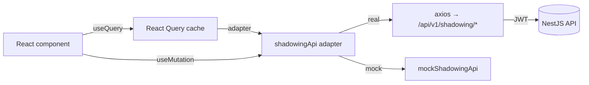
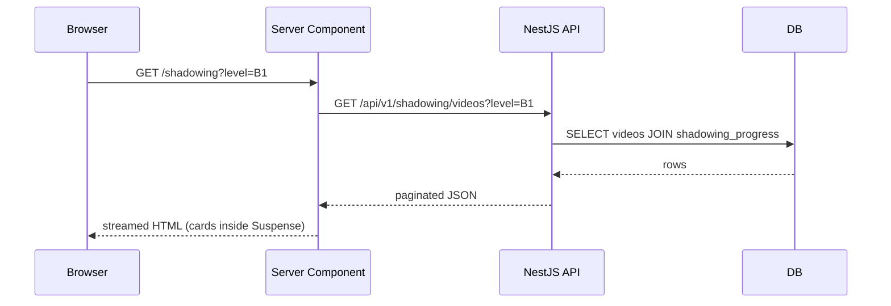
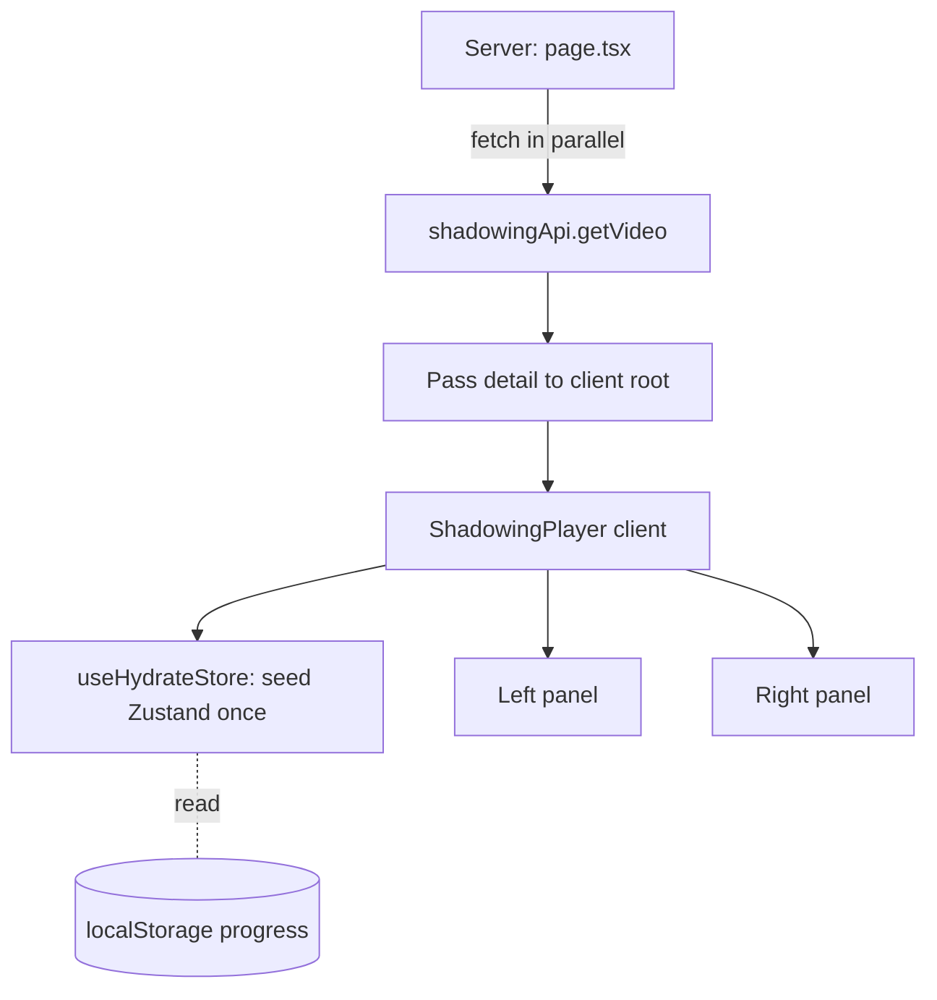
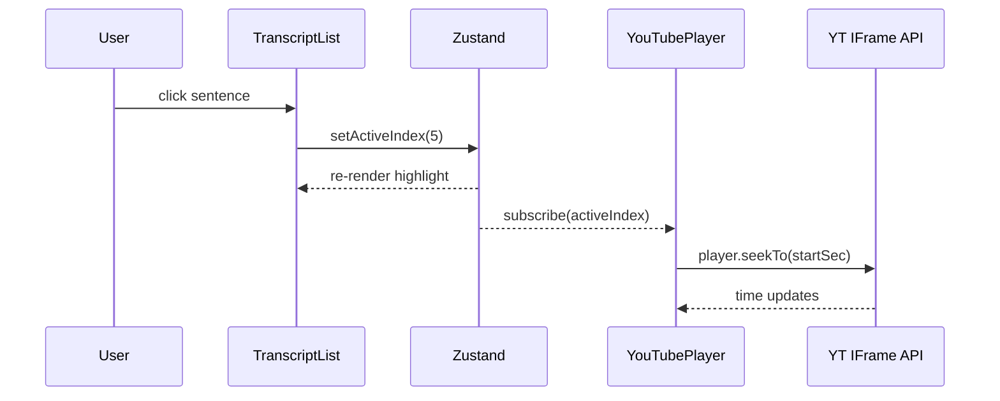
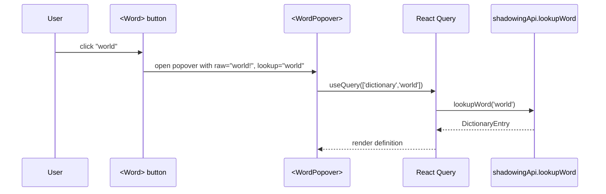
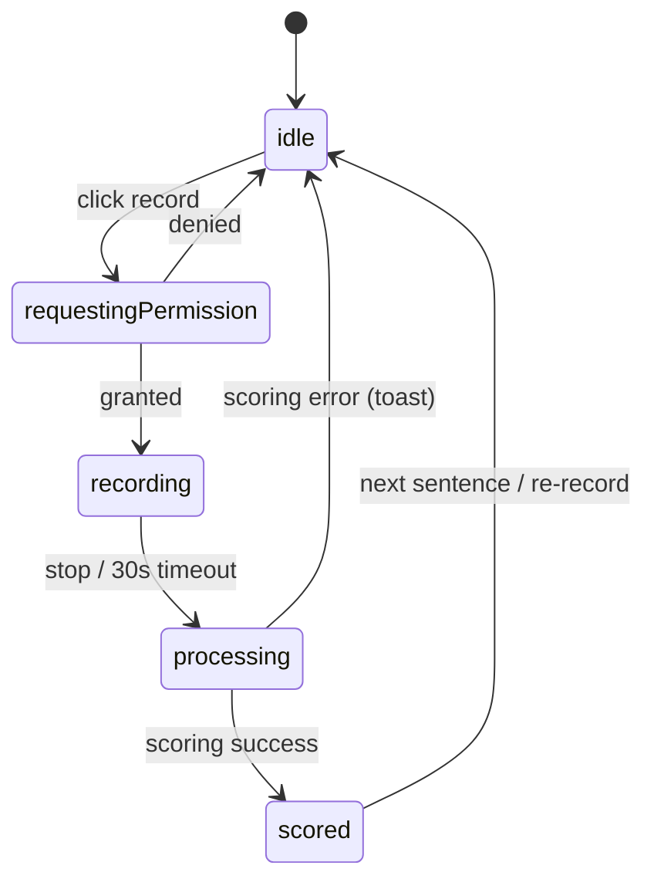
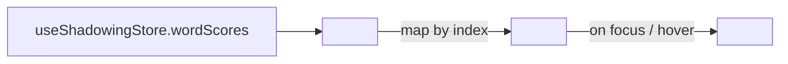
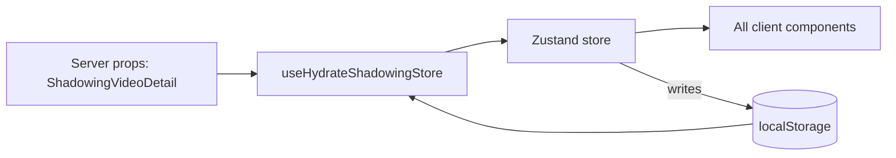
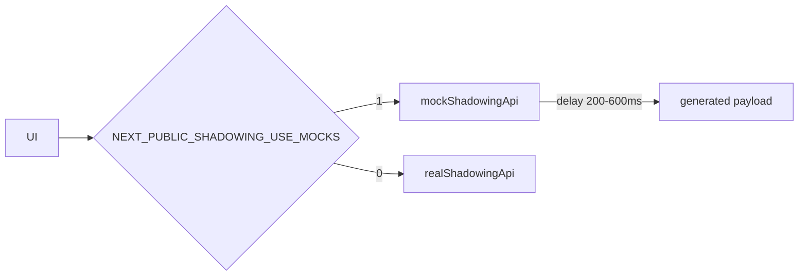

# Interactive Shadowing — Client Implementation Guide

> **Audience:** Frontend engineer implementing Phase 2 of the English Learning Platform.
> **Last updated:** 2026-05-04
> **Scope:** `apps/web` only. Backend endpoints consumed by this guide are stubbed via mocks where their contracts are not yet finalized (dictionary lookup + per-word scoring).

---

> ⚠️ **PREREQUISITE — DO NOT START THIS GUIDE UNTIL:**
>
> All features described in [`admin-panel-implementation-guide.md`](./admin-panel-implementation-guide.md) have been **fully implemented and verified**:
> - Video Category CRUD is operational; categories exist in the database.
> - Video CRUD with YouTube import + subtitle ingestion is working — at least one `videos` row with associated `subtitles` rows must exist.
> - The `videos`, `subtitles`, and `video_categories` tables match `docs/database.md`.
> - The auth stack (`JwtAuthGuard`, `RolesGuard`, NextAuth credentials provider) is operational and the web app can issue authenticated calls to the API.
> - Shared package `@english-platform/shared` exports `DifficultyLevel` and the admin schemas.
>
> **If any of these are incomplete, stop and finish the admin panel guide first.**

---

## Table of Contents

1. [Architecture Overview](#architecture-overview)
2. [Shared Infrastructure](#shared-infrastructure)
3. [Feature 1 — Video List Page](#feature-1--video-list-page)
4. [Feature 2 — Shadowing Player Shell & Layout](#feature-2--shadowing-player-shell--layout)
5. [Feature 3 — Left Panel: YouTube Player + Transcript Sidebar](#feature-3--left-panel-youtube-player--transcript-sidebar)
6. [Feature 4 — Right Panel: Sentence Practice Card](#feature-4--right-panel-sentence-practice-card)
7. [Feature 5 — Microphone & Recording State Machine](#feature-5--microphone--recording-state-machine)
8. [Feature 6 — Per-Word Scoring Display](#feature-6--per-word-scoring-display)
9. [Feature 7 — Playback Controls (Segment, Replay, Speed)](#feature-7--playback-controls-segment-replay-speed)
10. [Feature 8 — State Management & Local Persistence](#feature-8--state-management--local-persistence)
11. [Feature 9 — Accessibility & Keyboard Shortcuts](#feature-9--accessibility--keyboard-shortcuts)
12. [Mock APIs (Dictionary + Scoring)](#mock-apis-dictionary--scoring)
13. [File Index](#file-index)
14. [Verification](#verification)

---

## Architecture Overview

### Page tree

```
apps/web/app/(dashboard)/
├── shadowing/
│   ├── page.tsx                       ← Video list (Server Component, streams cards)
│   └── [videoId]/
│       ├── page.tsx                   ← Player route (Server: fetches video + subtitles)
│       └── _components/               ← Co-located client components
│           ├── shadowing-player.tsx
│           ├── left-panel/
│           │   ├── youtube-player.tsx
│           │   ├── transcript-list.tsx
│           │   └── progress-header.tsx
│           └── right-panel/
│               ├── practice-tabs.tsx
│               ├── sentence-card.tsx
│               ├── word-popover.tsx
│               ├── microphone-panel.tsx
│               ├── recording-button.tsx
│               ├── playback-controls.tsx
│               └── word-score-chips.tsx
```

### Server vs. Client component split

| Concern | Component type | Why |
|---|---|---|
| Video list (catalog) | **Server** | SEO + cacheable; streams in via Suspense. |
| Player route shell | **Server** | Initial fetch of video + subtitles is parallelizable on the server (`async-parallel`). |
| YouTube iframe wrapper | **Client + `next/dynamic`** | Needs `window.YT`; defer to first interaction (`bundle-dynamic-imports`). |
| Transcript list | **Client** | Subscribes to active sentence index. Uses `content-visibility` for long lists. |
| Practice card / mic / scoring | **Client** | Browser APIs (`MediaRecorder`, `enumerateDevices`, dictionary popovers). |

### State ownership

| State | Lives in | Persistence |
|---|---|---|
| Active sentence index | Zustand store, scoped by `videoId` | Memory only |
| Per-sentence completion + best score | Zustand → `localStorage` (lazy init) | localStorage `eep:shadowing:v1:<videoId>` |
| Recording state machine (`idle/recording/processing/scored`) | Zustand | Memory only |
| Word scores (latest attempt) | Zustand | Memory only |
| Toggle visibility (sentence/IPA/translation/show-all) | Zustand | localStorage `eep:shadowing-prefs:v1` |
| Mic device id selection | Zustand | localStorage `eep:shadowing-prefs:v1` |
| Server data (video, subtitles, server-stored progress) | React Query | HTTP cache only |

### Performance budget

- First meaningful paint of the player shell ≤ 1.5 s on cable.
- YouTube iframe + speech polyfills code-split out of the initial bundle (`bundle-dynamic-imports`).
- Transcript list of 200 sentences must scroll at 60 fps (`rendering-content-visibility`).
- Re-renders during recording must not affect the transcript list (selector-based subscriptions, `rerender-derived-state`).

---

## Shared Infrastructure

### Step 1 — Requirement Analysis

The shadowing feature consumes contracts that the admin panel does not yet expose to learners. Before implementing UI, define:

1. **User-facing video catalog endpoint** (`GET /api/v1/shadowing/videos`) — paginated, filterable by `level`, returns thumbnail + per-user progress aggregate.
2. **Video detail with subtitles** (`GET /api/v1/shadowing/videos/:id`) — single round-trip; subtitles ordered by `index`.
3. **Submit attempt** (`POST /api/v1/shadowing/attempts`) — persists `accuracy_score` + `word_scores` to `shadowing_attempts`.
4. **Dictionary lookup** (`GET /api/v1/dictionary/:word`) — placeholder; the client must tolerate a 404 / timeout gracefully.
5. **Pronunciation scoring** (`POST /api/v1/shadowing/score`, `multipart/form-data`) — placeholder; the client mocks it.

**Out of scope for this guide:** implementing the backend endpoints. Until they ship, the client uses an injected `shadowingApi` adapter. Swap the adapter to the real fetcher when contracts land.

### Step 2 — Knowledge Prerequisites

- Zod schemas as the single source of truth (already used by admin guide).
- Axios instance with auth interceptor (already implemented in auth guide as `apps/web/lib/api-client.ts`).
- React Query `useQuery` / `useMutation` with stable query keys.
- Adapter pattern: an interface in `lib/shadowing/api.ts` with a real implementation + a `mockShadowingApi` for development.

### Step 3 — System Flow



### Step 4 — Recommended Solution

- Define Zod schemas in `packages/shared/src/schemas/shadowing.schema.ts`. The frontend imports types; once the backend implements endpoints, it imports the same schemas for validation. **Single source of truth.**
- Create a thin adapter file `apps/web/lib/shadowing/api.ts` that exposes typed methods. Real fetchers are tree-shaken via `bundle-dynamic-imports` — mocks live in a separate file imported only in dev.

### Step 5 — Implementation Code

#### Shared schemas

```ts
// packages/shared/src/schemas/shadowing.schema.ts

import { z } from 'zod';
import { DifficultyLevel } from '../enums';

export const ShadowingSubtitleSchema = z.object({
  id: z.string().uuid(),
  index: z.number().int().min(0),
  startMs: z.number().int().min(0),
  endMs: z.number().int().min(0),
  text: z.string().min(1),
  ipa: z.string().nullable().optional(),
  translation: z.string().nullable().optional(),
});

export const ShadowingVideoSummarySchema = z.object({
  id: z.string().uuid(),
  title: z.string(),
  thumbnailUrl: z.string().url().nullable(),
  durationSec: z.number().int().min(0),
  level: z.nativeEnum(DifficultyLevel).nullable(),
  totalSentences: z.number().int().min(0),
  completedSentences: z.number().int().min(0),
});

export const ShadowingVideoDetailSchema = z.object({
  id: z.string().uuid(),
  title: z.string(),
  description: z.string().nullable(),
  youtubeId: z.string().length(11),
  thumbnailUrl: z.string().url().nullable(),
  durationSec: z.number().int().min(0),
  level: z.nativeEnum(DifficultyLevel).nullable(),
  subtitles: z.array(ShadowingSubtitleSchema).min(1),
});

export const WordScoreSchema = z.object({
  word: z.string(),
  accuracyScore: z.number().min(0).max(100),
  errorType: z.enum(['None', 'Mispronunciation', 'Omission', 'Insertion', 'UnexpectedBreak']),
  expectedPhoneme: z.string().nullable().optional(),
  detectedPhoneme: z.string().nullable().optional(),
});

export const ScoringResultSchema = z.object({
  subtitleId: z.string().uuid(),
  accuracyScore: z.number().min(0).max(100),
  fluencyScore: z.number().min(0).max(100).nullable(),
  completenessScore: z.number().min(0).max(100).nullable(),
  wordScores: z.array(WordScoreSchema),
});

export const DictionaryEntrySchema = z.object({
  word: z.string(),
  ipa: z.string().nullable(),
  partOfSpeech: z.string().nullable(),
  definitions: z.array(z.string()).min(1),
  example: z.string().nullable(),
});

export type ShadowingSubtitle = z.infer<typeof ShadowingSubtitleSchema>;
export type ShadowingVideoSummary = z.infer<typeof ShadowingVideoSummarySchema>;
export type ShadowingVideoDetail = z.infer<typeof ShadowingVideoDetailSchema>;
export type WordScore = z.infer<typeof WordScoreSchema>;
export type ScoringResult = z.infer<typeof ScoringResultSchema>;
export type DictionaryEntry = z.infer<typeof DictionaryEntrySchema>;
```

Update the barrel:

```ts
// packages/shared/src/index.ts

export * from './enums';
export * from './schemas/auth.schema';
export * from './schemas/admin.schema';
export * from './schemas/shadowing.schema';
```

#### Adapter interface

```ts
// apps/web/lib/shadowing/api.ts

import type {
  DictionaryEntry,
  ScoringResult,
  ShadowingVideoDetail,
  ShadowingVideoSummary,
} from '@english-platform/shared';

export interface ShadowingApi {
  listVideos(params: { level?: string; page?: number; limit?: number }): Promise<{
    data: ShadowingVideoSummary[];
    meta: { total: number; page: number; limit: number; totalPages: number };
  }>;
  getVideo(videoId: string): Promise<ShadowingVideoDetail>;
  scoreAudio(input: {
    subtitleId: string;
    audioBlob: Blob;
    referenceText: string;
  }): Promise<ScoringResult>;
  lookupWord(word: string): Promise<DictionaryEntry>;
  saveAttempt(input: {
    subtitleId: string;
    result: ScoringResult;
  }): Promise<void>;
}
```

#### Real adapter (used in production)

```ts
// apps/web/lib/shadowing/real-api.ts

import { apiClient } from '@/lib/api-client';
import {
  DictionaryEntrySchema,
  ScoringResultSchema,
  ShadowingVideoDetailSchema,
  ShadowingVideoSummarySchema,
} from '@english-platform/shared';
import type { ShadowingApi } from './api';

export const realShadowingApi: ShadowingApi = {
  async listVideos({ level, page = 1, limit = 20 }) {
    const { data } = await apiClient.get('/shadowing/videos', {
      params: { level, page, limit },
    });
    return {
      data: data.data.map((v: unknown) => ShadowingVideoSummarySchema.parse(v)),
      meta: data.meta,
    };
  },

  async getVideo(videoId) {
    const { data } = await apiClient.get(`/shadowing/videos/${videoId}`);
    return ShadowingVideoDetailSchema.parse(data);
  },

  async scoreAudio({ subtitleId, audioBlob, referenceText }) {
    const form = new FormData();
    form.append('subtitleId', subtitleId);
    form.append('referenceText', referenceText);
    form.append('audio', audioBlob, 'recording.webm');
    const { data } = await apiClient.post('/shadowing/score', form, {
      headers: { 'Content-Type': 'multipart/form-data' },
    });
    return ScoringResultSchema.parse(data);
  },

  async lookupWord(word) {
    const { data } = await apiClient.get(`/dictionary/${encodeURIComponent(word)}`);
    return DictionaryEntrySchema.parse(data);
  },

  async saveAttempt({ subtitleId, result }) {
    await apiClient.post('/shadowing/attempts', { subtitleId, result });
  },
};
```

#### Adapter selector

```ts
// apps/web/lib/shadowing/index.ts

import { realShadowingApi } from './real-api';
import { mockShadowingApi } from './mock-api';
import type { ShadowingApi } from './api';

const useMocks = process.env.NEXT_PUBLIC_SHADOWING_USE_MOCKS === '1';

export const shadowingApi: ShadowingApi = useMocks ? mockShadowingApi : realShadowingApi;
export type { ShadowingApi } from './api';
```

> The `mockShadowingApi` implementation lives in [Mock APIs](#mock-apis-dictionary--scoring). Set `NEXT_PUBLIC_SHADOWING_USE_MOCKS=1` in `.env.local` while backend endpoints are still in flight.

---

## Feature 1 — Video List Page

### Step 1 — Requirement Analysis

**Functional**
- Grid of videos with thumbnail, title, level badge, and `X / Y sentences` progress.
- Filter by `DifficultyLevel` (chip row at top).
- Clicking a card routes to `/shadowing/<videoId>`.
- Server-rendered list (SEO + fast first paint), streamed via Suspense.

**Edge cases**
- Empty state (no videos in current filter): show illustration + CTA back to "All levels".
- Long titles: truncate to 2 lines with ellipsis.
- Server failure: error boundary with retry.

### Step 2 — Knowledge Prerequisites

- Next.js 16 App Router with Server Components fetching directly (`apps/web/AGENTS.md` warns: "This is NOT the Next.js you know" — read `node_modules/next/dist/docs/` for current data-fetching APIs).
- `React.cache()` for per-request deduplication when the same fetcher is called from multiple Server Components (`server-cache-react`).
- `Suspense` boundary at the grid level so the filter chip row paints first (`async-suspense-boundaries`).
- `next/link` for client-side navigation; pre-fetching is automatic on viewport.

### Step 3 — System Flow



### Step 4 — Recommended Solution

- The filter chip row is a small Client Component that updates the URL search params via `next/navigation`'s `useRouter().push`. The Server Component re-renders.
- Wrap the grid in `<Suspense fallback={<VideoGridSkeleton />}>` so the chips are interactive immediately while the cards stream.
- Use `next/image` for thumbnails with `sizes` set for the responsive grid (lazy-loaded by default).

### Step 5 — Implementation Code

#### Server Component — page.tsx

```tsx
// apps/web/app/(dashboard)/shadowing/page.tsx

import { Suspense } from 'react';
import { DifficultyLevel } from '@english-platform/shared';
import { LevelFilter } from './_components/level-filter';
import { VideoGrid } from './_components/video-grid';
import { VideoGridSkeleton } from './_components/video-grid-skeleton';

export const dynamic = 'force-dynamic';

interface PageProps {
  searchParams: Promise<{ level?: string }>;
}

export default async function ShadowingPage({ searchParams }: PageProps) {
  const { level } = await searchParams;
  const validLevel = isLevel(level) ? level : undefined;

  return (
    <div className="mx-auto max-w-7xl px-6 py-10">
      <header className="mb-8">
        <h1 className="text-3xl font-bold tracking-tight">Shadowing Library</h1>
        <p className="mt-2 text-muted-foreground">
          Pick a video and shadow each sentence. Your progress is saved automatically.
        </p>
      </header>

      <LevelFilter activeLevel={validLevel} />

      <Suspense key={validLevel ?? 'all'} fallback={<VideoGridSkeleton />}>
        <VideoGrid level={validLevel} />
      </Suspense>
    </div>
  );
}

function isLevel(value: string | undefined): value is DifficultyLevel {
  return Object.values(DifficultyLevel).includes(value as DifficultyLevel);
}
```

#### Server Component — VideoGrid (streams)

```tsx
// apps/web/app/(dashboard)/shadowing/_components/video-grid.tsx

import { cache } from 'react';
import { shadowingApi } from '@/lib/shadowing';
import type { DifficultyLevel } from '@english-platform/shared';
import { VideoCard } from './video-card';
import { EmptyState } from './empty-state';

const fetchVideos = cache(async (level: DifficultyLevel | undefined) => {
  return shadowingApi.listVideos({ level, page: 1, limit: 60 });
});

interface Props {
  level: DifficultyLevel | undefined;
}

export async function VideoGrid({ level }: Props) {
  const { data: videos } = await fetchVideos(level);

  if (videos.length === 0) {
    return <EmptyState level={level} />;
  }

  return (
    <ul className="grid grid-cols-1 gap-6 sm:grid-cols-2 lg:grid-cols-3 xl:grid-cols-4">
      {videos.map((video) => (
        <li key={video.id}>
          <VideoCard video={video} />
        </li>
      ))}
    </ul>
  );
}
```

> `cache()` deduplicates within the same request — useful if a layout or generateMetadata also calls `fetchVideos` (`server-cache-react`).

#### VideoCard (Server Component — passes minimal data)

```tsx
// apps/web/app/(dashboard)/shadowing/_components/video-card.tsx

import Image from 'next/image';
import Link from 'next/link';
import type { ShadowingVideoSummary } from '@english-platform/shared';
import { ProgressBar } from '@/components/ui/progress-bar';
import { LevelBadge } from '@/components/ui/level-badge';

interface Props {
  video: ShadowingVideoSummary;
}

export function VideoCard({ video }: Props) {
  const percent = video.totalSentences === 0
    ? 0
    : Math.round((video.completedSentences / video.totalSentences) * 100);

  return (
    <Link
      href={`/shadowing/${video.id}`}
      className="group block overflow-hidden rounded-lg border bg-card transition-colors hover:border-foreground/20"
      prefetch
    >
      <div className="relative aspect-video bg-muted">
        {video.thumbnailUrl ? (
          <Image
            src={video.thumbnailUrl}
            alt=""
            fill
            sizes="(min-width: 1280px) 25vw, (min-width: 1024px) 33vw, (min-width: 640px) 50vw, 100vw"
            className="object-cover transition-transform duration-300 group-hover:scale-[1.02]"
          />
        ) : null}
        <div className="absolute right-3 top-3">
          <LevelBadge level={video.level} />
        </div>
      </div>
      <div className="p-4">
        <h3 className="line-clamp-2 text-sm font-semibold leading-snug">
          {video.title}
        </h3>
        <div className="mt-3 flex items-center justify-between text-xs text-muted-foreground">
          <span>{video.completedSentences} / {video.totalSentences} sentences</span>
          <span>{percent}%</span>
        </div>
        <ProgressBar value={percent} className="mt-2" />
      </div>
    </Link>
  );
}
```

> `rendering-conditional-render`: `video.thumbnailUrl ? <Image /> : null` — never `&&` (avoids accidental `0` / `""` rendering bugs).

#### LevelFilter (Client Component — chip row)

```tsx
// apps/web/app/(dashboard)/shadowing/_components/level-filter.tsx

'use client';

import { useTransition } from 'react';
import { useRouter, usePathname } from 'next/navigation';
import { DifficultyLevel } from '@english-platform/shared';
import { cn } from '@/lib/utils';

const LEVELS: readonly (DifficultyLevel | 'ALL')[] = [
  'ALL',
  DifficultyLevel.A1,
  DifficultyLevel.A2,
  DifficultyLevel.B1,
  DifficultyLevel.B2,
  DifficultyLevel.C1,
  DifficultyLevel.C2,
] as const;

interface Props {
  activeLevel: DifficultyLevel | undefined;
}

export function LevelFilter({ activeLevel }: Props) {
  const router = useRouter();
  const pathname = usePathname();
  const [isPending, startTransition] = useTransition();

  const handleClick = (level: DifficultyLevel | 'ALL') => {
    const next = level === 'ALL' ? pathname : `${pathname}?level=${level}`;
    startTransition(() => {
      router.push(next, { scroll: false });
    });
  };

  return (
    <div
      role="tablist"
      aria-label="Filter videos by difficulty level"
      className={cn('mb-6 flex flex-wrap gap-2', isPending && 'opacity-70')}
    >
      {LEVELS.map((level) => {
        const isActive = level === 'ALL' ? !activeLevel : activeLevel === level;
        return (
          <button
            key={level}
            type="button"
            role="tab"
            aria-selected={isActive}
            onClick={() => handleClick(level)}
            className={cn(
              'rounded-full border px-4 py-1.5 text-sm transition-colors',
              isActive
                ? 'border-foreground bg-foreground text-background'
                : 'border-border bg-card text-muted-foreground hover:border-foreground/40',
            )}
          >
            {level === 'ALL' ? 'All levels' : level}
          </button>
        );
      })}
    </div>
  );
}
```

> `rerender-transitions`: filter changes are wrapped in `startTransition` so the click feels instant even while the new server response streams in.

#### Skeleton

```tsx
// apps/web/app/(dashboard)/shadowing/_components/video-grid-skeleton.tsx

export function VideoGridSkeleton() {
  return (
    <ul className="grid grid-cols-1 gap-6 sm:grid-cols-2 lg:grid-cols-3 xl:grid-cols-4">
      {Array.from({ length: 8 }).map((_, i) => (
        <li
          key={i}
          className="overflow-hidden rounded-lg border bg-card"
          aria-hidden
        >
          <div className="aspect-video animate-pulse bg-muted" />
          <div className="space-y-2 p-4">
            <div className="h-4 w-4/5 animate-pulse rounded bg-muted" />
            <div className="h-3 w-2/5 animate-pulse rounded bg-muted" />
            <div className="h-1.5 w-full animate-pulse rounded bg-muted" />
          </div>
        </li>
      ))}
    </ul>
  );
}
```

#### Reusable primitives

```tsx
// apps/web/components/ui/progress-bar.tsx

import { cn } from '@/lib/utils';

interface Props {
  value: number;
  className?: string;
}

export function ProgressBar({ value, className }: Props) {
  const clamped = Math.max(0, Math.min(100, value));
  return (
    <div
      role="progressbar"
      aria-valuenow={clamped}
      aria-valuemin={0}
      aria-valuemax={100}
      className={cn('h-1.5 w-full overflow-hidden rounded-full bg-muted', className)}
    >
      <div
        className="h-full rounded-full bg-foreground transition-[width] duration-500"
        style={{ width: `${clamped}%` }}
      />
    </div>
  );
}
```

```tsx
// apps/web/components/ui/level-badge.tsx

import { cn } from '@/lib/utils';
import type { DifficultyLevel } from '@english-platform/shared';

interface Props {
  level: DifficultyLevel | null;
}

export function LevelBadge({ level }: Props) {
  if (level === null) return null;
  return (
    <span
      className={cn(
        'rounded-md bg-background/90 px-2 py-0.5 text-xs font-semibold tracking-wide backdrop-blur',
      )}
    >
      {level}
    </span>
  );
}
```

---

## Feature 2 — Shadowing Player Shell & Layout

### Step 1 — Requirement Analysis

The player route needs:
- A two-panel layout (left = video + transcript, right = practice).
- Server-side fetch of the video + subtitles in **one parallel batch** (`async-parallel`).
- A client-side store hydrated from server data + localStorage.
- An error boundary distinct from the catalog (route-level `error.tsx`).

### Step 2 — Knowledge Prerequisites

- Server Components passing serializable data to a client root component (`server-serialization`: pass only what the client needs — no entity instances, no Date objects without `.toISOString()`).
- React Query hydration: optional; for this guide we hand video data into Zustand directly because subtitles never change after load.
- Layout: CSS grid `lg:grid-cols-[minmax(0,1fr)_minmax(0,1fr)]` — explicit `minmax(0, 1fr)` is required to prevent flex children from overflowing.

### Step 3 — System Flow



### Step 4 — Recommended Solution

- Server Component fetches the detail and passes it as a single prop to one client root component (`shadowing-player.tsx`).
- The client root uses a `useHydrateStore` hook (run once) to seed the Zustand store with `videoId`, `subtitles`, persisted progress, and preferences.
- A separate `error.tsx` and `loading.tsx` for graceful failure / streaming.

### Step 5 — Implementation Code

#### Server Component — route page

```tsx
// apps/web/app/(dashboard)/shadowing/[videoId]/page.tsx

import { notFound } from 'next/navigation';
import { shadowingApi } from '@/lib/shadowing';
import { ShadowingPlayer } from './_components/shadowing-player';

interface Props {
  params: Promise<{ videoId: string }>;
}

export default async function VideoPlayerPage({ params }: Props) {
  const { videoId } = await params;

  const video = await shadowingApi.getVideo(videoId).catch(() => null);
  if (!video) notFound();

  return <ShadowingPlayer video={video} />;
}

export async function generateMetadata({ params }: Props) {
  const { videoId } = await params;
  const video = await shadowingApi.getVideo(videoId).catch(() => null);
  return { title: video ? `Shadowing — ${video.title}` : 'Shadowing' };
}
```

> Both `page` and `generateMetadata` call `getVideo`. With `cache()` wrapping in the adapter (or using `unstable_cache`), only one fetch hits the API per request.

#### Loading + Error UI

```tsx
// apps/web/app/(dashboard)/shadowing/[videoId]/loading.tsx

export default function Loading() {
  return (
    <div className="grid h-screen place-items-center bg-background">
      <div
        className="h-10 w-10 animate-spin rounded-full border-2 border-muted border-t-foreground"
        aria-label="Loading video"
      />
    </div>
  );
}
```

```tsx
// apps/web/app/(dashboard)/shadowing/[videoId]/error.tsx

'use client';

import { useEffect } from 'react';
import Link from 'next/link';

export default function PlayerError({
  error,
  reset,
}: {
  error: Error & { digest?: string };
  reset: () => void;
}) {
  useEffect(() => {
    console.error('Shadowing player crashed', error);
  }, [error]);

  return (
    <div className="mx-auto max-w-md px-6 py-24 text-center">
      <h1 className="text-2xl font-bold">Something went wrong</h1>
      <p className="mt-2 text-muted-foreground">
        We could not load this video. The link may be broken or the server is down.
      </p>
      <div className="mt-6 flex justify-center gap-3">
        <button
          type="button"
          onClick={reset}
          className="rounded-md border px-4 py-2 text-sm hover:bg-muted"
        >
          Try again
        </button>
        <Link
          href="/shadowing"
          className="rounded-md bg-foreground px-4 py-2 text-sm text-background hover:opacity-90"
        >
          Back to library
        </Link>
      </div>
    </div>
  );
}
```

#### Client root — ShadowingPlayer

```tsx
// apps/web/app/(dashboard)/shadowing/[videoId]/_components/shadowing-player.tsx

'use client';

import { useEffect } from 'react';
import dynamic from 'next/dynamic';
import type { ShadowingVideoDetail } from '@english-platform/shared';
import { useShadowingStore } from '@/lib/shadowing/store';
import { useHydrateShadowingStore } from '@/lib/shadowing/use-hydrate-store';
import { LeftPanel } from './left-panel/left-panel';
import { LeftPanelSkeleton } from './left-panel/left-panel-skeleton';

const RightPanel = dynamic(
  () => import('./right-panel/right-panel').then((m) => m.RightPanel),
  { ssr: false, loading: () => <RightPanelSkeleton /> },
);

interface Props {
  video: ShadowingVideoDetail;
}

export function ShadowingPlayer({ video }: Props) {
  useHydrateShadowingStore(video);

  const isHydrated = useShadowingStore((s) => s.isHydrated);

  return (
    <main className="grid h-[calc(100vh-4rem)] grid-cols-1 gap-px bg-border lg:grid-cols-[minmax(0,1fr)_minmax(0,1fr)]">
      <section className="bg-background lg:overflow-hidden" aria-label="Video and transcript">
        {isHydrated ? <LeftPanel /> : <LeftPanelSkeleton />}
      </section>
      <section className="bg-background lg:overflow-hidden" aria-label="Practice">
        {isHydrated ? <RightPanel /> : <RightPanelSkeleton />}
      </section>
    </main>
  );
}

function RightPanelSkeleton() {
  return (
    <div className="flex h-full items-center justify-center">
      <div
        className="h-8 w-8 animate-spin rounded-full border-2 border-muted border-t-foreground"
        aria-label="Loading practice panel"
      />
    </div>
  );
}
```

> `bundle-dynamic-imports`: the right panel pulls in MediaRecorder + audio-utils. Code-splitting it cuts ~30 KB from the initial player payload.
> `rerender-derived-state`: `useShadowingStore((s) => s.isHydrated)` returns a primitive — only re-renders on flip from false → true.

The `useHydrateShadowingStore` hook and Zustand store appear in [Feature 8](#feature-8--state-management--local-persistence).

---

## Feature 3 — Left Panel: YouTube Player + Transcript Sidebar

### Step 1 — Requirement Analysis

**Layout (top-down)**
1. YouTube iframe (16:9).
2. "Skip to start" button beneath the player → seeks to `subtitles[0].startMs`.
3. Progress header (`X / total · NN%` + bar).
4. "Show" toggle (reveals real text in transcript).
5. Transcript list (each item: number, blurred or revealed text, completion radio).

**Behaviors**
- Clicking a transcript row sets the active sentence and seeks the YouTube player to that timestamp.
- Active row is visually highlighted; auto-scrolls into view when the active index changes.
- Completed rows render a filled radio dot.
- Masked text uses dot pattern — but is still **selectable** for accessibility (do not block `user-select`).

### Step 2 — Knowledge Prerequisites

- YouTube IFrame API (`window.YT`) — must be loaded once, asynchronously. Use a singleton loader.
- The IFrame API is browser-only, so this whole panel must be a client component, dynamically imported.
- `IntersectionObserver` for "auto-scroll active row into view" without thrashing.
- `content-visibility: auto` on each row for cheap virtualization on lists of 200+ sentences (`rendering-content-visibility`).

### Step 3 — System Flow



### Step 4 — Recommended Solution

- A `useYouTubeApi` hook lazily loads the IFrame API once across the app.
- The `YouTubePlayer` component memoizes its `playerVars` so the iframe never re-mounts (re-mounting an iframe is expensive and resets playback).
- The `TranscriptList` subscribes to `activeIndex` only — not to the whole store. Row components subscribe to their own derived selector (`isActive`, `isCompleted`) so a click on row #5 does not re-render rows #1–4 or #6+.
- Auto-scroll uses `scrollIntoView({ block: 'center', behavior: 'smooth' })` debounced via `requestAnimationFrame`.

### Step 5 — Implementation Code

#### YouTube IFrame API loader (singleton)

```ts
// apps/web/lib/shadowing/youtube-api.ts

declare global {
  interface Window {
    YT?: typeof YT;
    onYouTubeIframeAPIReady?: () => void;
  }
}

let loaderPromise: Promise<typeof YT> | null = null;

export function loadYouTubeApi(): Promise<typeof YT> {
  if (typeof window === 'undefined') {
    return Promise.reject(new Error('YouTube API only available in the browser'));
  }
  if (window.YT && window.YT.Player) {
    return Promise.resolve(window.YT);
  }
  if (loaderPromise) return loaderPromise;

  loaderPromise = new Promise((resolve, reject) => {
    const existing = document.querySelector<HTMLScriptElement>(
      'script[src="https://www.youtube.com/iframe_api"]',
    );
    if (!existing) {
      const tag = document.createElement('script');
      tag.src = 'https://www.youtube.com/iframe_api';
      tag.async = true;
      tag.onerror = () => reject(new Error('Failed to load YouTube IFrame API'));
      document.head.appendChild(tag);
    }
    window.onYouTubeIframeAPIReady = () => {
      if (window.YT) resolve(window.YT);
      else reject(new Error('YT global not available after API ready'));
    };
  });

  return loaderPromise;
}
```

> Module-level `loaderPromise` is a single-instance cache (`server-cache-lru` analog for the client).

#### Type augmentation

```ts
// apps/web/types/youtube-iframe.d.ts

declare namespace YT {
  interface Player {
    playVideo(): void;
    pauseVideo(): void;
    seekTo(seconds: number, allowSeekAhead?: boolean): void;
    getCurrentTime(): number;
    setPlaybackRate(rate: number): void;
    getPlaybackRate(): number;
    destroy(): void;
  }
  interface PlayerEvent { target: Player }
  interface OnStateChangeEvent extends PlayerEvent { data: number }
  const PlayerState: { ENDED: 0; PLAYING: 1; PAUSED: 2; BUFFERING: 3; CUED: 5 };
  // eslint-disable-next-line @typescript-eslint/no-misused-new
  const Player: new (
    elementId: string | HTMLElement,
    options: {
      videoId: string;
      playerVars?: Record<string, unknown>;
      events?: {
        onReady?: (e: PlayerEvent) => void;
        onStateChange?: (e: OnStateChangeEvent) => void;
      };
    },
  ) => Player;
}
```

#### YouTubePlayer component

```tsx
// apps/web/app/(dashboard)/shadowing/[videoId]/_components/left-panel/youtube-player.tsx

'use client';

import { memo, useEffect, useRef } from 'react';
import { loadYouTubeApi } from '@/lib/shadowing/youtube-api';
import { useShadowingStore } from '@/lib/shadowing/store';

interface Props {
  youtubeId: string;
}

export const YouTubePlayer = memo(function YouTubePlayer({ youtubeId }: Props) {
  const containerRef = useRef<HTMLDivElement | null>(null);
  const playerRef = useRef<YT.Player | null>(null);
  const setPlayerHandle = useShadowingStore((s) => s.setPlayerHandle);

  useEffect(() => {
    let cancelled = false;
    loadYouTubeApi()
      .then((YT) => {
        if (cancelled || !containerRef.current) return;
        const player = new YT.Player(containerRef.current, {
          videoId: youtubeId,
          playerVars: { rel: 0, modestbranding: 1, playsinline: 1 },
          events: {
            onReady: () => {
              if (!cancelled) setPlayerHandle(player);
            },
          },
        });
        playerRef.current = player;
      })
      .catch((err) => console.error(err));

    return () => {
      cancelled = true;
      setPlayerHandle(null);
      playerRef.current?.destroy();
      playerRef.current = null;
    };
  }, [youtubeId, setPlayerHandle]);

  return (
    <div className="aspect-video w-full bg-black">
      <div ref={containerRef} className="h-full w-full" />
    </div>
  );
});
```

> The component is wrapped in `memo` and depends only on `youtubeId`. The store handle is set once via a stable callback — the iframe never remounts during a session.

#### LeftPanel composition

```tsx
// apps/web/app/(dashboard)/shadowing/[videoId]/_components/left-panel/left-panel.tsx

'use client';

import { useShadowingStore } from '@/lib/shadowing/store';
import { YouTubePlayer } from './youtube-player';
import { ProgressHeader } from './progress-header';
import { TranscriptList } from './transcript-list';
import { SkipToStartButton } from './skip-to-start-button';
import { ShowTextToggle } from './show-text-toggle';

export function LeftPanel() {
  const youtubeId = useShadowingStore((s) => s.video?.youtubeId);

  if (!youtubeId) return null;

  return (
    <div className="flex h-full flex-col">
      <YouTubePlayer youtubeId={youtubeId} />

      <div className="flex items-center justify-between border-b px-4 py-3">
        <SkipToStartButton />
        <ShowTextToggle />
      </div>

      <ProgressHeader />

      <div className="min-h-0 flex-1 overflow-y-auto" data-testid="transcript-scroller">
        <TranscriptList />
      </div>
    </div>
  );
}
```

#### SkipToStartButton

```tsx
// apps/web/app/(dashboard)/shadowing/[videoId]/_components/left-panel/skip-to-start-button.tsx

'use client';

import { useCallback } from 'react';
import { useShadowingStore } from '@/lib/shadowing/store';
import { Rewind } from 'lucide-react';

export function SkipToStartButton() {
  const seekToIndex = useShadowingStore((s) => s.seekToIndex);

  const handleClick = useCallback(() => {
    seekToIndex(0);
  }, [seekToIndex]);

  return (
    <button
      type="button"
      onClick={handleClick}
      className="inline-flex items-center gap-2 rounded-md border px-3 py-1.5 text-sm font-medium hover:bg-muted"
    >
      <Rewind className="h-4 w-4" aria-hidden />
      Skip to start
    </button>
  );
}
```

#### ShowTextToggle

```tsx
// apps/web/app/(dashboard)/shadowing/[videoId]/_components/left-panel/show-text-toggle.tsx

'use client';

import { useShadowingStore } from '@/lib/shadowing/store';
import { Eye, EyeOff } from 'lucide-react';
import { cn } from '@/lib/utils';

export function ShowTextToggle() {
  const show = useShadowingStore((s) => s.prefs.revealAllInTranscript);
  const toggle = useShadowingStore((s) => s.toggleRevealAllInTranscript);

  return (
    <button
      type="button"
      role="switch"
      aria-checked={show}
      onClick={toggle}
      className={cn(
        'inline-flex items-center gap-2 rounded-md border px-3 py-1.5 text-sm font-medium transition-colors',
        show ? 'bg-foreground text-background' : 'hover:bg-muted',
      )}
    >
      {show ? <Eye className="h-4 w-4" aria-hidden /> : <EyeOff className="h-4 w-4" aria-hidden />}
      <span>{show ? 'Hide' : 'Show'}</span>
    </button>
  );
}
```

#### ProgressHeader

```tsx
// apps/web/app/(dashboard)/shadowing/[videoId]/_components/left-panel/progress-header.tsx

'use client';

import { useShadowingStore } from '@/lib/shadowing/store';
import { ProgressBar } from '@/components/ui/progress-bar';

export function ProgressHeader() {
  const completedCount = useShadowingStore((s) => s.completedCount);
  const total = useShadowingStore((s) => s.video?.subtitles.length ?? 0);
  const percent = total === 0 ? 0 : Math.round((completedCount / total) * 100);

  return (
    <div className="border-b px-4 py-3">
      <div className="mb-2 flex items-baseline justify-between">
        <span className="text-sm font-medium">
          {completedCount} / {total}
          <span className="ml-1 text-muted-foreground">sentences</span>
        </span>
        <span className="text-sm font-semibold">{percent}%</span>
      </div>
      <ProgressBar value={percent} />
    </div>
  );
}
```

> `rerender-derived-state`: subscribing to `completedCount` (a number) instead of the whole `completedSet` — the header only re-renders when the count flips.

#### TranscriptList

```tsx
// apps/web/app/(dashboard)/shadowing/[videoId]/_components/left-panel/transcript-list.tsx

'use client';

import { memo, useEffect, useRef } from 'react';
import { useShadowingStore } from '@/lib/shadowing/store';
import { TranscriptRow } from './transcript-row';

export function TranscriptList() {
  const subtitles = useShadowingStore((s) => s.video?.subtitles ?? []);
  const activeIndex = useShadowingStore((s) => s.activeIndex);
  const activeRowRef = useRef<HTMLLIElement | null>(null);

  useEffect(() => {
    const id = requestAnimationFrame(() => {
      activeRowRef.current?.scrollIntoView({ block: 'center', behavior: 'smooth' });
    });
    return () => cancelAnimationFrame(id);
  }, [activeIndex]);

  return (
    <ol className="divide-y">
      {subtitles.map((subtitle, index) => (
        <MemoRow
          key={subtitle.id}
          index={index}
          ref={index === activeIndex ? activeRowRef : null}
        />
      ))}
    </ol>
  );
}

const MemoRow = memo(
  function MemoRow({
    index,
    ref,
  }: {
    index: number;
    ref: React.Ref<HTMLLIElement> | null;
  }) {
    return <TranscriptRow index={index} rowRef={ref} />;
  },
  (prev, next) => prev.index === next.index,
);
```

> `MemoRow` only forwards the index. The row itself subscribes to its own slice of state, so changing `activeIndex` only re-renders the new and old active rows — not the entire list.

#### TranscriptRow

```tsx
// apps/web/app/(dashboard)/shadowing/[videoId]/_components/left-panel/transcript-row.tsx

'use client';

import { useCallback } from 'react';
import { useShadowingStore } from '@/lib/shadowing/store';
import { cn } from '@/lib/utils';
import { CheckCircle2, Circle } from 'lucide-react';
import { maskSentence } from '@/lib/shadowing/mask';

interface Props {
  index: number;
  rowRef: React.Ref<HTMLLIElement> | null;
}

export function TranscriptRow({ index, rowRef }: Props) {
  const text = useShadowingStore((s) => s.video?.subtitles[index]?.text ?? '');
  const isActive = useShadowingStore((s) => s.activeIndex === index);
  const isCompleted = useShadowingStore((s) => s.completedIndices.has(index));
  const reveal = useShadowingStore((s) => s.prefs.revealAllInTranscript);
  const seekToIndex = useShadowingStore((s) => s.seekToIndex);

  const handleClick = useCallback(() => seekToIndex(index), [index, seekToIndex]);

  const showRealText = reveal || isActive || isCompleted;
  const display = showRealText ? text : maskSentence(text);

  return (
    <li
      ref={rowRef}
      style={{ contentVisibility: 'auto', containIntrinsicSize: '64px' }}
    >
      <button
        type="button"
        onClick={handleClick}
        aria-current={isActive ? 'true' : undefined}
        className={cn(
          'flex w-full items-start gap-3 px-4 py-3 text-left text-sm transition-colors',
          isActive ? 'bg-muted/80' : 'hover:bg-muted/40',
        )}
      >
        <span className="mt-0.5 shrink-0 text-xs font-semibold tabular-nums text-muted-foreground">
          #{index + 1}
        </span>
        <span
          className={cn(
            'min-w-0 flex-1 leading-relaxed',
            !showRealText && 'tracking-widest text-muted-foreground',
          )}
        >
          {display}
        </span>
        <span className="mt-0.5 shrink-0">
          {isCompleted ? (
            <CheckCircle2 className="h-4 w-4 text-foreground" aria-label="Completed" />
          ) : (
            <Circle className="h-4 w-4 text-muted-foreground/50" aria-hidden />
          )}
        </span>
      </button>
    </li>
  );
}
```

> `rendering-content-visibility`: each row declares its intrinsic size, letting the browser skip layout/paint for off-screen rows. This is the cheapest way to handle 200+ sentences without virtualization libraries.
> `rerender-derived-state`: `s.completedIndices.has(index)` returns a boolean per row.

#### Mask helper

```ts
// apps/web/lib/shadowing/mask.ts

const MASK_CHAR = '•';

export function maskSentence(text: string): string {
  return text
    .split(/(\s+)/)
    .map((token) => (/^\s+$/.test(token) ? token : MASK_CHAR.repeat(Math.max(2, token.length))))
    .join('');
}
```

> Selectable, copy-able masking. Whitespace is preserved so the line still wraps naturally.

---

## Feature 4 — Right Panel: Sentence Practice Card

### Step 1 — Requirement Analysis

**Composition (top-down)**
1. Mode tabs (`Shadowing` | `Dictation`). Build the shell; only `Shadowing` is wired up.
2. Sentence card:
   - Number badge + word count (`#1 · 18 words`).
   - Toggle row: Sentence / IPA / Translation visibility.
   - Sentence text — large, every word individually clickable for dictionary lookup.
   - IPA line below (when toggled).
   - Translation line below IPA (when toggled).
3. Word score chips (rendered after a successful score).
4. Microphone & recording (separate feature).
5. Playback controls (separate feature).
6. `Next →` button.

**Word-click dictionary lookup**
- Click a word → open a popover with definition, IPA, example.
- Strip punctuation before lookup (`Hello, world!` → `Hello`, `world`).
- Lookups are React Query–cached by lowercased word so re-clicks are instant (`client-swr-dedup`).
- Loading spinner inside the popover; error shows a "Word not found" state.

### Step 2 — Knowledge Prerequisites

- Radix UI `Popover` (already in `radix-ui` dep) for accessible click-outside + focus management.
- React Query `useQuery({ enabled, queryKey: ['dictionary', word] })` + `staleTime: Infinity` for dictionary entries.
- Word tokenization: split on whitespace, store the original token + a normalized lookup key.

### Step 3 — System Flow



### Step 4 — Recommended Solution

- `SentenceCard` reads only the active subtitle (one selector returning a primitive id), so unrelated state changes don't re-render the whole card (`rerender-derived-state`).
- `Word` is its own component; props are stable (`raw`, `lookupKey`). Memoized.
- `WordPopover` lazy-fires the query — `enabled: open` — so closed words never trigger network calls.
- Toggle states (`showSentence`, `showIpa`, `showTranslation`) live in the store under `prefs` (persisted) so reload remembers the user's preference.

### Step 5 — Implementation Code

#### RightPanel composition

```tsx
// apps/web/app/(dashboard)/shadowing/[videoId]/_components/right-panel/right-panel.tsx

'use client';

import { useShadowingStore } from '@/lib/shadowing/store';
import { PracticeTabs } from './practice-tabs';
import { SentenceCard } from './sentence-card';
import { MicrophonePanel } from './microphone-panel';
import { PlaybackControls } from './playback-controls';
import { WordScoreChips } from './word-score-chips';
import { NextButton } from './next-button';

export function RightPanel() {
  const mode = useShadowingStore((s) => s.mode);

  return (
    <div className="flex h-full flex-col">
      <PracticeTabs />
      {mode === 'shadowing' ? (
        <div className="flex min-h-0 flex-1 flex-col gap-6 overflow-y-auto p-6">
          <SentenceCard />
          <WordScoreChips />
          <MicrophonePanel />
          <PlaybackControls />
          <NextButton />
        </div>
      ) : (
        <DictationPlaceholder />
      )}
    </div>
  );
}

function DictationPlaceholder() {
  return (
    <div className="grid flex-1 place-items-center p-6 text-center">
      <p className="max-w-sm text-sm text-muted-foreground">
        Dictation mode is coming soon. For now, use the Shadowing tab.
      </p>
    </div>
  );
}
```

#### PracticeTabs

```tsx
// apps/web/app/(dashboard)/shadowing/[videoId]/_components/right-panel/practice-tabs.tsx

'use client';

import { useShadowingStore } from '@/lib/shadowing/store';
import { cn } from '@/lib/utils';

const TABS = [
  { id: 'shadowing', label: 'Shadowing' },
  { id: 'dictation', label: 'Dictation' },
] as const;

export function PracticeTabs() {
  const mode = useShadowingStore((s) => s.mode);
  const setMode = useShadowingStore((s) => s.setMode);

  return (
    <div role="tablist" aria-label="Practice mode" className="flex border-b">
      {TABS.map((tab) => (
        <button
          key={tab.id}
          type="button"
          role="tab"
          aria-selected={mode === tab.id}
          onClick={() => setMode(tab.id)}
          className={cn(
            'flex-1 border-b-2 px-4 py-3 text-sm font-medium transition-colors',
            mode === tab.id
              ? 'border-foreground text-foreground'
              : 'border-transparent text-muted-foreground hover:text-foreground',
          )}
        >
          {tab.label}
        </button>
      ))}
    </div>
  );
}
```

#### SentenceCard

```tsx
// apps/web/app/(dashboard)/shadowing/[videoId]/_components/right-panel/sentence-card.tsx

'use client';

import { useMemo } from 'react';
import { useShadowingStore } from '@/lib/shadowing/store';
import { tokenizeSentence } from '@/lib/shadowing/tokenize';
import { Word } from './word';
import { ToggleVisibilityRow } from './toggle-visibility-row';

export function SentenceCard() {
  const subtitle = useShadowingStore((s) =>
    s.video ? s.video.subtitles[s.activeIndex] ?? null : null,
  );
  const showSentence = useShadowingStore((s) => s.prefs.showSentence);
  const showIpa = useShadowingStore((s) => s.prefs.showIpa);
  const showTranslation = useShadowingStore((s) => s.prefs.showTranslation);

  const tokens = useMemo(
    () => (subtitle ? tokenizeSentence(subtitle.text) : []),
    [subtitle?.text],
  );

  if (!subtitle) return null;

  const wordCount = tokens.filter((t) => t.kind === 'word').length;

  return (
    <article className="rounded-lg border bg-card p-6">
      <header className="mb-4 flex items-center justify-between">
        <span className="inline-flex items-center gap-2 text-sm font-semibold">
          <span className="rounded-md bg-foreground px-2 py-0.5 text-xs text-background">
            #{subtitle.index + 1}
          </span>
          <span className="text-muted-foreground">·</span>
          <span className="tabular-nums text-muted-foreground">{wordCount} words</span>
        </span>
        <ToggleVisibilityRow />
      </header>

      {showSentence ? (
        <p
          className="select-text text-2xl leading-relaxed tracking-tight"
          lang="en"
        >
          {tokens.map((token, i) =>
            token.kind === 'word' ? (
              <Word
                key={`${i}-${token.raw}`}
                raw={token.raw}
                lookupKey={token.lookupKey}
              />
            ) : (
              <span key={`${i}-ws`}>{token.raw}</span>
            ),
          )}
        </p>
      ) : (
        <p className="text-2xl tracking-widest text-muted-foreground" aria-hidden>
          {tokens.map((t) => (t.kind === 'word' ? '••••' : t.raw)).join('')}
        </p>
      )}

      {showIpa && subtitle.ipa ? (
        <p className="mt-3 font-mono text-base text-muted-foreground" aria-label="IPA">
          /{subtitle.ipa}/
        </p>
      ) : null}

      {showTranslation && subtitle.translation ? (
        <p className="mt-3 text-base italic text-muted-foreground" lang="vi">
          {subtitle.translation}
        </p>
      ) : null}
    </article>
  );
}
```

#### Tokenizer

```ts
// apps/web/lib/shadowing/tokenize.ts

export type Token =
  | { kind: 'word'; raw: string; lookupKey: string }
  | { kind: 'whitespace'; raw: string };

const WORD_REGEX = /[A-Za-z][A-Za-z'-]*/;

export function tokenizeSentence(text: string): Token[] {
  const out: Token[] = [];
  let buffer = '';
  let i = 0;

  while (i < text.length) {
    const ch = text[i];
    if (/\s/.test(ch)) {
      if (buffer) {
        out.push(toToken(buffer));
        buffer = '';
      }
      out.push({ kind: 'whitespace', raw: ch });
    } else {
      buffer += ch;
    }
    i++;
  }
  if (buffer) out.push(toToken(buffer));
  return out;
}

function toToken(raw: string): Token {
  const match = raw.match(WORD_REGEX);
  return {
    kind: 'word',
    raw,
    lookupKey: (match ? match[0] : raw).toLowerCase(),
  };
}
```

#### Word + WordPopover

```tsx
// apps/web/app/(dashboard)/shadowing/[videoId]/_components/right-panel/word.tsx

'use client';

import { memo, useState } from 'react';
import { Popover, PopoverContent, PopoverTrigger } from '@/components/ui/popover';
import { WordPopover } from './word-popover';

interface Props {
  raw: string;
  lookupKey: string;
}

export const Word = memo(function Word({ raw, lookupKey }: Props) {
  const [open, setOpen] = useState(false);

  return (
    <Popover open={open} onOpenChange={setOpen}>
      <PopoverTrigger asChild>
        <button
          type="button"
          className="rounded-sm px-0.5 transition-colors hover:bg-muted focus-visible:bg-muted focus-visible:outline-none"
        >
          {raw}
        </button>
      </PopoverTrigger>
      <PopoverContent align="center" className="w-72 p-4" sideOffset={8}>
        <WordPopover lookupKey={lookupKey} open={open} />
      </PopoverContent>
    </Popover>
  );
});
```

```tsx
// apps/web/app/(dashboard)/shadowing/[videoId]/_components/right-panel/word-popover.tsx

'use client';

import { useQuery } from '@tanstack/react-query';
import { shadowingApi } from '@/lib/shadowing';
import { Loader2, AlertCircle } from 'lucide-react';

interface Props {
  lookupKey: string;
  open: boolean;
}

export function WordPopover({ lookupKey, open }: Props) {
  const { data, isLoading, isError } = useQuery({
    queryKey: ['dictionary', lookupKey],
    queryFn: () => shadowingApi.lookupWord(lookupKey),
    enabled: open && lookupKey.length > 0,
    staleTime: Infinity,
    retry: 1,
  });

  if (isLoading) {
    return (
      <div className="flex items-center justify-center py-6">
        <Loader2 className="h-5 w-5 animate-spin text-muted-foreground" aria-label="Loading" />
      </div>
    );
  }

  if (isError || !data) {
    return (
      <div className="flex flex-col items-center gap-2 py-4 text-center text-sm text-muted-foreground">
        <AlertCircle className="h-5 w-5" aria-hidden />
        <span>Word not found.</span>
      </div>
    );
  }

  return (
    <div className="space-y-2">
      <div className="flex items-baseline gap-2">
        <h4 className="text-base font-semibold">{data.word}</h4>
        {data.ipa ? (
          <span className="font-mono text-xs text-muted-foreground">/{data.ipa}/</span>
        ) : null}
        {data.partOfSpeech ? (
          <span className="text-xs italic text-muted-foreground">{data.partOfSpeech}</span>
        ) : null}
      </div>
      <ul className="space-y-1 text-sm">
        {data.definitions.map((def, i) => (
          <li key={i}>
            <span className="text-muted-foreground">{i + 1}.</span> {def}
          </li>
        ))}
      </ul>
      {data.example ? (
        <p className="border-t pt-2 text-xs italic text-muted-foreground">
          “{data.example}”
        </p>
      ) : null}
    </div>
  );
}
```

> `client-swr-dedup`: React Query dedupes concurrent calls for the same word and caches results forever (`staleTime: Infinity`).

#### ToggleVisibilityRow

```tsx
// apps/web/app/(dashboard)/shadowing/[videoId]/_components/right-panel/toggle-visibility-row.tsx

'use client';

import { useShadowingStore } from '@/lib/shadowing/store';
import { cn } from '@/lib/utils';

const TOGGLES = [
  { key: 'showSentence', label: 'Sentence' },
  { key: 'showIpa', label: 'IPA' },
  { key: 'showTranslation', label: 'Translation' },
] as const;

export function ToggleVisibilityRow() {
  const prefs = useShadowingStore((s) => s.prefs);
  const togglePref = useShadowingStore((s) => s.togglePref);

  return (
    <div className="flex gap-2" role="group" aria-label="Toggle visibility">
      {TOGGLES.map(({ key, label }) => {
        const on = prefs[key];
        return (
          <button
            key={key}
            type="button"
            role="switch"
            aria-checked={on}
            onClick={() => togglePref(key)}
            className={cn(
              'rounded-md border px-2.5 py-1 text-xs font-medium transition-colors',
              on
                ? 'border-foreground bg-foreground text-background'
                : 'border-border bg-card text-muted-foreground hover:border-foreground/40',
            )}
          >
            {label}
          </button>
        );
      })}
    </div>
  );
}
```

#### Popover primitive

```tsx
// apps/web/components/ui/popover.tsx

'use client';

import * as PopoverPrimitive from '@radix-ui/react-popover';
import { cn } from '@/lib/utils';

export const Popover = PopoverPrimitive.Root;
export const PopoverTrigger = PopoverPrimitive.Trigger;

export function PopoverContent({
  className,
  align = 'center',
  sideOffset = 4,
  ...props
}: React.ComponentProps<typeof PopoverPrimitive.Content>) {
  return (
    <PopoverPrimitive.Portal>
      <PopoverPrimitive.Content
        align={align}
        sideOffset={sideOffset}
        className={cn(
          'z-50 rounded-lg border bg-popover text-popover-foreground shadow-md outline-none',
          'data-[state=open]:animate-in data-[state=closed]:animate-out',
          className,
        )}
        {...props}
      />
    </PopoverPrimitive.Portal>
  );
}
```

> `bundle-barrel-imports`: import Radix from `@radix-ui/react-popover` directly, not from the `radix-ui` umbrella package.

#### NextButton

```tsx
// apps/web/app/(dashboard)/shadowing/[videoId]/_components/right-panel/next-button.tsx

'use client';

import { useCallback } from 'react';
import { ArrowRight } from 'lucide-react';
import { useShadowingStore } from '@/lib/shadowing/store';

export function NextButton() {
  const advance = useShadowingStore((s) => s.advanceToNext);
  const hasNext = useShadowingStore((s) => {
    if (!s.video) return false;
    return s.activeIndex < s.video.subtitles.length - 1;
  });

  const handleClick = useCallback(() => advance(), [advance]);

  return (
    <button
      type="button"
      onClick={handleClick}
      disabled={!hasNext}
      className="ml-auto inline-flex items-center gap-2 rounded-md bg-foreground px-4 py-2 text-sm font-medium text-background transition-opacity disabled:opacity-40"
    >
      Next
      <ArrowRight className="h-4 w-4" aria-hidden />
    </button>
  );
}
```

---

## Feature 5 — Microphone & Recording State Machine

### Step 1 — Requirement Analysis

**State machine**

```
idle ──(click record)──► recording ──(click stop | 30s elapsed)──► processing
processing ──(score arrives)──► scored ──(advance | re-record)──► idle
processing ──(error)──► idle (toast)
```

**Behaviors**
- The first click must trigger `getUserMedia({ audio: true })` if permission is not yet granted.
- Mic dropdown enumerates `audioinput` devices via `enumerateDevices()`. Default is `'default'` device.
- Max duration: 30 seconds. A countdown ring or numeric counter shows time remaining.
- On stop, audio blob is sent to `shadowingApi.scoreAudio(...)`. While inflight, button shows "Processing…".
- On success, the result is committed to the store; `WordScoreChips` renders.
- On failure, transition back to `idle` and toast the error.

### Step 2 — Knowledge Prerequisites

- `MediaRecorder` API. Use `mimeType: 'audio/webm;codecs=opus'` with a fallback.
- `navigator.permissions.query({ name: 'microphone' })` to detect permission state (with try/catch — Safari does not implement it).
- `navigator.mediaDevices.enumerateDevices()` returns labels only after the first `getUserMedia` grant.
- `addEventListener('devicechange', ...)` to refresh the dropdown when the user plugs/unplugs a mic.

### Step 3 — System Flow



### Step 4 — Recommended Solution

- A custom `useRecorder` hook owns the `MediaRecorder` instance + chunk array in **refs**, never in subscribed state (`rerender-defer-reads`, `advanced-event-handler-refs`). The hook only updates Zustand when phase transitions.
- Countdown is local component state, ticked by `setInterval`. The recording phase boolean comes from Zustand.
- `useDevices` returns `{ devices, selectedId, setSelectedId }`. Persists `selectedId` to localStorage.
- The score mutation goes through React Query (`useMutation`) so `isPending` is reactive but does not race the state machine.

### Step 5 — Implementation Code

#### useDevices hook

```ts
// apps/web/lib/shadowing/use-devices.ts

'use client';

import { useEffect, useState, useCallback } from 'react';
import { useShadowingStore } from './store';

export interface AudioDevice {
  deviceId: string;
  label: string;
}

export function useDevices() {
  const [devices, setDevices] = useState<AudioDevice[]>([]);
  const selectedId = useShadowingStore((s) => s.prefs.micDeviceId);
  const setSelectedId = useShadowingStore((s) => s.setMicDeviceId);

  const refresh = useCallback(async () => {
    try {
      const all = await navigator.mediaDevices.enumerateDevices();
      const audio = all
        .filter((d) => d.kind === 'audioinput')
        .map((d, i) => ({
          deviceId: d.deviceId,
          label: d.label || `Microphone ${i + 1}`,
        }));
      setDevices(audio);
    } catch (err) {
      console.error('enumerateDevices failed', err);
    }
  }, []);

  useEffect(() => {
    refresh();
    navigator.mediaDevices?.addEventListener('devicechange', refresh);
    return () => navigator.mediaDevices?.removeEventListener('devicechange', refresh);
  }, [refresh]);

  return { devices, selectedId, setSelectedId, refresh };
}
```

#### useRecorder hook

```ts
// apps/web/lib/shadowing/use-recorder.ts

'use client';

import { useCallback, useEffect, useRef, useState } from 'react';
import { useShadowingStore } from './store';
import { shadowingApi } from '@/lib/shadowing';
import { toast } from 'sonner';

const MAX_DURATION_MS = 30_000;
const MIME = 'audio/webm;codecs=opus';

export function useRecorder() {
  const recorderRef = useRef<MediaRecorder | null>(null);
  const chunksRef = useRef<Blob[]>([]);
  const streamRef = useRef<MediaStream | null>(null);
  const stopTimeoutRef = useRef<number | null>(null);
  const startedAtRef = useRef<number>(0);
  const [elapsedMs, setElapsedMs] = useState(0);

  const phase = useShadowingStore((s) => s.recordingPhase);
  const setPhase = useShadowingStore((s) => s.setRecordingPhase);
  const setWordScores = useShadowingStore((s) => s.setWordScores);
  const markCompleted = useShadowingStore((s) => s.markCompleted);
  const subtitle = useShadowingStore((s) =>
    s.video ? s.video.subtitles[s.activeIndex] ?? null : null,
  );
  const micDeviceId = useShadowingStore((s) => s.prefs.micDeviceId);

  const cleanup = useCallback(() => {
    if (stopTimeoutRef.current !== null) {
      window.clearTimeout(stopTimeoutRef.current);
      stopTimeoutRef.current = null;
    }
    streamRef.current?.getTracks().forEach((t) => t.stop());
    streamRef.current = null;
    recorderRef.current = null;
    chunksRef.current = [];
    setElapsedMs(0);
  }, []);

  useEffect(() => {
    if (phase !== 'recording') return;
    const tick = window.setInterval(() => {
      setElapsedMs(Date.now() - startedAtRef.current);
    }, 100);
    return () => window.clearInterval(tick);
  }, [phase]);

  const start = useCallback(async () => {
    if (!subtitle) return;
    if (phase !== 'idle' && phase !== 'scored') return;

    try {
      setPhase('requestingPermission');
      const stream = await navigator.mediaDevices.getUserMedia({
        audio: micDeviceId ? { deviceId: { exact: micDeviceId } } : true,
      });
      streamRef.current = stream;

      const mimeType = MediaRecorder.isTypeSupported(MIME) ? MIME : '';
      const recorder = new MediaRecorder(stream, mimeType ? { mimeType } : undefined);
      recorderRef.current = recorder;
      chunksRef.current = [];

      recorder.ondataavailable = (e) => {
        if (e.data.size > 0) chunksRef.current.push(e.data);
      };

      recorder.onstop = async () => {
        const blob = new Blob(chunksRef.current, { type: mimeType || 'audio/webm' });
        cleanup();

        try {
          setPhase('processing');
          const result = await shadowingApi.scoreAudio({
            subtitleId: subtitle.id,
            audioBlob: blob,
            referenceText: subtitle.text,
          });
          setWordScores(result.wordScores);
          if (result.accuracyScore >= 60) markCompleted(subtitle.index);
          await shadowingApi.saveAttempt({ subtitleId: subtitle.id, result });
          setPhase('scored');
        } catch (err) {
          console.error('scoring failed', err);
          toast.error('Could not score your recording. Please try again.');
          setPhase('idle');
        }
      };

      recorder.start();
      startedAtRef.current = Date.now();
      setPhase('recording');

      stopTimeoutRef.current = window.setTimeout(() => {
        recorder.stop();
      }, MAX_DURATION_MS);
    } catch (err) {
      console.error('mic permission failed', err);
      toast.error('Microphone permission required.');
      cleanup();
      setPhase('idle');
    }
  }, [phase, subtitle, micDeviceId, cleanup, setPhase, setWordScores, markCompleted]);

  const stop = useCallback(() => {
    if (phase !== 'recording') return;
    recorderRef.current?.stop();
  }, [phase]);

  const toggle = useCallback(() => {
    if (phase === 'recording') stop();
    else start();
  }, [phase, start, stop]);

  useEffect(() => () => cleanup(), [cleanup]);

  return { phase, elapsedMs, maxDurationMs: MAX_DURATION_MS, start, stop, toggle };
}
```

> `rerender-defer-reads`: `chunksRef`, `streamRef`, `recorderRef`, `stopTimeoutRef`, `startedAtRef` all live in refs because consumers don't need to re-render when they change. Only `phase` and `elapsedMs` are reactive.

#### MicrophonePanel

```tsx
// apps/web/app/(dashboard)/shadowing/[videoId]/_components/right-panel/microphone-panel.tsx

'use client';

import { useDevices } from '@/lib/shadowing/use-devices';
import { useRecorder } from '@/lib/shadowing/use-recorder';
import { RecordingButton } from './recording-button';
import { Mic } from 'lucide-react';

export function MicrophonePanel() {
  const { devices, selectedId, setSelectedId } = useDevices();
  const recorder = useRecorder();

  return (
    <section
      aria-label="Microphone and recording"
      className="rounded-lg border bg-card p-6"
    >
      <div className="mb-4 flex items-center gap-3">
        <Mic className="h-4 w-4 text-muted-foreground" aria-hidden />
        <label htmlFor="mic-select" className="text-xs font-medium text-muted-foreground">
          Microphone
        </label>
        <select
          id="mic-select"
          className="min-w-0 flex-1 rounded-md border bg-background px-2 py-1 text-sm"
          value={selectedId ?? ''}
          onChange={(e) => setSelectedId(e.target.value || null)}
        >
          <option value="">System default</option>
          {devices.map((d) => (
            <option key={d.deviceId} value={d.deviceId}>{d.label}</option>
          ))}
        </select>
      </div>

      <div className="flex flex-col items-center gap-3">
        <RecordingButton
          phase={recorder.phase}
          elapsedMs={recorder.elapsedMs}
          maxMs={recorder.maxDurationMs}
          onToggle={recorder.toggle}
        />
        <StatusLabel phase={recorder.phase} />
      </div>
    </section>
  );
}

function StatusLabel({ phase }: { phase: ReturnType<typeof useRecorder>['phase'] }) {
  const text =
    phase === 'idle' || phase === 'scored'
      ? 'Click to start recording'
      : phase === 'requestingPermission'
        ? 'Waiting for permission…'
        : phase === 'recording'
          ? 'Recording…'
          : 'Processing…';
  return <p className="text-xs text-muted-foreground" aria-live="polite">{text}</p>;
}
```

#### RecordingButton

```tsx
// apps/web/app/(dashboard)/shadowing/[videoId]/_components/right-panel/recording-button.tsx

'use client';

import { Mic, Square, Loader2 } from 'lucide-react';
import { cn } from '@/lib/utils';

interface Props {
  phase: 'idle' | 'requestingPermission' | 'recording' | 'processing' | 'scored';
  elapsedMs: number;
  maxMs: number;
  onToggle: () => void;
}

export function RecordingButton({ phase, elapsedMs, maxMs, onToggle }: Props) {
  const isRecording = phase === 'recording';
  const isProcessing = phase === 'processing' || phase === 'requestingPermission';
  const remainingSec = Math.max(0, Math.ceil((maxMs - elapsedMs) / 1000));
  const ringPercent = isRecording ? Math.min(100, (elapsedMs / maxMs) * 100) : 0;

  const label = isRecording
    ? `Stop recording (${remainingSec} seconds left)`
    : isProcessing
      ? 'Processing recording'
      : 'Start recording';

  return (
    <button
      type="button"
      onClick={onToggle}
      disabled={isProcessing}
      aria-label={label}
      aria-pressed={isRecording}
      className={cn(
        'relative grid h-20 w-20 place-items-center rounded-full border-4 transition-all',
        isRecording
          ? 'border-destructive bg-destructive/10 text-destructive'
          : 'border-foreground bg-background hover:scale-[1.03]',
        isProcessing && 'opacity-70',
      )}
      style={
        isRecording
          ? {
              backgroundImage: `conic-gradient(currentColor ${ringPercent}%, transparent ${ringPercent}%)`,
              backgroundClip: 'border-box',
            }
          : undefined
      }
    >
      {isProcessing ? (
        <Loader2 className="h-8 w-8 animate-spin" aria-hidden />
      ) : isRecording ? (
        <Square className="h-7 w-7 fill-current" aria-hidden />
      ) : (
        <Mic className="h-8 w-8" aria-hidden />
      )}
      {isRecording ? (
        <span className="absolute -bottom-7 text-xs font-semibold tabular-nums">
          {remainingSec}s
        </span>
      ) : null}
    </button>
  );
}
```

> Single source of truth for `aria-label`: it always reflects the current state, including remaining seconds during recording.

---

## Feature 6 — Per-Word Scoring Display

### Step 1 — Requirement Analysis

- After `processing → scored`, render every word of the **reference** sentence as a chip.
- Colour bands by `accuracyScore`:

| Score range | Class | Label |
|---|---|---|
| `≥ 85` | green | correct |
| `60 – 84` | yellow | partial |
| `< 60` | red | incorrect |
| `errorType === 'Omission'` | gray | not detected |

- Hover/focus a chip → tooltip with `expectedPhoneme` vs `detectedPhoneme`.
- The chip list aligns word-by-word with the reference sentence (whitespace preserved).
- When phase returns to `idle` (e.g. on `Next →`), chips are cleared.

### Step 2 — Knowledge Prerequisites

- Mapping `wordScores[]` to reference tokens by **index**, not by string match (Azure returns words in reference order).
- Radix `Tooltip` for accessible hover/focus tooltips (or HTML `title` for keyboard fallback).
- Pure functions for colour classification — easy to unit test.

### Step 3 — System Flow



### Step 4 — Recommended Solution

- A pure helper `classifyWordScore(score)` returns `{ tone, label }`. Tested independently.
- `WordScoreChips` reads only `wordScores` from the store via a selector. Returns `null` when empty (`rendering-conditional-render`).
- Use `key={word.word + i}` (composite) so React reconciles correctly when the user re-records the same sentence.

### Step 5 — Implementation Code

#### Classifier

```ts
// apps/web/lib/shadowing/classify-word-score.ts

import type { WordScore } from '@english-platform/shared';

export type ScoreTone = 'correct' | 'partial' | 'incorrect' | 'missing';

export interface Classification {
  tone: ScoreTone;
  label: string;
}

export function classifyWordScore(score: WordScore): Classification {
  if (score.errorType === 'Omission') return { tone: 'missing', label: 'not detected' };
  if (score.accuracyScore >= 85) return { tone: 'correct', label: 'correct' };
  if (score.accuracyScore >= 60) return { tone: 'partial', label: 'partial' };
  return { tone: 'incorrect', label: 'incorrect' };
}

export const TONE_CLASSES: Record<ScoreTone, string> = {
  correct: 'bg-emerald-100 text-emerald-900 border-emerald-300',
  partial: 'bg-amber-100 text-amber-900 border-amber-300',
  incorrect: 'bg-rose-100 text-rose-900 border-rose-300',
  missing: 'bg-zinc-100 text-zinc-600 border-zinc-300 line-through',
};
```

#### WordScoreChips

```tsx
// apps/web/app/(dashboard)/shadowing/[videoId]/_components/right-panel/word-score-chips.tsx

'use client';

import { useShadowingStore } from '@/lib/shadowing/store';
import { classifyWordScore, TONE_CLASSES } from '@/lib/shadowing/classify-word-score';
import { Tooltip, TooltipContent, TooltipProvider, TooltipTrigger } from '@/components/ui/tooltip';
import { cn } from '@/lib/utils';

export function WordScoreChips() {
  const wordScores = useShadowingStore((s) => s.wordScores);

  if (!wordScores || wordScores.length === 0) return null;

  return (
    <TooltipProvider delayDuration={150}>
      <section
        aria-label="Per-word pronunciation scores"
        className="flex flex-wrap gap-1.5"
      >
        {wordScores.map((word, i) => {
          const { tone, label } = classifyWordScore(word);
          return (
            <Tooltip key={`${word.word}-${i}`}>
              <TooltipTrigger asChild>
                <span
                  tabIndex={0}
                  className={cn(
                    'rounded-md border px-2 py-1 text-sm font-medium outline-none focus-visible:ring-2 focus-visible:ring-ring',
                    TONE_CLASSES[tone],
                  )}
                  aria-label={`${word.word}: ${label}, accuracy ${Math.round(word.accuracyScore)}`}
                >
                  {word.word}
                </span>
              </TooltipTrigger>
              <TooltipContent className="max-w-xs space-y-1 text-xs">
                <p className="font-semibold">{word.word}</p>
                <p>
                  Accuracy: <span className="font-mono">{Math.round(word.accuracyScore)}</span>
                </p>
                {word.expectedPhoneme || word.detectedPhoneme ? (
                  <dl className="grid grid-cols-[auto_1fr] gap-x-2">
                    <dt className="text-muted-foreground">Expected</dt>
                    <dd className="font-mono">/{word.expectedPhoneme ?? '—'}/</dd>
                    <dt className="text-muted-foreground">Detected</dt>
                    <dd className="font-mono">/{word.detectedPhoneme ?? '—'}/</dd>
                  </dl>
                ) : null}
              </TooltipContent>
            </Tooltip>
          );
        })}
      </section>
    </TooltipProvider>
  );
}
```

#### Tooltip primitive

```tsx
// apps/web/components/ui/tooltip.tsx

'use client';

import * as TooltipPrimitive from '@radix-ui/react-tooltip';
import { cn } from '@/lib/utils';

export const TooltipProvider = TooltipPrimitive.Provider;
export const Tooltip = TooltipPrimitive.Root;
export const TooltipTrigger = TooltipPrimitive.Trigger;

export function TooltipContent({
  className,
  sideOffset = 6,
  ...props
}: React.ComponentProps<typeof TooltipPrimitive.Content>) {
  return (
    <TooltipPrimitive.Portal>
      <TooltipPrimitive.Content
        sideOffset={sideOffset}
        className={cn(
          'z-50 rounded-md border bg-popover px-3 py-2 text-popover-foreground shadow-md',
          className,
        )}
        {...props}
      />
    </TooltipPrimitive.Portal>
  );
}
```

---

## Feature 7 — Playback Controls (Segment, Replay, Speed)

### Step 1 — Requirement Analysis

- **Play/Pause** the current sentence segment (between `subtitle.startMs` and `subtitle.endMs`).
- **Replay** restarts playback from `subtitle.startMs`.
- **Speed selector**: 0.5× / 0.75× / 1× / 1.25× / 1.5× — applied via `player.setPlaybackRate(rate)`.
- When playback time exceeds `subtitle.endMs`, the player auto-pauses.

### Step 2 — Knowledge Prerequisites

- The YouTube IFrame API has no native "play range" feature. Implement a timer that polls `getCurrentTime()` and pauses when `time >= endSec`.
- Use `requestAnimationFrame` (not `setInterval`) for smooth checks, but `setInterval(80ms)` is fine — `getCurrentTime()` only updates ~4× per second anyway.
- Store the player handle in the Zustand store (set by `<YouTubePlayer>`); these controls only call methods on it.

### Step 3 — System Flow

```mermaid
sequenceDiagram
    participant U as User
    participant PC as PlaybackControls
    participant Z as Zustand
    participant YT as YouTube Player

    U->>PC: click play
    PC->>Z: read player + active subtitle
    PC->>YT: seekTo(startSec); playVideo()
    PC->>PC: poll currentTime
    PC->>YT: pauseVideo() when t >= endSec
```

### Step 4 — Recommended Solution

- A small `useSegmentPlayback` hook owns the polling timer in a ref. It pauses the player when the segment ends.
- The speed dropdown is a 5-option chip group; Zustand persists `prefs.playbackRate`.
- These controls are inert until the player handle is ready (`disabled` state).

### Step 5 — Implementation Code

#### useSegmentPlayback

```ts
// apps/web/lib/shadowing/use-segment-playback.ts

'use client';

import { useCallback, useEffect, useRef } from 'react';
import { useShadowingStore } from './store';

export function useSegmentPlayback() {
  const player = useShadowingStore((s) => s.playerHandle);
  const subtitle = useShadowingStore((s) =>
    s.video ? s.video.subtitles[s.activeIndex] ?? null : null,
  );
  const playbackRate = useShadowingStore((s) => s.prefs.playbackRate);
  const pollerRef = useRef<number | null>(null);

  const stopPolling = useCallback(() => {
    if (pollerRef.current !== null) {
      window.clearInterval(pollerRef.current);
      pollerRef.current = null;
    }
  }, []);

  const startPolling = useCallback(
    (endSec: number) => {
      stopPolling();
      pollerRef.current = window.setInterval(() => {
        if (!player) return;
        if (player.getCurrentTime() >= endSec) {
          player.pauseVideo();
          stopPolling();
        }
      }, 80);
    },
    [player, stopPolling],
  );

  const playSegment = useCallback(() => {
    if (!player || !subtitle) return;
    player.setPlaybackRate(playbackRate);
    player.seekTo(subtitle.startMs / 1000, true);
    player.playVideo();
    startPolling(subtitle.endMs / 1000);
  }, [player, subtitle, playbackRate, startPolling]);

  const pause = useCallback(() => {
    player?.pauseVideo();
    stopPolling();
  }, [player, stopPolling]);

  const replay = useCallback(() => {
    pause();
    playSegment();
  }, [pause, playSegment]);

  useEffect(() => () => stopPolling(), [stopPolling]);

  return { playSegment, pause, replay, isReady: Boolean(player && subtitle) };
}
```

#### PlaybackControls

```tsx
// apps/web/app/(dashboard)/shadowing/[videoId]/_components/right-panel/playback-controls.tsx

'use client';

import { useShadowingStore } from '@/lib/shadowing/store';
import { useSegmentPlayback } from '@/lib/shadowing/use-segment-playback';
import { cn } from '@/lib/utils';
import { Play, RotateCcw } from 'lucide-react';

const SPEEDS = [0.5, 0.75, 1, 1.25, 1.5] as const;

export function PlaybackControls() {
  const { playSegment, replay, isReady } = useSegmentPlayback();
  const playbackRate = useShadowingStore((s) => s.prefs.playbackRate);
  const setRate = useShadowingStore((s) => s.setPlaybackRate);

  return (
    <section aria-label="Playback controls" className="rounded-lg border bg-card p-4">
      <div className="flex flex-wrap items-center gap-3">
        <button
          type="button"
          onClick={playSegment}
          disabled={!isReady}
          className="inline-flex items-center gap-2 rounded-md border px-3 py-1.5 text-sm font-medium hover:bg-muted disabled:opacity-40"
        >
          <Play className="h-4 w-4" aria-hidden />
          Play sentence
        </button>
        <button
          type="button"
          onClick={replay}
          disabled={!isReady}
          className="inline-flex items-center gap-2 rounded-md border px-3 py-1.5 text-sm font-medium hover:bg-muted disabled:opacity-40"
        >
          <RotateCcw className="h-4 w-4" aria-hidden />
          Replay
        </button>

        <div className="ml-auto flex items-center gap-1" role="group" aria-label="Playback speed">
          {SPEEDS.map((s) => (
            <button
              key={s}
              type="button"
              onClick={() => setRate(s)}
              aria-pressed={playbackRate === s}
              className={cn(
                'rounded-md border px-2.5 py-1 text-xs font-medium tabular-nums',
                playbackRate === s
                  ? 'border-foreground bg-foreground text-background'
                  : 'border-border bg-card text-muted-foreground hover:border-foreground/40',
              )}
            >
              {s}×
            </button>
          ))}
        </div>
      </div>
    </section>
  );
}
```

---

## Feature 8 — State Management & Local Persistence

### Step 1 — Requirement Analysis

The store must track:
- `video` — full detail (set once at hydration).
- `activeIndex` — drives transcript highlight + sentence card.
- `completedIndices` — `Set<number>`; persisted per video.
- `bestScores` — `Map<index, accuracyScore>`; persisted per video.
- `wordScores` — latest attempt; memory only.
- `recordingPhase` — state machine.
- `playerHandle` — YouTube player instance; not serializable.
- `prefs` — `{ revealAllInTranscript, showSentence, showIpa, showTranslation, playbackRate, micDeviceId }`; persisted globally (one prefs blob shared across videos).
- `mode` — `'shadowing' | 'dictation'`.

**Persistence keys**

```
eep:shadowing:v1:<videoId>      → { completedIndices: number[], bestScores: [number, number][] }
eep:shadowing-prefs:v1          → { revealAllInTranscript, showSentence, showIpa, showTranslation, playbackRate, micDeviceId }
```

### Step 2 — Knowledge Prerequisites

- Zustand v5 + `subscribeWithSelector` middleware for write-only selectors.
- Hand-rolled persistence (instead of `zustand/middleware/persist`) because we need per-video scoping and `Set`/`Map` serialization.
- `rerender-lazy-state-init`: localStorage reads happen only inside selectors, not at store creation, to avoid SSR mismatch.

### Step 3 — System Flow



### Step 4 — Recommended Solution

- Single `useShadowingStore` with a top-level `isHydrated` flag. UI gates on this flag to avoid showing stale data during initial render.
- `useHydrateShadowingStore(video)` runs once via `useEffect` with the video id as dependency. It reads localStorage and seeds the store atomically.
- Mutating actions (`markCompleted`, `setPlaybackRate`, etc.) write through to localStorage synchronously after updating in-memory state. Use `try/catch` to handle quota errors.
- All selectors return primitives or stable references — never raw `Set`/`Map` objects, to keep `Object.is` checks accurate (`rerender-derived-state`).

### Step 5 — Implementation Code

#### Store

```ts
// apps/web/lib/shadowing/store.ts

'use client';

import { create } from 'zustand';
import { subscribeWithSelector } from 'zustand/middleware';
import type { ShadowingVideoDetail, WordScore } from '@english-platform/shared';
import { loadProgress, saveProgress, loadPrefs, savePrefs, type StoredPrefs } from './storage';

export type RecordingPhase =
  | 'idle'
  | 'requestingPermission'
  | 'recording'
  | 'processing'
  | 'scored';

export type PracticeMode = 'shadowing' | 'dictation';

interface ShadowingState {
  isHydrated: boolean;
  video: ShadowingVideoDetail | null;
  activeIndex: number;
  completedIndices: Set<number>;
  completedCount: number;
  bestScores: Map<number, number>;
  wordScores: WordScore[] | null;
  recordingPhase: RecordingPhase;
  mode: PracticeMode;
  playerHandle: YT.Player | null;
  prefs: StoredPrefs;

  hydrate(input: { video: ShadowingVideoDetail }): void;
  seekToIndex(index: number): void;
  advanceToNext(): void;
  markCompleted(index: number, score?: number): void;
  setWordScores(scores: WordScore[]): void;
  setRecordingPhase(phase: RecordingPhase): void;
  setMode(mode: PracticeMode): void;
  setPlayerHandle(handle: YT.Player | null): void;
  togglePref(key: 'showSentence' | 'showIpa' | 'showTranslation'): void;
  toggleRevealAllInTranscript(): void;
  setPlaybackRate(rate: number): void;
  setMicDeviceId(id: string | null): void;
}

const DEFAULT_PREFS: StoredPrefs = {
  revealAllInTranscript: false,
  showSentence: true,
  showIpa: false,
  showTranslation: false,
  playbackRate: 1,
  micDeviceId: null,
};

export const useShadowingStore = create<ShadowingState>()(
  subscribeWithSelector((set, get) => ({
    isHydrated: false,
    video: null,
    activeIndex: 0,
    completedIndices: new Set(),
    completedCount: 0,
    bestScores: new Map(),
    wordScores: null,
    recordingPhase: 'idle',
    mode: 'shadowing',
    playerHandle: null,
    prefs: DEFAULT_PREFS,

    hydrate({ video }) {
      const persisted = loadProgress(video.id);
      const prefs = loadPrefs() ?? DEFAULT_PREFS;
      const completedIndices = new Set(persisted?.completedIndices ?? []);
      const bestScores = new Map(persisted?.bestScores ?? []);
      set({
        isHydrated: true,
        video,
        activeIndex: 0,
        completedIndices,
        completedCount: completedIndices.size,
        bestScores,
        wordScores: null,
        recordingPhase: 'idle',
        prefs,
      });
    },

    seekToIndex(index) {
      const { video, playerHandle } = get();
      if (!video) return;
      const clamped = Math.max(0, Math.min(video.subtitles.length - 1, index));
      set({ activeIndex: clamped, wordScores: null, recordingPhase: 'idle' });
      const startSec = video.subtitles[clamped].startMs / 1000;
      playerHandle?.seekTo(startSec, true);
    },

    advanceToNext() {
      const { activeIndex, video } = get();
      if (!video) return;
      if (activeIndex >= video.subtitles.length - 1) return;
      get().seekToIndex(activeIndex + 1);
    },

    markCompleted(index, score) {
      const next = new Set(get().completedIndices);
      next.add(index);
      const nextScores = new Map(get().bestScores);
      if (typeof score === 'number') {
        const prev = nextScores.get(index);
        if (prev === undefined || score > prev) nextScores.set(index, score);
      }
      set({ completedIndices: next, completedCount: next.size, bestScores: nextScores });
      const { video } = get();
      if (video) {
        saveProgress(video.id, {
          completedIndices: Array.from(next),
          bestScores: Array.from(nextScores.entries()),
        });
      }
    },

    setWordScores(scores) {
      set({ wordScores: scores });
    },

    setRecordingPhase(phase) {
      set({ recordingPhase: phase });
    },

    setMode(mode) {
      set({ mode });
    },

    setPlayerHandle(handle) {
      set({ playerHandle: handle });
    },

    togglePref(key) {
      const next = { ...get().prefs, [key]: !get().prefs[key] };
      set({ prefs: next });
      savePrefs(next);
    },

    toggleRevealAllInTranscript() {
      const next = { ...get().prefs, revealAllInTranscript: !get().prefs.revealAllInTranscript };
      set({ prefs: next });
      savePrefs(next);
    },

    setPlaybackRate(rate) {
      const next = { ...get().prefs, playbackRate: rate };
      set({ prefs: next });
      savePrefs(next);
    },

    setMicDeviceId(id) {
      const next = { ...get().prefs, micDeviceId: id };
      set({ prefs: next });
      savePrefs(next);
    },
  })),
);
```

#### Storage helpers

```ts
// apps/web/lib/shadowing/storage.ts

const PROGRESS_PREFIX = 'eep:shadowing:v1:';
const PREFS_KEY = 'eep:shadowing-prefs:v1';

export interface StoredProgress {
  completedIndices: number[];
  bestScores: [number, number][];
}

export interface StoredPrefs {
  revealAllInTranscript: boolean;
  showSentence: boolean;
  showIpa: boolean;
  showTranslation: boolean;
  playbackRate: number;
  micDeviceId: string | null;
}

function safeParse<T>(raw: string | null): T | null {
  if (!raw) return null;
  try {
    return JSON.parse(raw) as T;
  } catch {
    return null;
  }
}

export function loadProgress(videoId: string): StoredProgress | null {
  if (typeof window === 'undefined') return null;
  return safeParse<StoredProgress>(localStorage.getItem(PROGRESS_PREFIX + videoId));
}

export function saveProgress(videoId: string, value: StoredProgress): void {
  try {
    localStorage.setItem(PROGRESS_PREFIX + videoId, JSON.stringify(value));
  } catch (err) {
    console.warn('localStorage.setItem failed', err);
  }
}

export function loadPrefs(): StoredPrefs | null {
  if (typeof window === 'undefined') return null;
  return safeParse<StoredPrefs>(localStorage.getItem(PREFS_KEY));
}

export function savePrefs(value: StoredPrefs): void {
  try {
    localStorage.setItem(PREFS_KEY, JSON.stringify(value));
  } catch (err) {
    console.warn('localStorage.setItem failed', err);
  }
}
```

#### Hydration hook

```ts
// apps/web/lib/shadowing/use-hydrate-store.ts

'use client';

import { useEffect } from 'react';
import type { ShadowingVideoDetail } from '@english-platform/shared';
import { useShadowingStore } from './store';

export function useHydrateShadowingStore(video: ShadowingVideoDetail) {
  const hydrate = useShadowingStore((s) => s.hydrate);

  useEffect(() => {
    hydrate({ video });
  }, [video.id, hydrate]);
}
```

> `rerender-dependencies`: depending on `video.id` (a primitive) — not the whole `video` object. Re-running the effect because of object identity changes would reset progress on every parent re-render.

---

## Feature 9 — Accessibility & Keyboard Shortcuts

### Step 1 — Requirement Analysis

- Record button label reflects state — already covered in `RecordingButton`.
- Sentence text is selectable (`select-text` Tailwind class on the `<p>`); not blocked anywhere.
- Keyboard navigation:
  - **Space** — toggles recording (start/stop). Ignored when focus is in a text input or `contenteditable`.
  - **Enter** — advances to next sentence. Same input guard.
  - **ArrowUp / ArrowDown** — moves active sentence (in transcript list).
- All chip groups (filter, toggle row, speed selector) participate in keyboard tab order.
- Live regions for state changes: `<StatusLabel>` uses `aria-live="polite"`.

### Step 2 — Knowledge Prerequisites

- Global keydown listener registration without leaks: attach once on mount, detach on unmount.
- Avoid stale closures: actions are read from refs (`advanced-event-handler-refs`) or via `getState()` outside the reactive subscription.
- `target` filter: `if (target.matches('input, textarea, [contenteditable="true"]')) return;`

### Step 3 — System Flow

```mermaid
flowchart LR
    Browser[document keydown] --> Filter{In editable target?}
    Filter -->|yes| Skip
    Filter -->|no| Switch{key?}
    Switch -->|Space| Rec[recorder.toggle()]
    Switch -->|Enter| Next[store.advanceToNext()]
    Switch -->|ArrowDown| Down[seekToIndex(activeIndex+1)]
    Switch -->|ArrowUp| Up[seekToIndex(activeIndex-1)]
```

### Step 4 — Recommended Solution

- A `useShadowingShortcuts` hook attached once at the player root. It uses `useShadowingStore.getState()` to read latest actions without subscribing — no stale closures, no re-registration churn (`advanced-event-handler-refs`).
- `useRecorder().toggle` is a stable callback (refs inside) — pass it through a ref.
- Use `e.preventDefault()` for Space to prevent page scroll.

### Step 5 — Implementation Code

#### useShadowingShortcuts

```ts
// apps/web/lib/shadowing/use-shortcuts.ts

'use client';

import { useEffect, useRef } from 'react';
import { useShadowingStore } from './store';

interface Args {
  toggleRecording: () => void;
}

export function useShadowingShortcuts({ toggleRecording }: Args) {
  const toggleRef = useRef(toggleRecording);
  toggleRef.current = toggleRecording;

  useEffect(() => {
    const onKey = (e: KeyboardEvent) => {
      const target = e.target as HTMLElement | null;
      if (target?.matches('input, textarea, select, [contenteditable="true"]')) return;

      const { activeIndex, advanceToNext, seekToIndex } = useShadowingStore.getState();

      switch (e.code) {
        case 'Space':
          e.preventDefault();
          toggleRef.current();
          break;
        case 'Enter':
          e.preventDefault();
          advanceToNext();
          break;
        case 'ArrowDown':
          e.preventDefault();
          seekToIndex(activeIndex + 1);
          break;
        case 'ArrowUp':
          e.preventDefault();
          seekToIndex(activeIndex - 1);
          break;
      }
    };

    window.addEventListener('keydown', onKey);
    return () => window.removeEventListener('keydown', onKey);
  }, []);
}
```

#### Wiring in RightPanel

Update the `RightPanel` to install shortcuts:

```tsx
// apps/web/app/(dashboard)/shadowing/[videoId]/_components/right-panel/right-panel.tsx

'use client';

import { useShadowingStore } from '@/lib/shadowing/store';
import { useRecorder } from '@/lib/shadowing/use-recorder';
import { useShadowingShortcuts } from '@/lib/shadowing/use-shortcuts';
import { PracticeTabs } from './practice-tabs';
import { SentenceCard } from './sentence-card';
import { MicrophonePanel } from './microphone-panel';
import { PlaybackControls } from './playback-controls';
import { WordScoreChips } from './word-score-chips';
import { NextButton } from './next-button';

export function RightPanel() {
  const mode = useShadowingStore((s) => s.mode);
  const recorder = useRecorder();

  useShadowingShortcuts({ toggleRecording: recorder.toggle });

  return (
    <div className="flex h-full flex-col">
      <PracticeTabs />
      {mode === 'shadowing' ? (
        <div className="flex min-h-0 flex-1 flex-col gap-6 overflow-y-auto p-6">
          <SentenceCard />
          <WordScoreChips />
          <MicrophonePanel recorder={recorder} />
          <PlaybackControls />
          <NextButton />
        </div>
      ) : (
        <div className="grid flex-1 place-items-center p-6 text-center">
          <p className="max-w-sm text-sm text-muted-foreground">
            Dictation mode is coming soon.
          </p>
        </div>
      )}
    </div>
  );
}
```

> `MicrophonePanel` now accepts the `recorder` prop instead of calling `useRecorder()` itself, ensuring the hook only runs once. Update the panel signature to `function MicrophonePanel({ recorder }: { recorder: ReturnType<typeof useRecorder> })` and remove the inner `useRecorder()` call.

---

## Mock APIs (Dictionary + Scoring)

### Step 1 — Requirement Analysis

While backend contracts are pending, the UI must run end-to-end against deterministic stubs:
- `mockShadowingApi.lookupWord` — returns a fake `DictionaryEntry` with a brief delay.
- `mockShadowingApi.scoreAudio` — returns a `ScoringResult` with realistic per-word variance based on word length / position.
- `mockShadowingApi.listVideos` / `getVideo` — proxy through to the real admin endpoints (which already exist after the admin-panel guide).

### Step 2 — Knowledge Prerequisites

- Promise-based delay helper.
- Deterministic-ish randomness via a string hash (so the same word produces a stable score during a session — useful for QA).

### Step 3 — System Flow



### Step 4 — Recommended Solution

- Mocks are colocated with the real adapter so swap-in is trivial.
- The mock for `scoreAudio` ignores the audio blob — that's fine for client-side iteration.
- Keep the file out of production by gating with an env flag and tree-shaking via dead-code elimination on the env literal.

### Step 5 — Implementation Code

```ts
// apps/web/lib/shadowing/mock-api.ts

import { realShadowingApi } from './real-api';
import type { ShadowingApi } from './api';
import type {
  DictionaryEntry,
  ScoringResult,
  WordScore,
} from '@english-platform/shared';

const sleep = (ms: number) => new Promise<void>((r) => setTimeout(r, ms));

function hash(input: string): number {
  let h = 2166136261;
  for (let i = 0; i < input.length; i++) {
    h ^= input.charCodeAt(i);
    h = Math.imul(h, 16777619);
  }
  return (h >>> 0) / 0xffffffff;
}

function mockScoreFor(word: string, position: number): WordScore {
  const r = hash(`${word}:${position}`);
  const accuracy = Math.round(60 + r * 40);
  let errorType: WordScore['errorType'] = 'None';
  if (accuracy < 65 && r < 0.05) errorType = 'Omission';
  else if (accuracy < 75) errorType = 'Mispronunciation';
  return {
    word,
    accuracyScore: errorType === 'Omission' ? 0 : accuracy,
    errorType,
    expectedPhoneme: 'ˈeksˌpɛktɪd',
    detectedPhoneme: errorType === 'None' ? 'ˈeksˌpɛktɪd' : 'ˈɛksˌpɛktɛd',
  };
}

export const mockShadowingApi: ShadowingApi = {
  listVideos: realShadowingApi.listVideos,
  getVideo: realShadowingApi.getVideo,
  saveAttempt: async () => {},

  async scoreAudio({ subtitleId, referenceText }) {
    await sleep(450 + Math.random() * 350);
    const words = referenceText.match(/[A-Za-z][A-Za-z'-]*/g) ?? [];
    const wordScores = words.map((w, i) => mockScoreFor(w, i));
    const avg =
      wordScores.length === 0
        ? 0
        : wordScores.reduce((sum, s) => sum + s.accuracyScore, 0) / wordScores.length;
    return {
      subtitleId,
      accuracyScore: Math.round(avg),
      fluencyScore: Math.round(70 + Math.random() * 25),
      completenessScore: Math.round(80 + Math.random() * 20),
      wordScores,
    } satisfies ScoringResult;
  },

  async lookupWord(word) {
    await sleep(120 + Math.random() * 200);
    if (hash(word) < 0.05) {
      throw new Error('Word not found');
    }
    return {
      word,
      ipa: 'wɜːrd',
      partOfSpeech: 'noun',
      definitions: [`A meaningful unit of language: "${word}".`, 'A spoken or written symbol.'],
      example: `She used the word "${word}" in a sentence.`,
    } satisfies DictionaryEntry;
  },
};
```

---

## File Index

### `packages/shared/src/`

| File | Purpose |
|---|---|
| `index.ts` | Updated barrel adds `shadowing.schema` |
| `schemas/shadowing.schema.ts` | Zod schemas + types for video, subtitle, word score, dictionary |

### `apps/web/lib/shadowing/`

| File | Purpose |
|---|---|
| `api.ts` | `ShadowingApi` adapter interface |
| `real-api.ts` | Production adapter using axios |
| `mock-api.ts` | Local stubs for dictionary + scoring |
| `index.ts` | Adapter selector based on `NEXT_PUBLIC_SHADOWING_USE_MOCKS` |
| `store.ts` | Zustand store (state machine, progress, prefs) |
| `storage.ts` | Localstorage helpers (per-video progress + global prefs) |
| `use-hydrate-store.ts` | Run-once seed hook |
| `use-recorder.ts` | MediaRecorder + scoring orchestration |
| `use-devices.ts` | Mic enumeration + selection |
| `use-segment-playback.ts` | YouTube segment play/pause/replay |
| `use-shortcuts.ts` | Space / Enter / Arrow shortcuts |
| `youtube-api.ts` | IFrame API singleton loader |
| `tokenize.ts` | Sentence tokenizer (words + whitespace) |
| `mask.ts` | Sentence masking helper |
| `classify-word-score.ts` | Score → tone/label classifier |

### `apps/web/types/`

| File | Purpose |
|---|---|
| `youtube-iframe.d.ts` | Global `YT` type augmentation |

### `apps/web/components/ui/`

| File | Purpose |
|---|---|
| `progress-bar.tsx` | Reusable progress bar |
| `level-badge.tsx` | Difficulty badge |
| `popover.tsx` | Radix popover wrapper |
| `tooltip.tsx` | Radix tooltip wrapper |

### `apps/web/app/(dashboard)/shadowing/`

| File | Purpose |
|---|---|
| `page.tsx` | Video catalog (Server Component) |
| `_components/level-filter.tsx` | Difficulty chip filter (Client) |
| `_components/video-grid.tsx` | Streamed grid (Server) |
| `_components/video-grid-skeleton.tsx` | Suspense fallback |
| `_components/video-card.tsx` | Card with thumbnail + progress |
| `_components/empty-state.tsx` | "No videos in this filter" |

### `apps/web/app/(dashboard)/shadowing/[videoId]/`

| File | Purpose |
|---|---|
| `page.tsx` | Server fetch of video + subtitles |
| `loading.tsx` | Route-level loading UI |
| `error.tsx` | Route-level error boundary |
| `_components/shadowing-player.tsx` | Client root + layout shell |
| `_components/left-panel/left-panel.tsx` | Left panel composition |
| `_components/left-panel/left-panel-skeleton.tsx` | Loading state |
| `_components/left-panel/youtube-player.tsx` | IFrame wrapper (memo) |
| `_components/left-panel/skip-to-start-button.tsx` | Seek to first sentence |
| `_components/left-panel/show-text-toggle.tsx` | Reveal masked transcript |
| `_components/left-panel/progress-header.tsx` | X / Y + bar |
| `_components/left-panel/transcript-list.tsx` | Scrollable list with auto-scroll |
| `_components/left-panel/transcript-row.tsx` | Memoised row with `content-visibility` |
| `_components/right-panel/right-panel.tsx` | Right panel composition + shortcuts |
| `_components/right-panel/practice-tabs.tsx` | Shadowing / Dictation tabs |
| `_components/right-panel/sentence-card.tsx` | Sentence + IPA + translation |
| `_components/right-panel/word.tsx` | Memoized clickable word |
| `_components/right-panel/word-popover.tsx` | Dictionary lookup popover |
| `_components/right-panel/toggle-visibility-row.tsx` | Sentence/IPA/Translation toggles |
| `_components/right-panel/microphone-panel.tsx` | Mic select + record button |
| `_components/right-panel/recording-button.tsx` | Record button with countdown |
| `_components/right-panel/word-score-chips.tsx` | Per-word coloured chips |
| `_components/right-panel/playback-controls.tsx` | Play / replay / speed |
| `_components/right-panel/next-button.tsx` | Advance to next sentence |

---

## Verification

### Environment

Add to `apps/web/.env.local` for development against mocks:

```bash
NEXT_PUBLIC_SHADOWING_USE_MOCKS=1
```

Remove (or set to `0`) when the backend endpoints land.

### Manual smoke test

```bash
pnpm --filter web dev
```

1. **Catalog.** Visit `http://localhost:3000/shadowing`. Cards appear, level filter changes the URL, the chip row stays interactive while cards re-stream.
2. **Player.** Click a card. The route streams a loading spinner, then the player appears in two panels.
3. **Transcript.**
   - All sentences except #1 show the masked dot pattern.
   - Toggle "Show" → real text appears in every row (and the toggle label flips).
   - Click row #5 → transcript highlights row #5, the YouTube player seeks to row #5's timestamp, sentence card on the right updates.
4. **Sentence card.**
   - Number badge `#5 · N words` is correct.
   - Toggle Sentence / IPA / Translation chips → each line shows/hides; preference survives reload.
   - Click any word → popover opens, shows IPA + definitions (mock).
   - Click an obscure word (one in 20 according to the mock hash) → "Word not found" state.
5. **Recording.**
   - Click the record button → permission prompt → countdown ring fills over 30 s.
   - Click again before 30 s → status flips to "Processing…", then chips render under the sentence.
   - Word chips are colour-coded; hover/focus shows expected/detected phonemes.
   - On `accuracyScore ≥ 60`, the row's circle becomes a filled check.
   - Refresh the page → completed sentences remain ticked.
6. **Playback controls.** "Play sentence" plays only that segment and auto-pauses at the end. "Replay" restarts. Speed changes apply mid-playback.
7. **Keyboard.**
   - `Space` toggles recording.
   - `Enter` advances to the next sentence (auto-scrolls transcript).
   - `ArrowDown` / `ArrowUp` change the active sentence.
   - All shortcuts are inert when focus is inside an input or `contenteditable`.
8. **Accessibility.**
   - Tab through all interactive elements without a mouse.
   - Sentence text is selectable.
   - Screen reader announces phase changes via the `aria-live` status label.

### Automated checks (recommended)

- Unit tests for `tokenizeSentence`, `maskSentence`, `classifyWordScore`, and the `storage` helpers.
- A Playwright smoke test that loads the player route, mocks `getUserMedia`, simulates Space-press, and asserts chips render.
- Performance budget assertion in CI: `apps/web/.next/analyze` shows the YouTube + recorder code in a separate chunk under the page-level boundary.

---

> **When the real scoring + dictionary endpoints land:** flip `NEXT_PUBLIC_SHADOWING_USE_MOCKS` to `0`, drop the mocks file from production builds via tree-shaking, and re-run the verification checklist. No component code should need to change.
