# Speaking Practice with AI — Implementation Guide

> **Audience:** Full-stack engineer implementing Phase 3 of the English Learning Platform.
> **Last updated:** 2026-05-05
> **Scope:** `apps/api` (backend), `apps/web` (frontend), `packages/shared` (contracts).
> **Backend rules:** must follow [`apps/api/CLAUDE.md`](../apps/api/CLAUDE.md).
> **Frontend rules:** must follow the `vercel-react-best-practices` skill (waterfall avoidance, bundle, server, re-render, rendering, JS performance, advanced patterns).

---

> ⚠️ **PREREQUISITE — DO NOT START THIS GUIDE UNTIL:**
>
> All features described in [`admin-panel-implementation-guide.md`](./admin-panel-implementation-guide.md) have been **fully implemented and verified**:
> - Scenario Category CRUD and Scenario CRUD are operational; at least one `scenarios` row exists with a non-empty `system_prompt`, `opening_line`, and `opening_audio_url`.
> - The `scenarios`, `scenario_categories`, `users`, `refresh_tokens` tables match `docs/database.md`.
> - Auth stack (`JwtAuthGuard`, `RolesGuard`, NextAuth credentials provider) is operational; the web app can issue authenticated calls to the API.
> - `@english-platform/shared` exports `DifficultyLevel`, `Role`, and the auth + admin Zod schemas.
> - The shared admin layout (sidebar + header) is rendering and the `@Roles('admin')` decorator is functional.
>
> **If any of these are incomplete, stop and finish the admin panel guide first.**

---

## Table of Contents

1. [Architecture Overview](#architecture-overview)
2. [Shared Infrastructure](#shared-infrastructure)
3. [Feature 1 — Scenario List Page (Client)](#feature-1--scenario-list-page-client)
4. [Feature 2 — Conversation Page Shell & Layout (Client)](#feature-2--conversation-page-shell--layout-client)
5. [Feature 3 — Header Bar (Client)](#feature-3--header-bar-client)
6. [Feature 4 — Conversation Area, Bubbles, IPA & Translate Toggles (Client)](#feature-4--conversation-area-bubbles-ipa--translate-toggles-client)
7. [Feature 5 — Suggestion Chips (Client)](#feature-5--suggestion-chips-client)
8. [Feature 6 — Recording Area & Mic State Machine (Client)](#feature-6--recording-area--mic-state-machine-client)
9. [Feature 7 — Speaking Sessions API (Backend)](#feature-7--speaking-sessions-api-backend)
10. [Feature 8 — Turn Pipeline: STT → LLM → TTS (Backend)](#feature-8--turn-pipeline-stt--llm--tts-backend)
11. [Feature 9 — LLM Model Configuration (Backend + Admin Panel)](#feature-9--llm-model-configuration-backend--admin-panel)
12. [Feature 10 — Progress Tracking (Backend + Client)](#feature-10--progress-tracking-backend--client)
13. [Accessibility & UX Constraints](#accessibility--ux-constraints)
14. [Environment Variables](#environment-variables)
15. [File Index](#file-index)
16. [Verification](#verification)

---

## Architecture Overview

### Page tree

```
apps/web/app/(dashboard)/
├── speaking/
│   ├── page.tsx                            ← Scenario list (Server Component, streams cards)
│   └── [scenarioId]/
│       ├── page.tsx                        ← Conversation route (Server: fetches scenario)
│       ├── loading.tsx
│       ├── error.tsx
│       └── _components/
│           ├── conversation-shell.tsx      ← Client root — orchestrates all panels
│           ├── header-bar.tsx
│           ├── voice-selector.tsx
│           ├── end-session-button.tsx
│           ├── conversation-area.tsx
│           ├── ai-bubble.tsx
│           ├── ai-bubble-toggles.tsx
│           ├── suggestion-chips.tsx
│           ├── recording-bar.tsx
│           ├── mic-button.tsx
│           └── audio-player.tsx
├── progress/
│   └── page.tsx                            ← Dashboard (Server Component)
└── admin/(dashboard)/llm-configs/
    └── page.tsx                            ← Admin LLM config management

apps/api/src/
├── speaking-sessions/                      ← Sessions + turn pipeline
│   ├── speaking-sessions.module.ts
│   ├── speaking-sessions.controller.ts
│   ├── speaking-sessions.service.ts
│   ├── turn-pipeline.service.ts
│   ├── dto/
│   ├── entities/                           ← speaking-session.entity, speaking-turn.entity
│   └── speaking-sessions.spec.ts
├── llm/                                    ← LLM provider abstraction
│   ├── llm.module.ts
│   ├── llm.service.ts                      ← Orchestrator with fallback chain
│   ├── providers/
│   │   ├── azure-openai.provider.ts
│   │   ├── openai.provider.ts
│   │   └── anthropic.provider.ts
│   ├── tokens.ts                           ← LLM_PROVIDER_REGISTRY
│   └── interfaces/illm-provider.interface.ts
├── llm-configs/                            ← Admin CRUD for LLM configs
│   ├── llm-configs.module.ts
│   ├── llm-configs.controller.ts
│   ├── llm-configs.service.ts
│   ├── encryption.service.ts               ← AES-GCM at rest
│   ├── dto/
│   └── entities/llm-config.entity.ts
├── speech/                                 ← Azure STT + TTS broker
│   ├── speech.module.ts
│   ├── stt.service.ts
│   ├── tts.service.ts
│   └── voices.controller.ts
├── scenarios/                              ← Already exists — extend with public list endpoint
└── progress/
    ├── progress.module.ts
    ├── progress.controller.ts
    └── progress.service.ts
```

### Server vs. Client component split (web)

| Concern | Component type | Why |
|---|---|---|
| Scenario list (catalog) | **Server** | SEO + cacheable; streams cards via Suspense (`async-suspense-boundaries`). |
| Level filter chip row | **Client** | Drives URL search params via `useTransition` (`rerender-transitions`). |
| Conversation page shell | **Server** | Initial scenario fetch happens on the server (`async-parallel`). |
| Conversation interactive UI | **Client + `next/dynamic`** | Needs `MediaRecorder`, audio playback, and timers (`bundle-dynamic-imports`). |
| Progress dashboard | **Server** | Pure read; per-request cached (`server-cache-react`). |

### State ownership

| State | Lives in | Persistence |
|---|---|---|
| Server data (scenario, voices) | React Server Components / React Query | HTTP cache only |
| Active session id, turn list, mic state | Zustand store, scoped by `sessionId` | Memory only — sessions are short-lived |
| TTS voice selection | Zustand → `localStorage` | `eep:speaking-prefs:v1` |
| IPA / Translate toggle visibility per turn | Zustand | Memory only |
| Recording state machine (`idle / recording / processing / speaking / playable / error`) | Zustand | Memory only |

### Performance budget

- First meaningful paint of the scenario list ≤ 1.5 s on cable.
- Conversation shell initial JS payload: ≤ 90 KB gzipped (mic + audio code-split via `bundle-dynamic-imports`).
- Mic button must respond to tap within 16 ms — never re-render on each turn (`rerender-defer-reads`, `rerender-derived-state`).
- LLM round-trip target: < 2.0 s p95 from `POST /turn` to `ai_text` arrival.

---

## Shared Infrastructure

### Step 1 — Requirement Analysis

The Speaking Practice feature consumes four contract surfaces that must be defined once and used by both the API and the web client:

1. **Public scenario catalog** — `GET /api/v1/speaking/scenarios` (filter by `level`, only `is_active = true`).
2. **Speaking session lifecycle** — `POST /speaking-sessions`, `POST /speaking-sessions/:id/turn`, `POST /speaking-sessions/:id/end`.
3. **TTS voice catalog** — `GET /api/v1/speech/voices`.
4. **Progress aggregates** — `GET /api/v1/me/progress`.

Edge cases:
- Scenario was deactivated mid-session → finish the in-flight session, but block new sessions for that scenario.
- Network interruption between user audio upload and AI response → support idempotent retry of `/turn` via a client-generated `clientTurnId`.
- LLM provider exhausted (HTTP 429) → automatic fallback handled in `LlmService` (Feature 9).

### Step 2 — Knowledge Prerequisites

- Zod schemas as single source of truth (already used by admin and shadowing guides).
- Adapter pattern in the web app (interface in `lib/speaking/api.ts`, real impl + optional mock).
- Axios instance with auth interceptor (already implemented as `apps/web/lib/api-client.ts`).
- TypeORM entities mirror the canonical schemas in `docs/database.md`.

### Step 3 — System Flow

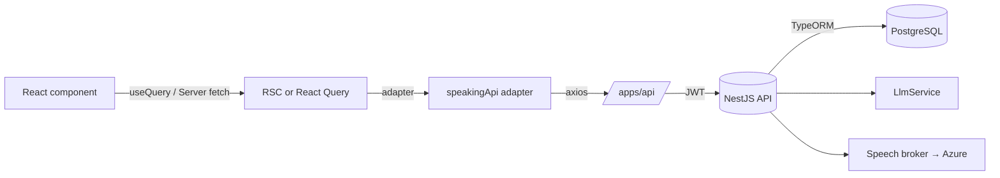

### Step 4 — Recommended Solution

- All new schemas live in `packages/shared/src/schemas/speaking.schema.ts` and are re-exported from the barrel.
- The web client uses an adapter (`apps/web/lib/speaking/api.ts`) so the conversation page never depends directly on `axios`. This keeps Server and Client components testable.
- Backend DTO classes use `class-validator` and intentionally **mirror** the Zod schemas. We do not import Zod into the API — schemas live in `@english-platform/shared` for type inference only.

### Step 5 — Implementation Code

#### Shared schemas

```ts
// packages/shared/src/schemas/speaking.schema.ts

import { z } from 'zod';
import { DifficultyLevel } from '../enums';

// ─── Scenario (public catalog) ─────────────────────────────
export const SpeakingScenarioSummarySchema = z.object({
  id: z.string().uuid(),
  title: z.string(),
  description: z.string().nullable(),
  level: z.nativeEnum(DifficultyLevel).nullable(),
  completedSessions: z.number().int().min(0),
});

export const SpeakingScenarioDetailSchema = SpeakingScenarioSummarySchema.extend({
  openingLine: z.string(),
  openingAudioUrl: z.string().url().nullable(),
  personaName: z.string().nullable(),
});

// ─── Voice catalog ─────────────────────────────────────────
export const TtsVoiceSchema = z.object({
  id: z.string(),                  // e.g. "en-US-JennyNeural"
  displayName: z.string(),         // e.g. "Sierra"
  locale: z.string(),              // e.g. "en-US"
  shortLabel: z.string(),          // e.g. "us Sierra"
  gender: z.enum(['male', 'female', 'neutral']).nullable(),
});

// ─── Session lifecycle ─────────────────────────────────────
export const CreateSessionSchema = z.object({
  scenarioId: z.string().uuid(),
  voiceId: z.string().min(1),
});

export const SessionCreatedSchema = z.object({
  sessionId: z.string().uuid(),
  startedAt: z.string().datetime(),
});

export const SuggestionSchema = z.object({
  text: z.string().min(1).max(48),
  kind: z.enum(['word', 'phrase']).default('phrase'),
});

export const TurnRequestSchema = z.object({
  clientTurnId: z.string().uuid(),
  userText: z.string().nullable().optional(),    // optional if audio uploaded
  voiceId: z.string().min(1),
});

export const TurnResponseSchema = z.object({
  turnIndex: z.number().int().min(0),
  userText: z.string(),
  aiText: z.string(),
  aiAudioUrl: z.string().url(),
  ipa: z.string().nullable(),
  translation: z.string().nullable(),
  suggestions: z.array(SuggestionSchema).max(4),
});

export const EndSessionResponseSchema = z.object({
  sessionId: z.string().uuid(),
  durationSec: z.number().int().min(0),
  turnCount: z.number().int().min(0),
  endedAt: z.string().datetime(),
});

// ─── Progress aggregates ───────────────────────────────────
export const ShadowingVideoProgressSchema = z.object({
  videoId: z.string().uuid(),
  title: z.string(),
  totalSentences: z.number().int().min(0),
  completedSentences: z.number().int().min(0),
});

export const SpeakingScenarioProgressSchema = z.object({
  scenarioId: z.string().uuid(),
  title: z.string(),
  sessionCount: z.number().int().min(0),
  totalDurationSec: z.number().int().min(0),
});

export const UserProgressSchema = z.object({
  shadowing: z.object({
    totalSentencesCompleted: z.number().int().min(0),
    perVideo: z.array(ShadowingVideoProgressSchema),
  }),
  speaking: z.object({
    totalSessions: z.number().int().min(0),
    totalDurationSec: z.number().int().min(0),
    perScenario: z.array(SpeakingScenarioProgressSchema),
  }),
});

// ─── Inferred types ────────────────────────────────────────
export type SpeakingScenarioSummary = z.infer<typeof SpeakingScenarioSummarySchema>;
export type SpeakingScenarioDetail = z.infer<typeof SpeakingScenarioDetailSchema>;
export type TtsVoice = z.infer<typeof TtsVoiceSchema>;
export type CreateSessionDto = z.infer<typeof CreateSessionSchema>;
export type SessionCreated = z.infer<typeof SessionCreatedSchema>;
export type Suggestion = z.infer<typeof SuggestionSchema>;
export type TurnRequest = z.infer<typeof TurnRequestSchema>;
export type TurnResponse = z.infer<typeof TurnResponseSchema>;
export type EndSessionResponse = z.infer<typeof EndSessionResponseSchema>;
export type UserProgress = z.infer<typeof UserProgressSchema>;
```

Update the barrel:

```ts
// packages/shared/src/index.ts

export * from './enums';
export * from './schemas/auth.schema';
export * from './schemas/admin.schema';
export * from './schemas/shadowing.schema';
export * from './schemas/speaking.schema';
```

#### Adapter interface (web)

```ts
// apps/web/lib/speaking/api.ts

import type {
  CreateSessionDto,
  EndSessionResponse,
  SessionCreated,
  SpeakingScenarioDetail,
  SpeakingScenarioSummary,
  TtsVoice,
  TurnResponse,
  UserProgress,
} from '@english-platform/shared';

export interface SpeakingApi {
  listScenarios(params: { level?: string }): Promise<SpeakingScenarioSummary[]>;
  getScenario(scenarioId: string): Promise<SpeakingScenarioDetail>;
  listVoices(): Promise<TtsVoice[]>;

  createSession(dto: CreateSessionDto): Promise<SessionCreated>;
  sendTurn(input: {
    sessionId: string;
    clientTurnId: string;
    voiceId: string;
    audioBlob?: Blob;
    userText?: string;
  }): Promise<TurnResponse>;
  endSession(sessionId: string): Promise<EndSessionResponse>;

  getProgress(): Promise<UserProgress>;
}
```

#### Real adapter

```ts
// apps/web/lib/speaking/real-api.ts

import { apiClient } from '@/lib/api-client';
import {
  EndSessionResponseSchema,
  SessionCreatedSchema,
  SpeakingScenarioDetailSchema,
  SpeakingScenarioSummarySchema,
  TtsVoiceSchema,
  TurnResponseSchema,
  UserProgressSchema,
} from '@english-platform/shared';
import type { SpeakingApi } from './api';

export const realSpeakingApi: SpeakingApi = {
  async listScenarios({ level }) {
    const { data } = await apiClient.get('/speaking/scenarios', { params: { level } });
    return data.map((s: unknown) => SpeakingScenarioSummarySchema.parse(s));
  },

  async getScenario(scenarioId) {
    const { data } = await apiClient.get(`/speaking/scenarios/${scenarioId}`);
    return SpeakingScenarioDetailSchema.parse(data);
  },

  async listVoices() {
    const { data } = await apiClient.get('/speech/voices');
    return data.map((v: unknown) => TtsVoiceSchema.parse(v));
  },

  async createSession(dto) {
    const { data } = await apiClient.post('/speaking-sessions', dto);
    return SessionCreatedSchema.parse(data);
  },

  async sendTurn({ sessionId, clientTurnId, voiceId, audioBlob, userText }) {
    const form = new FormData();
    form.append('clientTurnId', clientTurnId);
    form.append('voiceId', voiceId);
    if (userText) form.append('userText', userText);
    if (audioBlob) form.append('audio', audioBlob, 'turn.webm');

    const { data } = await apiClient.post(
      `/speaking-sessions/${sessionId}/turn`,
      form,
      { headers: { 'Content-Type': 'multipart/form-data' } },
    );
    return TurnResponseSchema.parse(data);
  },

  async endSession(sessionId) {
    const { data } = await apiClient.post(`/speaking-sessions/${sessionId}/end`);
    return EndSessionResponseSchema.parse(data);
  },

  async getProgress() {
    const { data } = await apiClient.get('/me/progress');
    return UserProgressSchema.parse(data);
  },
};
```

#### Adapter selector

```ts
// apps/web/lib/speaking/index.ts

import { realSpeakingApi } from './real-api';
import type { SpeakingApi } from './api';

export const speakingApi: SpeakingApi = realSpeakingApi;
export type { SpeakingApi } from './api';
```

> When the LLM and TTS providers are still being wired up, swap in a `mockSpeakingApi` toggled by `NEXT_PUBLIC_SPEAKING_USE_MOCKS=1`. Keep the production adapter the default.

---

## Feature 1 — Scenario List Page (Client)

### Step 1 — Requirement Analysis

**Functional**
- Grid of scenario cards. Each card shows: title, difficulty level badge (`difficulty_level_enum`), short description, "completed N times" badge (when user has finished ≥ 1 session for that scenario).
- Filter by `level` via chip row at the top.
- Only render scenarios where `is_active = true`.
- On click → navigate to `/speaking/<scenarioId>`.

**Edge cases**
- No scenarios at all → empty state with friendly message.
- Filter returns zero results → "No scenarios at this level" + "Show all" CTA.
- Long descriptions truncate to 2 lines.
- Backend down → error boundary with retry.

### Step 2 — Knowledge Prerequisites

- Next.js 16 App Router Server Components fetch directly on the server. Stream cards into a `<Suspense>` boundary so the chip row paints first (`async-suspense-boundaries`).
- `React.cache()` to deduplicate `listScenarios` if both `page.tsx` and `generateMetadata` call it (`server-cache-react`).
- `next/link` with `prefetch` for instant card navigation.
- `URLSearchParams` driving the level filter — same pattern as the shadowing guide.

### Step 3 — System Flow

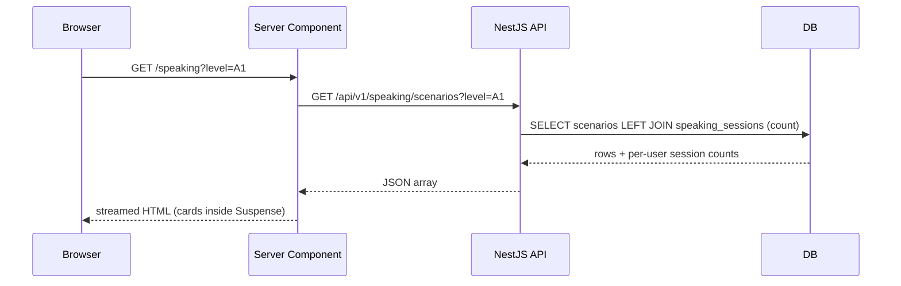

### Step 4 — Recommended Solution

- Mirror the structure of the shadowing list page exactly: `page.tsx` (Server), `LevelFilter` (Client + `useTransition`), `ScenarioGrid` (Server, fetches & maps), `ScenarioCard` (Server, link), and a `ScenarioGridSkeleton` for the Suspense fallback.
- Keep `ScenarioCard` as a Server Component — it receives plain serializable summary data (`server-serialization`).
- Use `next/dynamic` only for the conversation page itself, not for the list (`bundle-dynamic-imports`).

### Step 5 — Implementation Code

#### Server Component — page.tsx

```tsx
// apps/web/app/(dashboard)/speaking/page.tsx

import { Suspense } from 'react';
import { DifficultyLevel } from '@english-platform/shared';
import { LevelFilter } from './_components/level-filter';
import { ScenarioGrid } from './_components/scenario-grid';
import { ScenarioGridSkeleton } from './_components/scenario-grid-skeleton';

export const dynamic = 'force-dynamic';

interface PageProps {
  searchParams: Promise<{ level?: string }>;
}

export default async function SpeakingPage({ searchParams }: PageProps) {
  const { level } = await searchParams;
  const validLevel = isLevel(level) ? level : undefined;

  return (
    <div className="mx-auto max-w-7xl px-6 py-10">
      <header className="mb-8">
        <h1 className="text-3xl font-bold tracking-tight">Speaking Practice</h1>
        <p className="mt-2 text-muted-foreground">
          Pick a scenario and have a voice conversation with our AI partner.
        </p>
      </header>

      <LevelFilter activeLevel={validLevel} />

      <Suspense key={validLevel ?? 'all'} fallback={<ScenarioGridSkeleton />}>
        <ScenarioGrid level={validLevel} />
      </Suspense>
    </div>
  );
}

function isLevel(value: string | undefined): value is DifficultyLevel {
  return Object.values(DifficultyLevel).includes(value as DifficultyLevel);
}
```

#### ScenarioGrid (Server Component, streams)

```tsx
// apps/web/app/(dashboard)/speaking/_components/scenario-grid.tsx

import { cache } from 'react';
import { speakingApi } from '@/lib/speaking';
import type { DifficultyLevel } from '@english-platform/shared';
import { ScenarioCard } from './scenario-card';
import { EmptyState } from './empty-state';

const fetchScenarios = cache(async (level: DifficultyLevel | undefined) => {
  return speakingApi.listScenarios({ level });
});

interface Props {
  level: DifficultyLevel | undefined;
}

export async function ScenarioGrid({ level }: Props) {
  const scenarios = await fetchScenarios(level);

  if (scenarios.length === 0) {
    return <EmptyState level={level} />;
  }

  return (
    <ul className="grid grid-cols-1 gap-6 sm:grid-cols-2 lg:grid-cols-3">
      {scenarios.map((s) => (
        <li key={s.id}>
          <ScenarioCard scenario={s} />
        </li>
      ))}
    </ul>
  );
}
```

> `server-cache-react`: `cache()` deduplicates calls within a single render — useful if `generateMetadata` is later added.

#### ScenarioCard (Server Component)

```tsx
// apps/web/app/(dashboard)/speaking/_components/scenario-card.tsx

import Link from 'next/link';
import type { SpeakingScenarioSummary } from '@english-platform/shared';
import { LevelBadge } from '@/components/ui/level-badge';

interface Props {
  scenario: SpeakingScenarioSummary;
}

export function ScenarioCard({ scenario }: Props) {
  return (
    <Link
      href={`/speaking/${scenario.id}`}
      prefetch
      className="group flex h-full flex-col rounded-lg border bg-card p-5 transition-colors hover:border-foreground/20"
    >
      <div className="mb-3 flex items-center justify-between">
        <LevelBadge level={scenario.level} />
        {scenario.completedSessions > 0 ? (
          <span className="rounded-full bg-emerald-500/10 px-2.5 py-0.5 text-xs font-medium text-emerald-600">
            Completed {scenario.completedSessions} time
            {scenario.completedSessions === 1 ? '' : 's'}
          </span>
        ) : null}
      </div>
      <h3 className="line-clamp-2 text-base font-semibold leading-snug">
        {scenario.title}
      </h3>
      {scenario.description ? (
        <p className="mt-2 line-clamp-2 text-sm text-muted-foreground">
          {scenario.description}
        </p>
      ) : null}
    </Link>
  );
}
```

> `rendering-conditional-render`: ternaries instead of `&&` to avoid `0`/`""` rendering bugs.

#### LevelFilter (Client Component)

```tsx
// apps/web/app/(dashboard)/speaking/_components/level-filter.tsx

'use client';

import { useTransition } from 'react';
import { useRouter, usePathname } from 'next/navigation';
import { DifficultyLevel } from '@english-platform/shared';
import { cn } from '@/lib/utils';

const LEVELS: readonly (DifficultyLevel | 'ALL')[] = [
  'ALL',
  DifficultyLevel.A1,
  DifficultyLevel.A2,
  DifficultyLevel.B1,
  DifficultyLevel.B2,
  DifficultyLevel.C1,
  DifficultyLevel.C2,
];

interface Props {
  activeLevel: DifficultyLevel | undefined;
}

export function LevelFilter({ activeLevel }: Props) {
  const router = useRouter();
  const pathname = usePathname();
  const [isPending, startTransition] = useTransition();

  const handleClick = (level: DifficultyLevel | 'ALL') => {
    const next = level === 'ALL' ? pathname : `${pathname}?level=${level}`;
    startTransition(() => router.push(next, { scroll: false }));
  };

  return (
    <div
      role="tablist"
      aria-label="Filter scenarios by difficulty level"
      className={cn('mb-6 flex flex-wrap gap-2', isPending && 'opacity-70')}
    >
      {LEVELS.map((level) => {
        const isActive = level === 'ALL' ? !activeLevel : activeLevel === level;
        return (
          <button
            key={level}
            type="button"
            role="tab"
            aria-selected={isActive}
            onClick={() => handleClick(level)}
            className={cn(
              'rounded-full border px-4 py-1.5 text-sm transition-colors',
              isActive
                ? 'border-foreground bg-foreground text-background'
                : 'border-border bg-card text-muted-foreground hover:border-foreground/40',
            )}
          >
            {level === 'ALL' ? 'All levels' : level}
          </button>
        );
      })}
    </div>
  );
}
```

> `rerender-transitions`: filter changes wrap the navigation in `startTransition` so the click feels instant while the new server response streams in.

#### Backend — public scenarios controller

```ts
// apps/api/src/scenarios/scenarios.controller.ts (extend the existing file)

import {
  Controller,
  Get,
  Param,
  ParseUUIDPipe,
  Query,
  UseGuards,
} from '@nestjs/common';
import { ApiBearerAuth, ApiOperation, ApiTags } from '@nestjs/swagger';
import { JwtAuthGuard } from '../auth/guards/jwt-auth.guard';
import { CurrentUser } from '../auth/decorators/current-user.decorator';
import type { JwtUser } from '../auth/types/jwt-user.type';
import { ScenariosService } from './scenarios.service';
import { ListPublicScenariosQueryDto } from './dto/list-public-scenarios.query.dto';

@ApiTags('Speaking - Scenarios')
@ApiBearerAuth()
@UseGuards(JwtAuthGuard)
@Controller('speaking/scenarios')
export class PublicScenariosController {
  constructor(private readonly scenariosService: ScenariosService) {}

  @Get()
  @ApiOperation({ summary: 'List active scenarios for the authenticated learner' })
  list(
    @Query() query: ListPublicScenariosQueryDto,
    @CurrentUser() user: JwtUser,
  ) {
    return this.scenariosService.listForLearner(user.id, query.level);
  }

  @Get(':id')
  @ApiOperation({ summary: 'Get full scenario detail (with opening line)' })
  get(@Param('id', ParseUUIDPipe) id: string, @CurrentUser() user: JwtUser) {
    return this.scenariosService.getDetailForLearner(user.id, id);
  }
}
```

```ts
// apps/api/src/scenarios/scenarios.service.ts (add these methods)

async listForLearner(
  userId: string,
  level?: DifficultyLevel,
): Promise<SpeakingScenarioSummary[]> {
  const qb = this.scenarioRepo
    .createQueryBuilder('s')
    .leftJoin(
      'speaking_sessions',
      'ss',
      'ss.scenario_id = s.id AND ss.user_id = :userId AND ss.ended_at IS NOT NULL',
      { userId },
    )
    .select([
      's.id AS id',
      's.title AS title',
      's.description AS description',
      's.level AS level',
      'COUNT(ss.id)::int AS "completedSessions"',
    ])
    .where('s.is_active = true')
    .groupBy('s.id')
    .orderBy('s.level', 'ASC')
    .addOrderBy('s.title', 'ASC');

  if (level) qb.andWhere('s.level = :level', { level });

  return qb.getRawMany<SpeakingScenarioSummary>();
}
```

> Why `getRawMany`? We project a computed column (`completedSessions`) — `getMany` would discard it. Document this in the service's JSDoc for future maintainers.

---

## Feature 2 — Conversation Page Shell & Layout (Client)

### Step 1 — Requirement Analysis

The conversation page is a single-screen, three-region layout:

1. **Header bar** (fixed top) — back arrow, AI avatar + name + scenario title + level badge, voice selector, "End" button.
2. **Conversation area** (scrollable, fills remaining height) — scenario context card + AI message bubbles.
3. **Recording bar** (fixed bottom) — suggestion chips + large circular mic button.

The shell needs:
- One Server Component that fetches the scenario detail.
- One Client root that owns the session state machine, dynamically loads media-heavy children.
- A unique `clientTurnId` per turn for idempotent retries.
- Auto-scroll to the newest message after each turn ends.

### Step 2 — Knowledge Prerequisites

- Server Components passing serializable data to a single client root (`server-serialization`).
- `next/dynamic` with `{ ssr: false }` for the recording bar (depends on `MediaRecorder`, `AudioContext`).
- Mobile viewport: respect `100dvh` instead of `100vh`. Use `padding-bottom` on the scroll container equal to the recording bar height to prevent overlap.
- `useEffect`-free data flow: server component handles the initial fetch; React Query is only used for the voice list (which can change at runtime if admin updates settings).

### Step 3 — System Flow

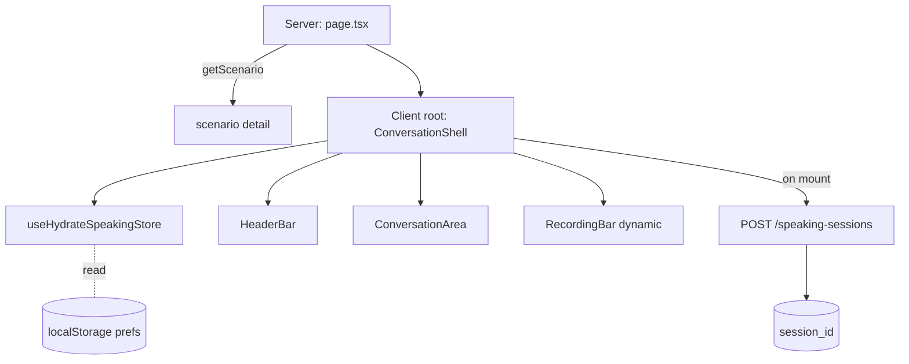

### Step 4 — Recommended Solution

- **Server fetch + single client root.** `page.tsx` calls `speakingApi.getScenario(scenarioId)`. The result is passed as a prop to `ConversationShell` (client). On mount, the shell creates the session by calling `POST /speaking-sessions` and seeds the store with the returned `sessionId` + the scenario's `opening_line`/`opening_audio_url` as the first turn.
- **Code-split the recording bar.** It pulls in audio recorder code that the conversation area never touches.
- **Layout primitive.** Use CSS grid with explicit rows: `grid-rows-[auto_1fr_auto]` so the header and recording bar don't shrink when the keyboard appears on mobile.
- **Avoid `useEffect` for data fetching.** All API mutations come from event handlers + React Query mutations.

### Step 5 — Implementation Code

#### Server Component — route page

```tsx
// apps/web/app/(dashboard)/speaking/[scenarioId]/page.tsx

import { notFound } from 'next/navigation';
import { speakingApi } from '@/lib/speaking';
import { ConversationShell } from './_components/conversation-shell';

interface Props {
  params: Promise<{ scenarioId: string }>;
}

export default async function ConversationPage({ params }: Props) {
  const { scenarioId } = await params;

  const scenario = await speakingApi.getScenario(scenarioId).catch(() => null);
  if (!scenario) notFound();

  return <ConversationShell scenario={scenario} />;
}

export async function generateMetadata({ params }: Props) {
  const { scenarioId } = await params;
  const scenario = await speakingApi.getScenario(scenarioId).catch(() => null);
  return { title: scenario ? `Speaking — ${scenario.title}` : 'Speaking' };
}
```

#### Client root — ConversationShell

```tsx
// apps/web/app/(dashboard)/speaking/[scenarioId]/_components/conversation-shell.tsx

'use client';

import { useEffect } from 'react';
import dynamic from 'next/dynamic';
import type { SpeakingScenarioDetail } from '@english-platform/shared';
import { useSpeakingStore } from '@/lib/speaking/store';
import { useStartSession } from '@/lib/speaking/hooks/use-start-session';
import { HeaderBar } from './header-bar';
import { ConversationArea } from './conversation-area';

const RecordingBar = dynamic(
  () => import('./recording-bar').then((m) => m.RecordingBar),
  { ssr: false, loading: () => <RecordingBarSkeleton /> },
);

interface Props {
  scenario: SpeakingScenarioDetail;
}

export function ConversationShell({ scenario }: Props) {
  const sessionId = useSpeakingStore((s) => s.sessionId);
  useStartSession(scenario);

  return (
    <main
      className="grid h-dvh grid-rows-[auto_1fr_auto] bg-background"
      aria-label={`Conversation with AI: ${scenario.title}`}
    >
      <HeaderBar scenario={scenario} />
      <ConversationArea scenario={scenario} />
      {sessionId ? <RecordingBar sessionId={sessionId} /> : <RecordingBarSkeleton />}
    </main>
  );
}

function RecordingBarSkeleton() {
  return (
    <div className="flex h-32 items-center justify-center border-t bg-card">
      <div
        className="h-6 w-6 animate-spin rounded-full border-2 border-muted border-t-foreground"
        aria-label="Preparing recording"
      />
    </div>
  );
}
```

> `bundle-dynamic-imports`: the recording bar pulls in `MediaRecorder` + audio decode helpers. Code-splitting trims ~40 KB from the initial conversation route.
> `rerender-derived-state`: the shell subscribes to `sessionId` (a string-or-null) — only re-renders once on session creation.

#### `useStartSession` hook

```ts
// apps/web/lib/speaking/hooks/use-start-session.ts

import { useEffect, useRef } from 'react';
import { useMutation } from '@tanstack/react-query';
import { speakingApi } from '@/lib/speaking';
import type { SpeakingScenarioDetail } from '@english-platform/shared';
import { useSpeakingStore } from '@/lib/speaking/store';

/**
 * Creates a session exactly once when the conversation page mounts.
 * The opening line is seeded as the first turn so the user sees content
 * immediately even before audio finishes loading.
 */
export function useStartSession(scenario: SpeakingScenarioDetail): void {
  const startedRef = useRef(false);
  const setSession = useSpeakingStore((s) => s.setSession);
  const seedOpening = useSpeakingStore((s) => s.seedOpening);
  const voiceId = useSpeakingStore((s) => s.voiceId);

  const { mutate } = useMutation({
    mutationFn: () => speakingApi.createSession({ scenarioId: scenario.id, voiceId }),
    onSuccess: ({ sessionId, startedAt }) => {
      setSession({ sessionId, scenarioId: scenario.id, startedAt });
      seedOpening({
        text: scenario.openingLine,
        audioUrl: scenario.openingAudioUrl,
      });
    },
  });

  useEffect(() => {
    if (startedRef.current) return;
    startedRef.current = true;
    mutate();
  }, [mutate]);
}
```

> The `startedRef` guard makes Strict Mode's double-invoke a no-op. We never call the mutation more than once per mount.

---

## Feature 3 — Header Bar (Client)

### Step 1 — Requirement Analysis

The header has four interactive regions:

1. **Back arrow** — exits to `/speaking`. If the conversation has at least one user turn, prompt for confirmation.
2. **AI avatar circle** — shows the first letter of `personaName` (or scenario title if `personaName` is null) with an "online" green indicator dot in the bottom-right.
3. **AI name + scenario title + level badge** — e.g. "Sierra · A1 · Greeting a new colleague".
4. **Voice selector** — opens a dropdown with all `TtsVoice` entries; selection updates Zustand and is sent on the next `POST /turn`.
5. **End button** — triggers `endSession`, then `router.replace('/speaking')`.

### Step 2 — Knowledge Prerequisites

- `useRouter` from `next/navigation` for navigation.
- Store-derived booleans (`hasUserTurns`) so the back arrow only re-renders when the boolean flips (`rerender-derived-state`).
- React Query `useQuery` for the voice list (so an admin updating voice config later refreshes without a page reload).
- Headless UI / Radix `DropdownMenu` for accessible voice selection (`aria-haspopup`, `aria-expanded` come for free).

### Step 3 — System Flow

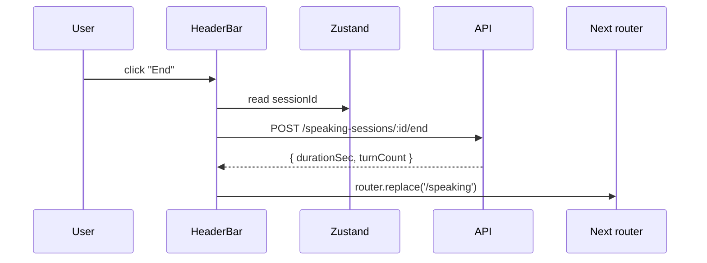

### Step 4 — Recommended Solution

- The header is **one** client component file split into smaller pieces, all of which are co-located. None of them subscribe to the entire store — each subscribes only to the slice it needs.
- The voice selector is its own component because it depends on a React Query hook; the rest of the header should not re-render when the voice list arrives.
- Confirm-on-back uses the platform `confirm()` for now. (Replace with a `<Dialog>` once design tokens land.)

### Step 5 — Implementation Code

```tsx
// apps/web/app/(dashboard)/speaking/[scenarioId]/_components/header-bar.tsx

'use client';

import { useRouter } from 'next/navigation';
import { ArrowLeft } from 'lucide-react';
import type { SpeakingScenarioDetail } from '@english-platform/shared';
import { useSpeakingStore } from '@/lib/speaking/store';
import { VoiceSelector } from './voice-selector';
import { EndSessionButton } from './end-session-button';

interface Props {
  scenario: SpeakingScenarioDetail;
}

export function HeaderBar({ scenario }: Props) {
  const router = useRouter();
  const hasUserTurns = useSpeakingStore((s) => s.turns.some((t) => t.role === 'user'));

  const handleBack = () => {
    if (hasUserTurns && !window.confirm('Leave this conversation? Progress will not be saved.')) return;
    router.push('/speaking');
  };

  const personaName = scenario.personaName ?? scenario.title.split(' ')[0];
  const initial = personaName.charAt(0).toUpperCase();

  return (
    <header className="flex items-center justify-between gap-3 border-b bg-card px-4 py-3">
      <button
        type="button"
        onClick={handleBack}
        aria-label="Back to scenarios"
        className="rounded-full p-2 hover:bg-muted"
      >
        <ArrowLeft className="h-5 w-5" />
      </button>

      <div className="flex flex-1 items-center gap-3 min-w-0">
        <div className="relative flex h-10 w-10 shrink-0 items-center justify-center rounded-full bg-primary text-primary-foreground font-semibold">
          {initial}
          <span
            aria-hidden
            className="absolute bottom-0 right-0 h-2.5 w-2.5 rounded-full border-2 border-card bg-emerald-500"
          />
        </div>
        <div className="min-w-0">
          <p className="truncate text-sm font-semibold leading-tight">{personaName}</p>
          <p className="truncate text-xs text-muted-foreground">
            {scenario.level ?? '—'} · {scenario.title}
          </p>
        </div>
      </div>

      <VoiceSelector />
      <EndSessionButton />
    </header>
  );
}
```

> `rerender-derived-state`: `s.turns.some((t) => t.role === 'user')` returns a primitive boolean — re-renders only when the boolean flips, not on every turn append.
> Pre-computing `personaName` and `initial` outside the JSX tree avoids re-creating them on every render (`js-cache-property-access`).

#### VoiceSelector

```tsx
// apps/web/app/(dashboard)/speaking/[scenarioId]/_components/voice-selector.tsx

'use client';

import { useQuery } from '@tanstack/react-query';
import { ChevronDown } from 'lucide-react';
import { speakingApi } from '@/lib/speaking';
import { useSpeakingStore } from '@/lib/speaking/store';
import {
  DropdownMenu,
  DropdownMenuContent,
  DropdownMenuItem,
  DropdownMenuTrigger,
} from '@/components/ui/dropdown-menu';

export function VoiceSelector() {
  const voiceId = useSpeakingStore((s) => s.voiceId);
  const setVoice = useSpeakingStore((s) => s.setVoice);

  const { data: voices = [] } = useQuery({
    queryKey: ['speaking', 'voices'],
    queryFn: () => speakingApi.listVoices(),
    staleTime: 5 * 60 * 1000,
  });

  const active = voices.find((v) => v.id === voiceId) ?? voices[0];

  return (
    <DropdownMenu>
      <DropdownMenuTrigger
        className="flex items-center gap-1 rounded-full border px-3 py-1.5 text-sm hover:border-foreground/40"
        aria-label={`Voice: ${active?.shortLabel ?? 'default'}`}
      >
        <span className="truncate max-w-28">{active?.shortLabel ?? '—'}</span>
        <ChevronDown className="h-3.5 w-3.5" />
      </DropdownMenuTrigger>
      <DropdownMenuContent align="end" className="max-h-72 overflow-auto">
        {voices.map((v) => (
          <DropdownMenuItem
            key={v.id}
            onSelect={() => setVoice(v.id)}
            data-active={v.id === voiceId}
          >
            <span className="font-medium">{v.displayName}</span>
            <span className="ml-2 text-xs text-muted-foreground">{v.locale}</span>
          </DropdownMenuItem>
        ))}
      </DropdownMenuContent>
    </DropdownMenu>
  );
}
```

> `client-swr-dedup`: React Query's deduplication ensures the voices query runs once even if mounted in multiple places.

#### EndSessionButton

```tsx
// apps/web/app/(dashboard)/speaking/[scenarioId]/_components/end-session-button.tsx

'use client';

import { useRouter } from 'next/navigation';
import { useMutation } from '@tanstack/react-query';
import { speakingApi } from '@/lib/speaking';
import { useSpeakingStore } from '@/lib/speaking/store';
import { Button } from '@/components/ui/button';
import { toast } from 'sonner';

export function EndSessionButton() {
  const router = useRouter();
  const sessionId = useSpeakingStore((s) => s.sessionId);

  const { mutate, isPending } = useMutation({
    mutationFn: () => speakingApi.endSession(sessionId!),
    onSuccess: () => {
      toast.success('Session saved');
      router.replace('/speaking');
    },
    onError: () => toast.error('Could not save session — try again'),
  });

  return (
    <Button
      type="button"
      variant="outline"
      size="sm"
      disabled={!sessionId || isPending}
      onClick={() => mutate()}
    >
      {isPending ? 'Saving…' : 'End'}
    </Button>
  );
}
```

---

## Feature 4 — Conversation Area, Bubbles, IPA & Translate Toggles (Client)

### Step 1 — Requirement Analysis

**Layout (top to bottom)**
1. Scenario context card — `title` + `description` from the scenario.
2. Vertical list of AI message bubbles (chronological). User turns are **not** rendered as bubbles.
3. Each AI bubble:
   - Avatar + name above the bubble.
   - Bubble body containing the `aiText`.
   - Below the bubble: `IPA` toggle and `Translate` toggle.
   - When toggled on: render IPA / translation **inline beneath the text**. Both are fetched lazily on first toggle.
4. Auto-scroll to the latest bubble after every turn.

**Edge cases**
- IPA / translation fetch failure → show error inline with retry.
- Long AI text (> 200 words) → bubble wraps without horizontal overflow.
- Autoplay blocked → render a "Tap to play" button next to the bubble.

### Step 2 — Knowledge Prerequisites

- The opening line is seeded into the store as turn `0` (AI). All subsequent turns come from the API.
- IPA + translation can be fetched lazily — define `GET /speaking-sessions/:id/turn/:turnIndex/ipa` and `…/translation`. Cache responses in React Query, keyed by `(sessionId, turnIndex)`.
- Use `scrollIntoView({ behavior: 'smooth', block: 'end' })` after each turn appends. Wrap in `requestAnimationFrame` to wait for DOM commit.
- `content-visibility: auto` on each bubble for cheap virtualization on long sessions (`rendering-content-visibility`).

### Step 3 — System Flow

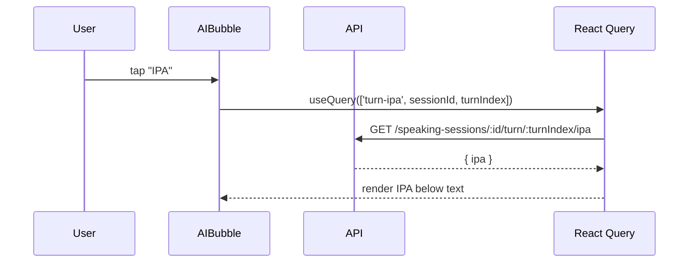

### Step 4 — Recommended Solution

- Store turns as `{ index, role, text, audioUrl, suggestions }`. Suggestions live on the AI turn for the chip row to read.
- Each AI bubble owns its own toggle state (local component state, two booleans). Lazy-fetched data is cached globally via React Query so navigating away and back keeps the toggle population.
- Memoize the bubble's "select audio playback" callback via `useEvent` / `useLatest` (`advanced-use-latest`) so the audio element does not re-bind handlers on every render.

### Step 5 — Implementation Code

#### ConversationArea

```tsx
// apps/web/app/(dashboard)/speaking/[scenarioId]/_components/conversation-area.tsx

'use client';

import { useEffect, useRef } from 'react';
import type { SpeakingScenarioDetail } from '@english-platform/shared';
import { useSpeakingStore } from '@/lib/speaking/store';
import { AIBubble } from './ai-bubble';
import { ScenarioContextCard } from './scenario-context-card';

interface Props {
  scenario: SpeakingScenarioDetail;
}

export function ConversationArea({ scenario }: Props) {
  const turns = useSpeakingStore((s) => s.turns);
  const lastTurnRef = useRef<HTMLLIElement | null>(null);

  useEffect(() => {
    if (!lastTurnRef.current) return;
    requestAnimationFrame(() => {
      lastTurnRef.current?.scrollIntoView({ behavior: 'smooth', block: 'end' });
    });
  }, [turns.length]);

  const aiTurns = turns.filter((t) => t.role === 'ai');

  return (
    <section
      className="overflow-y-auto px-4 pb-4"
      style={{ paddingBottom: 'calc(var(--recording-bar-h, 9rem) + 1rem)' }}
      aria-live="polite"
      aria-relevant="additions"
    >
      <ScenarioContextCard scenario={scenario} />
      <ul className="mt-4 space-y-6">
        {aiTurns.map((turn, idx) => {
          const isLast = idx === aiTurns.length - 1;
          return (
            <li
              key={turn.index}
              ref={isLast ? lastTurnRef : null}
              style={{ contentVisibility: 'auto', containIntrinsicSize: '1px 200px' }}
            >
              <AIBubble turn={turn} personaName={scenario.personaName ?? 'AI'} />
            </li>
          );
        })}
      </ul>
    </section>
  );
}
```

> `rendering-content-visibility`: each bubble is opted into the renderer's "skip offscreen layout" optimization for long sessions.
> `rerender-dependencies`: the effect's only dep is `turns.length` (a primitive), not the array reference.

#### AI bubble

```tsx
// apps/web/app/(dashboard)/speaking/[scenarioId]/_components/ai-bubble.tsx

'use client';

import { memo } from 'react';
import type { AiTurn } from '@/lib/speaking/types';
import { AudioPlayer } from './audio-player';
import { AIBubbleToggles } from './ai-bubble-toggles';

interface Props {
  turn: AiTurn;
  personaName: string;
}

export const AIBubble = memo(function AIBubble({ turn, personaName }: Props) {
  const initial = personaName.charAt(0).toUpperCase();

  return (
    <article className="flex flex-col gap-2">
      <header className="flex items-center gap-2 text-xs text-muted-foreground">
        <div className="flex h-6 w-6 items-center justify-center rounded-full bg-primary text-[10px] font-semibold text-primary-foreground">
          {initial}
        </div>
        <span>{personaName}</span>
      </header>

      <div className="rounded-2xl rounded-tl-sm bg-muted px-4 py-3 text-sm leading-relaxed">
        {turn.text}
      </div>

      <AudioPlayer src={turn.audioUrl} autoPlay={turn.autoplay} />
      <AIBubbleToggles turn={turn} />
    </article>
  );
});
```

> `rerender-memo`: each bubble is `memo`ed — when a new turn arrives, only the new bubble renders, not all prior ones.

#### Bubble toggles (lazy IPA + translation)

```tsx
// apps/web/app/(dashboard)/speaking/[scenarioId]/_components/ai-bubble-toggles.tsx

'use client';

import { useState } from 'react';
import { useQuery } from '@tanstack/react-query';
import { speakingApi } from '@/lib/speaking';
import { useSpeakingStore } from '@/lib/speaking/store';
import type { AiTurn } from '@/lib/speaking/types';

interface Props {
  turn: AiTurn;
}

export function AIBubbleToggles({ turn }: Props) {
  const sessionId = useSpeakingStore((s) => s.sessionId);
  const [showIpa, setShowIpa] = useState(false);
  const [showTranslation, setShowTranslation] = useState(false);

  const ipaQuery = useQuery({
    queryKey: ['turn', 'ipa', sessionId, turn.index],
    enabled: showIpa && !!sessionId,
    queryFn: () => speakingApi.getTurnIpa(sessionId!, turn.index),
    staleTime: Infinity,
  });

  const trQuery = useQuery({
    queryKey: ['turn', 'translation', sessionId, turn.index],
    enabled: showTranslation && !!sessionId,
    queryFn: () => speakingApi.getTurnTranslation(sessionId!, turn.index),
    staleTime: Infinity,
  });

  return (
    <div className="space-y-2">
      <div className="flex gap-2">
        <ToggleChip active={showIpa} onClick={() => setShowIpa((v) => !v)} label="IPA" />
        <ToggleChip
          active={showTranslation}
          onClick={() => setShowTranslation((v) => !v)}
          label="Translate"
        />
      </div>
      {showIpa ? (
        <p className="text-xs text-muted-foreground italic">
          {ipaQuery.isLoading ? 'Loading…' : ipaQuery.data ?? '—'}
        </p>
      ) : null}
      {showTranslation ? (
        <p className="text-xs text-muted-foreground">
          {trQuery.isLoading ? 'Loading…' : trQuery.data ?? '—'}
        </p>
      ) : null}
    </div>
  );
}

function ToggleChip({
  active,
  onClick,
  label,
}: {
  active: boolean;
  onClick: () => void;
  label: string;
}) {
  return (
    <button
      type="button"
      onClick={onClick}
      aria-pressed={active}
      className={`rounded-full border px-3 py-1 text-xs transition-colors ${
        active ? 'border-foreground bg-foreground text-background' : 'border-border'
      }`}
    >
      {label}
    </button>
  );
}
```

> `rerender-derived-state`: each toggle owns its own boolean state — the parent doesn't re-render when toggles flip.
> `client-swr-dedup`: React Query auto-dedupes if the user toggles IPA off and back on without remounting.

#### Audio player with autoplay-blocked fallback

```tsx
// apps/web/app/(dashboard)/speaking/[scenarioId]/_components/audio-player.tsx

'use client';

import { useEffect, useRef, useState } from 'react';
import { Play } from 'lucide-react';
import { useSpeakingStore } from '@/lib/speaking/store';

interface Props {
  src: string | null;
  autoPlay: boolean;
}

export function AudioPlayer({ src, autoPlay }: Props) {
  const audioRef = useRef<HTMLAudioElement | null>(null);
  const [needsTap, setNeedsTap] = useState(false);
  const setMicEnabled = useSpeakingStore((s) => s.setAiSpeaking);

  useEffect(() => {
    if (!src || !audioRef.current) return;
    if (!autoPlay) return;

    setMicEnabled(true);
    const playPromise = audioRef.current.play();
    if (playPromise !== undefined) {
      playPromise.catch(() => setNeedsTap(true));
    }
  }, [src, autoPlay, setMicEnabled]);

  if (!src) return null;

  return (
    <div className="flex items-center gap-2">
      <audio
        ref={audioRef}
        src={src}
        preload="auto"
        onEnded={() => setMicEnabled(false)}
        onPause={() => setMicEnabled(false)}
      />
      {needsTap ? (
        <button
          type="button"
          onClick={() => {
            setNeedsTap(false);
            audioRef.current?.play();
          }}
          className="inline-flex items-center gap-1 rounded-full border px-2 py-1 text-xs"
          aria-label="Tap to play AI audio"
        >
          <Play className="h-3 w-3" /> Tap to play
        </button>
      ) : null}
    </div>
  );
}
```

> While the audio plays, `aiSpeaking = true` in the store — the mic button reads this flag to disable itself.

---

## Feature 5 — Suggestion Chips (Client)

### Step 1 — Requirement Analysis

A horizontal row sitting **just above the mic button** displaying:

- Static label: "Try using these words:".
- 2–4 chips of `suggestions` from the **last AI turn**.
- Tapping a chip is purely visual feedback — no functional consequence.

### Step 2 — Knowledge Prerequisites

- Suggestions arrive embedded in `TurnResponse.suggestions`. The store stamps them onto the AI turn it generates.
- The chip row subscribes only to `state.lastAiSuggestions` — a derived selector that returns the suggestions of the last AI turn.

### Step 3 — System Flow

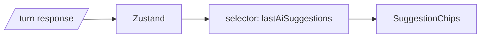

### Step 4 — Recommended Solution

- The selector returns a **primitive-friendly** shape — an array of strings — and uses Zustand's `shallow` equality so re-renders only happen when the actual suggestion strings change.
- The chip row is `memo`ed and renders nothing if the array is empty.

### Step 5 — Implementation Code

```ts
// apps/web/lib/speaking/store.selectors.ts

import { useSpeakingStore } from './store';

export const selectLastAiSuggestions = (s: { turns: { role: 'ai' | 'user'; suggestions?: { text: string }[] }[] }) => {
  for (let i = s.turns.length - 1; i >= 0; i--) {
    const t = s.turns[i];
    if (t.role === 'ai' && t.suggestions) return t.suggestions.map((x) => x.text);
  }
  return [];
};

export const useLastAiSuggestions = () =>
  useSpeakingStore(selectLastAiSuggestions);
```

> `js-early-exit`: iterate from the end and return on the first match instead of scanning the full array.

```tsx
// apps/web/app/(dashboard)/speaking/[scenarioId]/_components/suggestion-chips.tsx

'use client';

import { memo } from 'react';
import { useLastAiSuggestions } from '@/lib/speaking/store.selectors';

export const SuggestionChips = memo(function SuggestionChips() {
  const suggestions = useLastAiSuggestions();
  if (suggestions.length === 0) return null;

  return (
    <div className="flex flex-wrap items-center gap-2 px-4 py-2">
      <span className="text-xs text-muted-foreground">Try using these words:</span>
      {suggestions.map((text) => (
        <button
          key={text}
          type="button"
          tabIndex={-1}
          aria-hidden
          className="cursor-default rounded-full border bg-card px-3 py-1 text-xs text-foreground/80"
        >
          {text}
        </button>
      ))}
    </div>
  );
});
```

> `rerender-memo`: chip row only re-renders when the suggestions list actually changes.
> `tabIndex={-1}` + `aria-hidden`: chips are non-functional hints; we deliberately remove them from focus order so the mic button is always the next focusable element after the conversation area.

---

## Feature 6 — Recording Area & Mic State Machine (Client)

### Step 1 — Requirement Analysis

A fixed bottom bar containing:
- The suggestion chip row (Feature 5).
- A single large circular mic button, centered.
- Caption text below the mic that mirrors the state.

**State machine:**

```
idle → (tap)            → requestingMic
requestingMic → granted → recording
recording → (tap | silence | maxDuration) → processing
processing → (turn response received) → idle
recording → (mic error)  → error → idle
processing → (turn error) → error → idle
* → (aiSpeaking = true) → idle (button disabled)
```

**Constraints:**
- Max recording duration: 60 s. Auto-stop on overflow.
- Silence detection: stop recording if 1.5 s of audio below ‑45 dBFS RMS.
- While AI is speaking, the button is disabled and labeled "AI speaking…".
- After audio playback ends → re-enable.
- `aria-label` updates with state: "Tap to speak", "Recording", "Processing", "AI speaking".

### Step 2 — Knowledge Prerequisites

- `MediaRecorder` API for audio capture (Opus-in-WebM by default).
- `AudioContext` + `AnalyserNode` for silence detection (RMS calculation in `requestAnimationFrame`).
- Idempotent retries via `clientTurnId` (UUID v4 per turn) to survive transient network errors.
- React Query `useMutation` with `onMutate` to flip the state machine optimistically.

### Step 3 — System Flow

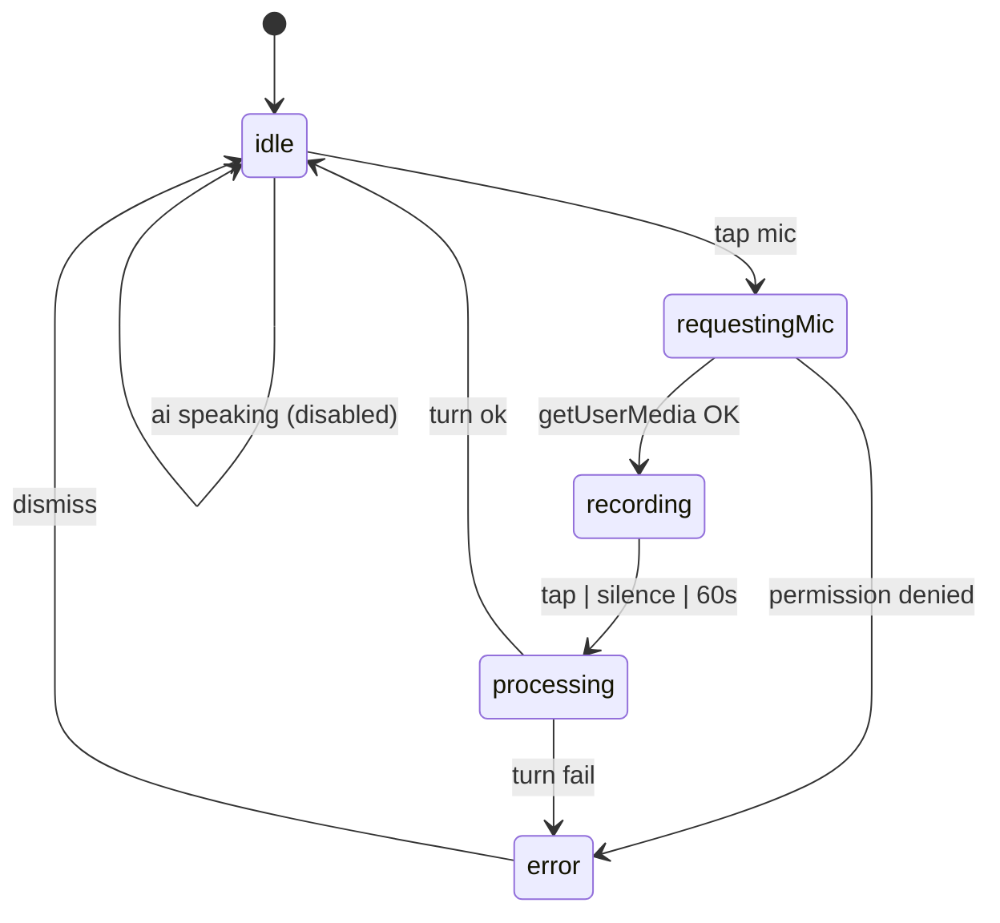

### Step 4 — Recommended Solution

- Encapsulate the audio capture pipeline in a class (`AudioRecorder`) injected via a hook (`useAudioRecorder`). The hook returns `{ start, stop, state, audioBlob }`.
- The state machine is a Zustand slice (`micState`) — components subscribe with primitive selectors only. The mic button itself subscribes to `(micState, aiSpeaking)` derived as a single tuple via `shallow` (`rerender-derived-state`).
- `useMutation` handles the turn upload. Its `onSettled` resets the mic state back to `idle`.

### Step 5 — Implementation Code

#### Audio recorder primitive

```ts
// apps/web/lib/speaking/audio-recorder.ts

const MAX_RECORDING_MS = 60_000;
const SILENCE_RMS_DB = -45;
const SILENCE_HOLD_MS = 1_500;

export interface AudioRecorderEvents {
  onStop(blob: Blob, durationMs: number): void;
  onError(reason: string): void;
}

export class AudioRecorder {
  private mediaRecorder: MediaRecorder | null = null;
  private chunks: Blob[] = [];
  private stream: MediaStream | null = null;
  private analyser: AnalyserNode | null = null;
  private audioCtx: AudioContext | null = null;
  private silenceStart: number | null = null;
  private startedAt = 0;
  private rafId: number | null = null;

  constructor(private readonly events: AudioRecorderEvents) {}

  async start(): Promise<void> {
    this.stream = await navigator.mediaDevices.getUserMedia({ audio: true });
    this.audioCtx = new AudioContext();
    const source = this.audioCtx.createMediaStreamSource(this.stream);
    this.analyser = this.audioCtx.createAnalyser();
    this.analyser.fftSize = 1024;
    source.connect(this.analyser);

    this.mediaRecorder = new MediaRecorder(this.stream, { mimeType: 'audio/webm;codecs=opus' });
    this.chunks = [];
    this.mediaRecorder.ondataavailable = (e) => {
      if (e.data.size > 0) this.chunks.push(e.data);
    };
    this.mediaRecorder.onstop = () => {
      const blob = new Blob(this.chunks, { type: 'audio/webm' });
      const duration = Date.now() - this.startedAt;
      this.events.onStop(blob, duration);
      this.cleanup();
    };

    this.startedAt = Date.now();
    this.mediaRecorder.start(250);
    this.tickSilence();
  }

  stop(): void {
    if (this.mediaRecorder?.state === 'recording') {
      this.mediaRecorder.stop();
    }
  }

  private tickSilence = (): void => {
    if (!this.analyser) return;

    const buffer = new Float32Array(this.analyser.fftSize);
    this.analyser.getFloatTimeDomainData(buffer);

    let sumSq = 0;
    for (let i = 0; i < buffer.length; i++) sumSq += buffer[i] * buffer[i];
    const rms = Math.sqrt(sumSq / buffer.length);
    const db = 20 * Math.log10(rms || 1e-8);

    const now = Date.now();
    if (db < SILENCE_RMS_DB) {
      this.silenceStart ??= now;
      if (now - this.silenceStart > SILENCE_HOLD_MS) {
        this.stop();
        return;
      }
    } else {
      this.silenceStart = null;
    }

    if (now - this.startedAt > MAX_RECORDING_MS) {
      this.stop();
      return;
    }

    this.rafId = requestAnimationFrame(this.tickSilence);
  };

  private cleanup(): void {
    if (this.rafId !== null) cancelAnimationFrame(this.rafId);
    this.rafId = null;
    this.silenceStart = null;
    this.stream?.getTracks().forEach((t) => t.stop());
    this.stream = null;
    void this.audioCtx?.close();
    this.audioCtx = null;
    this.analyser = null;
    this.mediaRecorder = null;
  }
}
```

> `js-cache-property-access`: `buffer.length` is read once before the loop. `js-combine-iterations`: silence detection runs in a single `requestAnimationFrame` tick that updates RMS, max-duration, and silence-hold all at once.

#### useAudioRecorder hook

```ts
// apps/web/lib/speaking/hooks/use-audio-recorder.ts

import { useCallback, useRef, useState } from 'react';
import { AudioRecorder } from '../audio-recorder';

type RecorderState = 'idle' | 'requestingMic' | 'recording';

export function useAudioRecorder() {
  const recorderRef = useRef<AudioRecorder | null>(null);
  const [state, setState] = useState<RecorderState>('idle');
  const [error, setError] = useState<string | null>(null);

  const stop = useCallback(() => recorderRef.current?.stop(), []);

  const start = useCallback(
    (onComplete: (blob: Blob, durationMs: number) => void) => {
      setError(null);
      setState('requestingMic');
      recorderRef.current = new AudioRecorder({
        onStop: (blob, durationMs) => {
          setState('idle');
          onComplete(blob, durationMs);
        },
        onError: (reason) => {
          setError(reason);
          setState('idle');
        },
      });
      recorderRef.current
        .start()
        .then(() => setState('recording'))
        .catch((err: unknown) => {
          const reason = err instanceof Error ? err.message : 'Microphone error';
          setError(reason);
          setState('idle');
        });
    },
    [],
  );

  return { state, error, start, stop };
}
```

> `advanced-event-handler-refs`: mutable recorder is held in a `ref` so React doesn't re-allocate on every render. Callbacks are stable thanks to `useCallback`.

#### MicButton

```tsx
// apps/web/app/(dashboard)/speaking/[scenarioId]/_components/mic-button.tsx

'use client';

import { useMutation } from '@tanstack/react-query';
import { Mic, Loader2 } from 'lucide-react';
import { useSpeakingStore } from '@/lib/speaking/store';
import { useAudioRecorder } from '@/lib/speaking/hooks/use-audio-recorder';
import { speakingApi } from '@/lib/speaking';
import { v4 as uuid } from 'uuid';
import { toast } from 'sonner';

interface Props {
  sessionId: string;
}

type Phase = 'idle' | 'recording' | 'processing' | 'speaking' | 'error';

export function MicButton({ sessionId }: Props) {
  const recorder = useAudioRecorder();
  const aiSpeaking = useSpeakingStore((s) => s.aiSpeaking);
  const voiceId = useSpeakingStore((s) => s.voiceId);
  const appendTurn = useSpeakingStore((s) => s.appendTurn);

  const turnMutation = useMutation({
    mutationFn: (audioBlob: Blob) =>
      speakingApi.sendTurn({
        sessionId,
        clientTurnId: uuid(),
        voiceId,
        audioBlob,
      }),
    onSuccess: (resp) => {
      appendTurn({
        index: resp.turnIndex,
        role: 'ai',
        text: resp.aiText,
        audioUrl: resp.aiAudioUrl,
        autoplay: true,
        suggestions: resp.suggestions,
      });
    },
    onError: () => toast.error('Could not get AI response — try again'),
  });

  const phase: Phase = aiSpeaking
    ? 'speaking'
    : turnMutation.isPending
      ? 'processing'
      : recorder.state === 'recording'
        ? 'recording'
        : recorder.error
          ? 'error'
          : 'idle';

  const handleClick = () => {
    if (phase === 'speaking' || phase === 'processing') return;
    if (phase === 'recording') {
      recorder.stop();
      return;
    }
    recorder.start((blob) => turnMutation.mutate(blob));
  };

  const label =
    phase === 'recording'
      ? 'Recording — tap to stop'
      : phase === 'processing'
        ? 'Processing'
        : phase === 'speaking'
          ? 'AI speaking'
          : 'Tap to speak';

  return (
    <div className="flex flex-col items-center gap-2 pb-3">
      <button
        type="button"
        onClick={handleClick}
        disabled={phase === 'speaking' || phase === 'processing'}
        aria-label={label}
        aria-pressed={phase === 'recording'}
        data-phase={phase}
        className={cnPhase(phase)}
      >
        {phase === 'processing' || phase === 'speaking' ? (
          <Loader2 className="h-7 w-7 animate-spin" />
        ) : (
          <Mic className="h-7 w-7" />
        )}
      </button>
      <span className="text-xs text-muted-foreground">{label}</span>
    </div>
  );
}

function cnPhase(phase: Phase): string {
  const base =
    'flex h-16 w-16 items-center justify-center rounded-full text-background shadow-md transition-transform';
  switch (phase) {
    case 'recording':
      return `${base} bg-red-600 scale-110 animate-pulse`;
    case 'processing':
    case 'speaking':
      return `${base} bg-muted text-foreground/60 cursor-not-allowed`;
    default:
      return `${base} bg-foreground hover:scale-105 active:scale-95`;
  }
}
```

> `rerender-derived-state`: each store selector returns a primitive (`aiSpeaking: boolean`, `voiceId: string`). The button never re-renders for unrelated state changes (turn appending, etc.).
> `js-early-exit`: `handleClick` returns immediately on disabled phases instead of branching deeper.

#### RecordingBar wrapper

```tsx
// apps/web/app/(dashboard)/speaking/[scenarioId]/_components/recording-bar.tsx

'use client';

import { SuggestionChips } from './suggestion-chips';
import { MicButton } from './mic-button';

interface Props {
  sessionId: string;
}

export function RecordingBar({ sessionId }: Props) {
  return (
    <div
      className="border-t bg-card pb-[env(safe-area-inset-bottom)]"
      style={{ '--recording-bar-h': '9rem' } as React.CSSProperties}
    >
      <SuggestionChips />
      <MicButton sessionId={sessionId} />
    </div>
  );
}
```

> The CSS custom property `--recording-bar-h` is consumed by `ConversationArea`'s padding-bottom so the conversation never hides behind the recorder on mobile.

---

## Feature 7 — Speaking Sessions API (Backend)

### Step 1 — Requirement Analysis

Three endpoints (all guarded by `JwtAuthGuard`):

| Endpoint | Body / Params | Returns |
|---|---|---|
| `POST /api/v1/speaking-sessions` | `{ scenarioId, voiceId }` | `{ sessionId, startedAt }` |
| `POST /api/v1/speaking-sessions/:id/turn` | multipart: `audio` (optional), `clientTurnId`, `voiceId`, `userText` (optional) | `{ turnIndex, userText, aiText, aiAudioUrl, ipa, translation, suggestions }` |
| `POST /api/v1/speaking-sessions/:id/end` | — | `{ sessionId, durationSec, turnCount, endedAt }` |

**Behaviors:**
- Creating a session inserts into `speaking_sessions` with `ended_at = NULL`.
- Each turn inserts **two** rows into `speaking_turns` (user + AI), incrementing `turn_index`.
- `clientTurnId` enables idempotent retries: if a turn with that client id was already persisted in the last 5 minutes, return the previous response instead of re-running the pipeline.
- Ending a session sets `ended_at = now()`. After this point, `/turn` returns 409.

### Step 2 — Knowledge Prerequisites

- `apps/api/CLAUDE.md` § "Architecture: Module Structure" — every feature is its own module.
- `apps/api/CLAUDE.md` § "S — Single Responsibility":
  - `SpeakingSessionsController` handles HTTP only.
  - `SpeakingSessionsService` orchestrates use cases.
  - `TurnPipelineService` does the STT → LLM → TTS chain.
  - `SpeakingTurnsRepository` does data access (optional repo, only because the queries get complex).
- `class-validator` for DTOs; multipart via `FileInterceptor` from `@nestjs/platform-express`.
- TypeORM transactions: each `/turn` insert is wrapped in a single transaction so we never end up with a user turn but no AI turn.

### Step 3 — System Flow

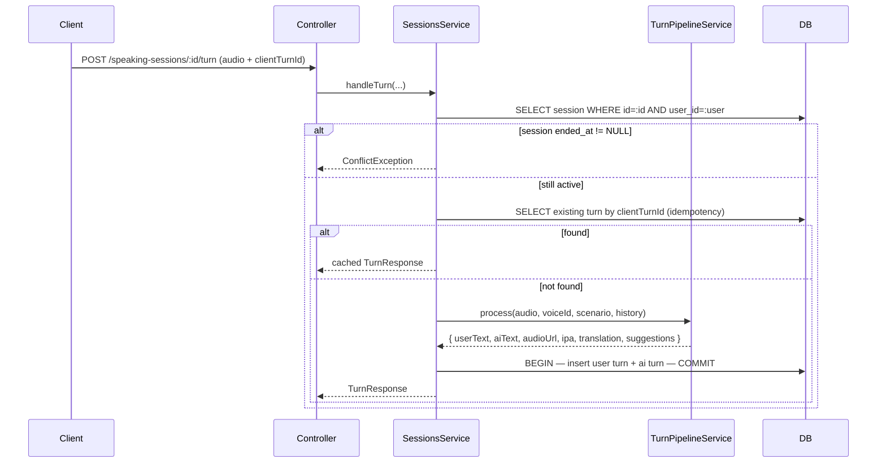

### Step 4 — Recommended Solution

- **Module split.** `SpeakingSessionsModule` imports `LlmModule` and `SpeechModule`. These are reusable across other features (e.g. AI feedback on shadowing).
- **Repository for turns.** Custom queries (`findLastNTurns`, `findByClientTurnId`) justify a dedicated repo rather than calling `Repository<SpeakingTurn>` directly from the service.
- **Idempotency window.** 5 minutes — enough to survive flaky networks, short enough to forget across page reloads.

### Step 5 — Implementation Code

#### Entities

```ts
// apps/api/src/speaking-sessions/entities/speaking-session.entity.ts

import {
  Column,
  CreateDateColumn,
  Entity,
  Index,
  ManyToOne,
  OneToMany,
  PrimaryGeneratedColumn,
} from 'typeorm';
import { User } from '../../users/user.entity';
import { Scenario } from '../../scenarios/entities/scenario.entity';
import { SpeakingTurn } from './speaking-turn.entity';

@Entity('speaking_sessions')
@Index(['user'])
export class SpeakingSession {
  @PrimaryGeneratedColumn('uuid')
  readonly id: string;

  @ManyToOne(() => User, { onDelete: 'CASCADE' })
  readonly user: User;

  @Column({ name: 'user_id' })
  readonly userId: string;

  @ManyToOne(() => Scenario)
  readonly scenario: Scenario;

  @Column({ name: 'scenario_id' })
  readonly scenarioId: string;

  @Column({ name: 'voice_id', type: 'varchar', length: 100 })
  voiceId: string;

  @Column({ name: 'session_summary', type: 'text', nullable: true })
  sessionSummary: string | null;

  @Column({ name: 'overall_score', type: 'decimal', precision: 5, scale: 2, nullable: true })
  overallScore: number | null;

  @CreateDateColumn({ name: 'started_at', type: 'timestamptz' })
  readonly startedAt: Date;

  @Column({ name: 'ended_at', type: 'timestamptz', nullable: true })
  endedAt: Date | null;

  @OneToMany(() => SpeakingTurn, (t) => t.session, { cascade: ['insert'] })
  turns: SpeakingTurn[];
}
```

```ts
// apps/api/src/speaking-sessions/entities/speaking-turn.entity.ts

import {
  Column,
  CreateDateColumn,
  Entity,
  Index,
  ManyToOne,
  PrimaryGeneratedColumn,
  Unique,
} from 'typeorm';
import { SpeakingSession } from './speaking-session.entity';

export type TurnRole = 'user' | 'ai';

@Entity('speaking_turns')
@Unique(['sessionId', 'turnIndex'])
@Index(['sessionId', 'clientTurnId'])
export class SpeakingTurn {
  @PrimaryGeneratedColumn('uuid')
  readonly id: string;

  @ManyToOne(() => SpeakingSession, (s) => s.turns, { onDelete: 'CASCADE' })
  readonly session: SpeakingSession;

  @Column({ name: 'session_id' })
  readonly sessionId: string;

  @Column({ type: 'varchar', length: 8 })
  readonly role: TurnRole;

  @Column({ name: 'turn_index', type: 'int' })
  readonly turnIndex: number;

  @Column({ name: 'client_turn_id', type: 'uuid', nullable: true })
  readonly clientTurnId: string | null;

  @Column({ type: 'text' })
  readonly text: string;

  @Column({ name: 'audio_url', type: 'varchar', length: 500, nullable: true })
  readonly audioUrl: string | null;

  @Column({ name: 'ipa', type: 'text', nullable: true })
  ipa: string | null;

  @Column({ name: 'translation', type: 'text', nullable: true })
  translation: string | null;

  @Column({ name: 'suggestions', type: 'jsonb', nullable: true })
  readonly suggestions: { text: string; kind: 'word' | 'phrase' }[] | null;

  @Column({ name: 'pronunciation_json', type: 'jsonb', nullable: true })
  readonly pronunciationJson: unknown | null;

  @CreateDateColumn({ name: 'created_at', type: 'timestamptz' })
  readonly createdAt: Date;
}
```

> The schema in `docs/database.md` defines `speaking_sessions` and `speaking_turns`. We add `voice_id`, `client_turn_id`, `audio_url`, `ipa`, `translation`, and `suggestions` columns via a migration documented at the end of this guide. Update `docs/database.md` accordingly.

#### DTOs

```ts
// apps/api/src/speaking-sessions/dto/create-session.dto.ts

import { ApiProperty } from '@nestjs/swagger';
import { IsString, IsUUID, MinLength } from 'class-validator';

export class CreateSpeakingSessionRequestDto {
  @ApiProperty()
  @IsUUID()
  readonly scenarioId: string;

  @ApiProperty()
  @IsString()
  @MinLength(1)
  readonly voiceId: string;
}
```

```ts
// apps/api/src/speaking-sessions/dto/turn.dto.ts

import { ApiProperty, ApiPropertyOptional } from '@nestjs/swagger';
import { IsOptional, IsString, IsUUID, MaxLength } from 'class-validator';

export class TurnRequestDto {
  @ApiProperty()
  @IsUUID()
  readonly clientTurnId: string;

  @ApiProperty()
  @IsString()
  readonly voiceId: string;

  @ApiPropertyOptional()
  @IsOptional()
  @IsString()
  @MaxLength(2000)
  readonly userText?: string;
}
```

#### Repository

```ts
// apps/api/src/speaking-sessions/speaking-turns.repository.ts

import { Injectable } from '@nestjs/common';
import { InjectRepository } from '@nestjs/typeorm';
import { DataSource, Repository } from 'typeorm';
import { SpeakingTurn } from './entities/speaking-turn.entity';

@Injectable()
export class SpeakingTurnsRepository {
  constructor(
    @InjectRepository(SpeakingTurn) private readonly repo: Repository<SpeakingTurn>,
    private readonly dataSource: DataSource,
  ) {}

  findByClientTurnId(sessionId: string, clientTurnId: string): Promise<SpeakingTurn | null> {
    return this.repo.findOne({
      where: { sessionId, clientTurnId, role: 'ai' },
    });
  }

  async lastN(sessionId: string, n: number): Promise<SpeakingTurn[]> {
    const rows = await this.repo.find({
      where: { sessionId },
      order: { turnIndex: 'DESC' },
      take: n,
    });
    return rows.reverse();
  }

  async insertPair(
    sessionId: string,
    nextIndex: number,
    user: Pick<SpeakingTurn, 'text' | 'pronunciationJson'>,
    ai: Pick<SpeakingTurn, 'text' | 'audioUrl' | 'ipa' | 'translation' | 'suggestions' | 'clientTurnId'>,
  ): Promise<{ aiTurn: SpeakingTurn }> {
    return this.dataSource.transaction(async (manager) => {
      await manager.insert(SpeakingTurn, {
        sessionId,
        turnIndex: nextIndex,
        role: 'user',
        text: user.text,
        pronunciationJson: user.pronunciationJson ?? null,
      });
      const aiInsert = await manager.insert(SpeakingTurn, {
        sessionId,
        turnIndex: nextIndex + 1,
        role: 'ai',
        text: ai.text,
        audioUrl: ai.audioUrl,
        ipa: ai.ipa,
        translation: ai.translation,
        suggestions: ai.suggestions,
        clientTurnId: ai.clientTurnId,
      });
      const aiTurn = await manager.findOneByOrFail(SpeakingTurn, {
        id: aiInsert.identifiers[0].id as string,
      });
      return { aiTurn };
    });
  }
}
```

#### Service

```ts
// apps/api/src/speaking-sessions/speaking-sessions.service.ts

import {
  ConflictException,
  ForbiddenException,
  Injectable,
  Logger,
  NotFoundException,
} from '@nestjs/common';
import { InjectRepository } from '@nestjs/typeorm';
import { Repository } from 'typeorm';
import { SpeakingSession } from './entities/speaking-session.entity';
import { SpeakingTurnsRepository } from './speaking-turns.repository';
import { TurnPipelineService } from './turn-pipeline.service';
import { ScenariosService } from '../scenarios/scenarios.service';
import { CreateSpeakingSessionRequestDto } from './dto/create-session.dto';
import { TurnRequestDto } from './dto/turn.dto';
import type { TurnResponse } from '@english-platform/shared';

@Injectable()
export class SpeakingSessionsService {
  private readonly logger = new Logger(SpeakingSessionsService.name);

  constructor(
    @InjectRepository(SpeakingSession)
    private readonly sessionRepo: Repository<SpeakingSession>,
    private readonly turnsRepo: SpeakingTurnsRepository,
    private readonly pipeline: TurnPipelineService,
    private readonly scenariosService: ScenariosService,
  ) {}

  async create(
    userId: string,
    dto: CreateSpeakingSessionRequestDto,
  ): Promise<{ sessionId: string; startedAt: Date }> {
    const scenario = await this.scenariosService.findActive(dto.scenarioId);
    if (!scenario) throw new NotFoundException(`Scenario ${dto.scenarioId} not found or inactive`);

    const session = this.sessionRepo.create({
      userId,
      scenarioId: scenario.id,
      voiceId: dto.voiceId,
    });
    const saved = await this.sessionRepo.save(session);
    return { sessionId: saved.id, startedAt: saved.startedAt };
  }

  async handleTurn(
    userId: string,
    sessionId: string,
    dto: TurnRequestDto,
    audio: Express.Multer.File | undefined,
  ): Promise<TurnResponse> {
    const session = await this.loadActiveSession(userId, sessionId);

    const replay = await this.turnsRepo.findByClientTurnId(sessionId, dto.clientTurnId);
    if (replay) return this.toTurnResponse(replay);

    if (!audio && !dto.userText) {
      throw new ConflictException('Turn requires either audio upload or userText.');
    }

    const history = await this.turnsRepo.lastN(sessionId, 12);
    const result = await this.pipeline.process({
      session,
      history,
      voiceId: dto.voiceId,
      audio,
      providedText: dto.userText ?? null,
    });

    const nextIndex = (history.at(-1)?.turnIndex ?? -1) + 1;
    const { aiTurn } = await this.turnsRepo.insertPair(
      sessionId,
      nextIndex,
      { text: result.userText, pronunciationJson: result.pronunciationJson },
      {
        text: result.aiText,
        audioUrl: result.aiAudioUrl,
        ipa: null,
        translation: null,
        suggestions: result.suggestions,
        clientTurnId: dto.clientTurnId,
      },
    );

    return {
      turnIndex: aiTurn.turnIndex,
      userText: result.userText,
      aiText: result.aiText,
      aiAudioUrl: result.aiAudioUrl,
      ipa: null,
      translation: null,
      suggestions: result.suggestions,
    };
  }

  async end(userId: string, sessionId: string) {
    const session = await this.loadActiveSession(userId, sessionId);
    session.endedAt = new Date();
    await this.sessionRepo.save(session);

    const durationSec = Math.floor((session.endedAt.getTime() - session.startedAt.getTime()) / 1000);
    const turnCount = await this.turnsRepo.lastN(sessionId, 1).then((rows) => (rows[0]?.turnIndex ?? -1) + 1);

    return {
      sessionId,
      durationSec,
      turnCount,
      endedAt: session.endedAt.toISOString(),
    };
  }

  private async loadActiveSession(userId: string, sessionId: string): Promise<SpeakingSession> {
    const session = await this.sessionRepo.findOne({ where: { id: sessionId } });
    if (!session) throw new NotFoundException(`Session ${sessionId} not found`);
    if (session.userId !== userId) throw new ForbiddenException();
    if (session.endedAt !== null) throw new ConflictException('Session already ended');
    return session;
  }

  private toTurnResponse(turn: { turnIndex: number; text: string; audioUrl: string | null; suggestions: unknown }): TurnResponse {
    return {
      turnIndex: turn.turnIndex,
      userText: '',
      aiText: turn.text,
      aiAudioUrl: turn.audioUrl ?? '',
      ipa: null,
      translation: null,
      suggestions: (turn.suggestions ?? []) as TurnResponse['suggestions'],
    };
  }
}
```

> Every public method has an explicit return type (`apps/api/CLAUDE.md` § Services). No `console.log`. No `any`. No `new SomeService()` — all collaborators are injected.

#### Controller

```ts
// apps/api/src/speaking-sessions/speaking-sessions.controller.ts

import {
  Body,
  Controller,
  Post,
  Param,
  ParseUUIDPipe,
  UploadedFile,
  UseGuards,
  UseInterceptors,
} from '@nestjs/common';
import { FileInterceptor } from '@nestjs/platform-express';
import { ApiBearerAuth, ApiBody, ApiConsumes, ApiOperation, ApiTags } from '@nestjs/swagger';
import { JwtAuthGuard } from '../auth/guards/jwt-auth.guard';
import { CurrentUser } from '../auth/decorators/current-user.decorator';
import type { JwtUser } from '../auth/types/jwt-user.type';
import { SpeakingSessionsService } from './speaking-sessions.service';
import { CreateSpeakingSessionRequestDto } from './dto/create-session.dto';
import { TurnRequestDto } from './dto/turn.dto';

@ApiTags('Speaking Sessions')
@ApiBearerAuth()
@UseGuards(JwtAuthGuard)
@Controller('speaking-sessions')
export class SpeakingSessionsController {
  constructor(private readonly sessions: SpeakingSessionsService) {}

  @Post()
  @ApiOperation({ summary: 'Create a new speaking session' })
  create(@CurrentUser() user: JwtUser, @Body() dto: CreateSpeakingSessionRequestDto) {
    return this.sessions.create(user.id, dto);
  }

  @Post(':id/turn')
  @UseInterceptors(FileInterceptor('audio', { limits: { fileSize: 10 * 1024 * 1024 } }))
  @ApiConsumes('multipart/form-data')
  @ApiBody({ type: TurnRequestDto })
  @ApiOperation({ summary: 'Send one user turn (audio or text) and get the AI reply' })
  turn(
    @CurrentUser() user: JwtUser,
    @Param('id', ParseUUIDPipe) sessionId: string,
    @Body() dto: TurnRequestDto,
    @UploadedFile() audio?: Express.Multer.File,
  ) {
    return this.sessions.handleTurn(user.id, sessionId, dto, audio);
  }

  @Post(':id/end')
  @ApiOperation({ summary: 'End an active session' })
  end(@CurrentUser() user: JwtUser, @Param('id', ParseUUIDPipe) sessionId: string) {
    return this.sessions.end(user.id, sessionId);
  }
}
```

> Controller is HTTP wiring only — every method is one line of forwarding.

---

## Feature 8 — Turn Pipeline: STT → LLM → TTS (Backend)

### Step 1 — Requirement Analysis

Given a user's audio (or text) plus the running history, the pipeline must:

1. Transcribe audio → `userText` (STT). Skip if `userText` was provided.
2. Build the LLM message stack: system prompt (from scenario) + last N turns + the new user text.
3. Call the LLM via `LlmService` (which handles provider selection + fallback — see Feature 9).
4. Parse the LLM response. The model is instructed to return JSON: `{ "reply": string, "suggestions": [{"text", "kind"}] }`.
5. TTS the AI text → upload to object storage → return public URL.
6. Persist the audio URL on the AI turn.

**Edge cases:**
- LLM JSON malformed → re-prompt once with a "respond in JSON only" reinforcement, then fall back to plain text (no suggestions).
- TTS fails → return AI text without `aiAudioUrl` (frontend renders "Tap to play" with retry).
- STT returns empty → return 400 to the client with a message ("We couldn't hear you — try again").

### Step 2 — Knowledge Prerequisites

- **Strategy pattern** for STT: an `ISpeechToText` interface with one current implementation (`AzureSpeechToText`). Allows swapping providers.
- **Structured outputs** for LLMs: Azure OpenAI and OpenAI both support `response_format: { type: 'json_object' }`. Anthropic supports tool use to coerce structure. Use whichever the active provider exposes.
- **Object storage**: presigned PUT to S3-compatible storage (or Azure Blob) for the generated TTS file. Local dev: write to disk under `apps/api/uploads/tts/<uuid>.mp3` and serve via static route.
- **Prompt template**: kept in a versioned file (`turn-prompt.template.ts`) so changes ship via git, not via DB updates.

### Step 3 — System Flow

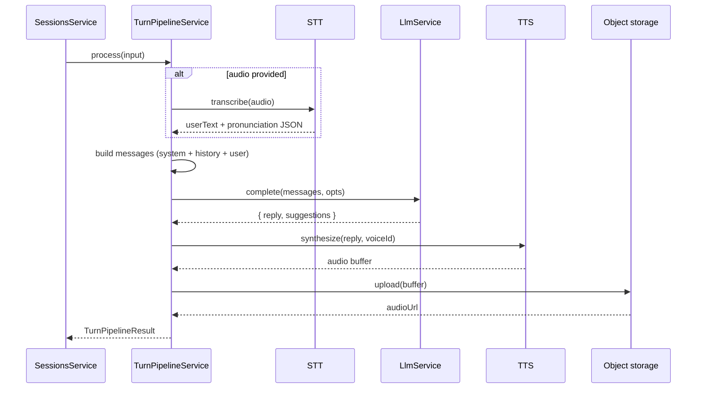

### Step 4 — Recommended Solution

- **Single orchestrator class** (`TurnPipelineService`) with three injected collaborators (`SttService`, `LlmService`, `TtsService`). Each is independently testable.
- **Prompt template lives in code, not in DB** — it changes too often during MVP iteration. Once stable, an admin tool can be added.
- **Output validation** with a tiny zod schema parses the LLM's JSON. Failure → log warning + degrade gracefully.

### Step 5 — Implementation Code

#### Prompt template

```ts
// apps/api/src/speaking-sessions/turn-prompt.template.ts

import type { Scenario } from '../scenarios/entities/scenario.entity';
import type { SpeakingTurn } from './entities/speaking-turn.entity';

export interface ChatMessage {
  readonly role: 'system' | 'user' | 'assistant';
  readonly content: string;
}

const RESPONSE_SCHEMA_HINT = `
Respond ONLY with a JSON object. Schema:
{
  "reply": "string — your next utterance, plain English, 1-3 sentences",
  "suggestions": [
    { "text": "string — a word or phrase the learner should try", "kind": "word" | "phrase" }
  ]
}
Provide 2-4 suggestions tailored to the scenario level. Never include markdown.`;

export function buildMessages(
  scenario: Scenario,
  history: SpeakingTurn[],
  newUserText: string,
): ChatMessage[] {
  const system: ChatMessage = {
    role: 'system',
    content: `${scenario.systemPrompt.trim()}\n\n${RESPONSE_SCHEMA_HINT}`,
  };

  const past: ChatMessage[] = history.map((t) => ({
    role: t.role === 'user' ? 'user' : 'assistant',
    content: t.text,
  }));

  return [system, ...past, { role: 'user', content: newUserText }];
}
```

> The schema hint lives next to the call site that depends on it (`apps/api/CLAUDE.md` § "Many small files > Few large files"). Editing prompt + parser at the same time is now a single PR.

#### Output parser

```ts
// apps/api/src/speaking-sessions/turn-output.parser.ts

import { z } from 'zod';
import { Logger } from '@nestjs/common';

const LlmReplySchema = z.object({
  reply: z.string().min(1),
  suggestions: z
    .array(
      z.object({
        text: z.string().min(1).max(48),
        kind: z.enum(['word', 'phrase']),
      }),
    )
    .max(4)
    .default([]),
});

export type LlmReply = z.infer<typeof LlmReplySchema>;

const logger = new Logger('TurnOutputParser');

export function parseLlmReply(raw: string): LlmReply {
  try {
    const parsed = JSON.parse(raw);
    return LlmReplySchema.parse(parsed);
  } catch (err) {
    logger.warn(`LLM returned non-JSON; degrading. Snippet: ${raw.slice(0, 80)}`);
    return { reply: raw.trim(), suggestions: [] };
  }
}
```

#### Pipeline service

```ts
// apps/api/src/speaking-sessions/turn-pipeline.service.ts

import { BadRequestException, Injectable, Logger } from '@nestjs/common';
import { LlmService } from '../llm/llm.service';
import { SttService } from '../speech/stt.service';
import { TtsService } from '../speech/tts.service';
import { buildMessages } from './turn-prompt.template';
import { parseLlmReply } from './turn-output.parser';
import type { Scenario } from '../scenarios/entities/scenario.entity';
import type { SpeakingTurn } from './entities/speaking-turn.entity';

export interface TurnPipelineInput {
  readonly session: { scenarioId: string };
  readonly history: SpeakingTurn[];
  readonly voiceId: string;
  readonly audio: Express.Multer.File | undefined;
  readonly providedText: string | null;
}

export interface TurnPipelineResult {
  readonly userText: string;
  readonly aiText: string;
  readonly aiAudioUrl: string;
  readonly suggestions: { text: string; kind: 'word' | 'phrase' }[];
  readonly pronunciationJson: unknown | null;
}

@Injectable()
export class TurnPipelineService {
  private readonly logger = new Logger(TurnPipelineService.name);

  constructor(
    private readonly stt: SttService,
    private readonly llm: LlmService,
    private readonly tts: TtsService,
    private readonly scenariosLoader: ScenarioLoader,
  ) {}

  async process(input: TurnPipelineInput): Promise<TurnPipelineResult> {
    const scenario = await this.scenariosLoader.findOrThrow(input.session.scenarioId);

    const { userText, pronunciationJson } = await this.resolveUserText(input);
    if (!userText.trim()) throw new BadRequestException("Couldn't hear you. Please try again.");

    const messages = buildMessages(scenario, input.history, userText);
    const raw = await this.llm.complete(messages, { jsonMode: true });
    const { reply, suggestions } = parseLlmReply(raw);

    const audioUrl = await this.tts
      .synthesize(reply, input.voiceId)
      .catch((err: unknown) => {
        this.logger.warn(`TTS failed: ${describe(err)} — returning text without audio`);
        return '';
      });

    return { userText, aiText: reply, aiAudioUrl: audioUrl, suggestions, pronunciationJson };
  }

  private async resolveUserText(
    input: TurnPipelineInput,
  ): Promise<{ userText: string; pronunciationJson: unknown | null }> {
    if (input.providedText) return { userText: input.providedText, pronunciationJson: null };
    if (!input.audio) throw new BadRequestException('Provide either audio or userText');
    return this.stt.transcribe(input.audio.buffer, input.audio.mimetype);
  }
}

function describe(err: unknown): string {
  return err instanceof Error ? err.message : String(err);
}
```

> `ScenarioLoader` is a thin injectable that wraps `ScenariosService.findOne` with caching — added to break a circular dependency between `SpeakingSessionsModule` and `ScenariosModule`.

#### STT and TTS services (skeleton)

```ts
// apps/api/src/speech/stt.service.ts

import { Injectable, ServiceUnavailableException } from '@nestjs/common';
import { ConfigService } from '@nestjs/config';

export interface ISttResult {
  readonly userText: string;
  readonly pronunciationJson: unknown | null;
}

@Injectable()
export class SttService {
  private readonly key: string;
  private readonly region: string;

  constructor(config: ConfigService) {
    this.key = config.getOrThrow<string>('AZURE_SPEECH_KEY');
    this.region = config.getOrThrow<string>('AZURE_SPEECH_REGION');
  }

  async transcribe(buffer: Buffer, mimetype: string): Promise<ISttResult> {
    const endpoint = `https://${this.region}.stt.speech.microsoft.com/speech/recognition/conversation/cognitiveservices/v1?language=en-US`;
    const res = await fetch(endpoint, {
      method: 'POST',
      headers: {
        'Ocp-Apim-Subscription-Key': this.key,
        'Content-Type': mimetype,
        Accept: 'application/json',
      },
      body: buffer,
    });
    if (!res.ok) throw new ServiceUnavailableException(`STT failed: ${res.status}`);
    const json = (await res.json()) as { DisplayText?: string; NBest?: unknown[] };
    return {
      userText: json.DisplayText ?? '',
      pronunciationJson: json.NBest ?? null,
    };
  }
}
```

```ts
// apps/api/src/speech/tts.service.ts

import { Injectable, Logger } from '@nestjs/common';
import { ConfigService } from '@nestjs/config';
import { randomUUID } from 'crypto';
import { writeFile, mkdir } from 'fs/promises';
import { join } from 'path';

@Injectable()
export class TtsService {
  private readonly logger = new Logger(TtsService.name);
  private readonly key: string;
  private readonly region: string;
  private readonly publicBase: string;
  private readonly storageDir: string;

  constructor(config: ConfigService) {
    this.key = config.getOrThrow<string>('AZURE_SPEECH_KEY');
    this.region = config.getOrThrow<string>('AZURE_SPEECH_REGION');
    this.publicBase = config.get<string>('PUBLIC_BASE_URL', 'http://localhost:4000');
    this.storageDir = config.get<string>('TTS_STORAGE_DIR', 'uploads/tts');
  }

  async synthesize(text: string, voiceId: string): Promise<string> {
    const ssml = this.buildSsml(text, voiceId);
    const res = await fetch(`https://${this.region}.tts.speech.microsoft.com/cognitiveservices/v1`, {
      method: 'POST',
      headers: {
        'Ocp-Apim-Subscription-Key': this.key,
        'Content-Type': 'application/ssml+xml',
        'X-Microsoft-OutputFormat': 'audio-24khz-48kbitrate-mono-mp3',
      },
      body: ssml,
    });
    if (!res.ok) throw new Error(`TTS HTTP ${res.status}`);

    const buffer = Buffer.from(await res.arrayBuffer());
    const filename = `${randomUUID()}.mp3`;
    await mkdir(this.storageDir, { recursive: true });
    await writeFile(join(this.storageDir, filename), buffer);

    return `${this.publicBase}/static/tts/${filename}`;
  }

  private buildSsml(text: string, voiceId: string): string {
    const safe = text.replace(/[<&]/g, (c) => (c === '<' ? '&lt;' : '&amp;'));
    return `<speak version='1.0' xml:lang='en-US'><voice name='${voiceId}'>${safe}</voice></speak>`;
  }
}
```

> Replace local file storage with S3 / Azure Blob in production. Keep the public URL contract identical so the frontend doesn't change.

---

## Feature 9 — LLM Model Configuration (Backend + Admin Panel)

### Step 1 — Requirement Analysis

**Backend:**
- New table `llm_configs` with columns: `id`, `provider` (`azure_openai` | `openai` | `anthropic`), `model_name`, `api_key_encrypted`, `endpoint_url` (nullable), `is_active`, `priority`, timestamps.
- Constraint: only one row may have `is_active = true` at a time.
- `LlmService.complete(messages, opts)` selects the active row, falls back to the next-priority row on quota errors (HTTP 429 or provider-specific equivalents), logs each fallback to a `llm_failure_logs` table, and re-runs the request.
- API keys are AES-256-GCM encrypted at rest with a server-side master key (`LLM_CONFIG_MASTER_KEY` — 32-byte base64).

**Admin panel:**
- Page at `/admin/llm-configs`.
- Lists all configs in priority order, masks `api_key_encrypted` showing only last 4 chars.
- Add / edit / delete configs.
- Toggle `is_active` (atomic — flipping one to `true` flips the others to `false`).
- Reorder priority by drag-and-drop.

### Step 2 — Knowledge Prerequisites

- `apps/api/CLAUDE.md` § "D — Dependency Inversion": LLM providers live behind an `ILlmProvider` interface; `LlmService` depends on the **interface**, not on `OpenAI` or `AzureOpenAI` directly.
- `apps/api/CLAUDE.md` § "O — Open/Closed": adding a new provider = new file implementing `ILlmProvider`, register it in the provider map. No existing files change.
- Encryption: `crypto.subtle` (Node 22+) or `node:crypto` `createCipheriv('aes-256-gcm', key, iv)`. Store `iv:tag:ciphertext` as a single base64 string.
- Quota detection: HTTP 429 is the universal signal. Some providers use 402 ("insufficient_quota"). Encode "is fallback-eligible" as a method on the provider strategy.

### Step 3 — System Flow

#### Inference with fallback

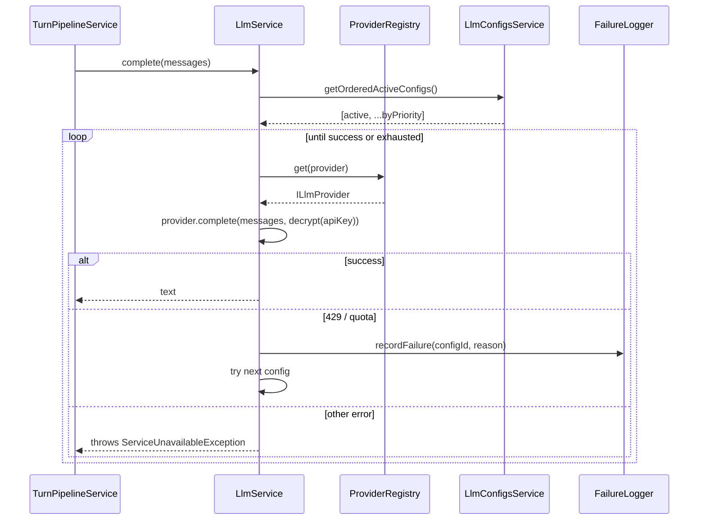

### Step 4 — Recommended Solution

- **Provider registry** keyed by `LlmProvider` enum, holding an instance per provider. Registered via NestJS DI tokens (`apps/api/CLAUDE.md` § "Naming Conventions" — token names in `SCREAMING_SNAKE_CASE`).
- **Fallback chain** computed once per call, then iterated. Each failure is logged with structured fields (`provider`, `model`, `reason`, `httpStatus`, `latencyMs`).
- **Encrypted at rest**: encryption logic isolated in `EncryptionService` with one method `encrypt(plaintext): string` and one `decrypt(envelope): string`. The service never logs decrypted material.
- **Active toggle is transactional**: `setActive(id)` runs `UPDATE … SET is_active = false; UPDATE … SET is_active = true WHERE id = $1` inside a single TypeORM transaction.

### Step 5 — Implementation Code

#### Entity & DTOs

```ts
// apps/api/src/llm-configs/entities/llm-config.entity.ts

import {
  Column,
  CreateDateColumn,
  Entity,
  Index,
  PrimaryGeneratedColumn,
  UpdateDateColumn,
} from 'typeorm';

export type LlmProvider = 'azure_openai' | 'openai' | 'anthropic';

@Entity('llm_configs')
@Index(['priority'])
export class LlmConfig {
  @PrimaryGeneratedColumn('uuid')
  readonly id: string;

  @Column({ type: 'varchar', length: 32 })
  provider: LlmProvider;

  @Column({ name: 'model_name', type: 'varchar', length: 100 })
  modelName: string;

  @Column({ name: 'api_key_encrypted', type: 'text' })
  apiKeyEncrypted: string;

  @Column({ name: 'endpoint_url', type: 'varchar', length: 500, nullable: true })
  endpointUrl: string | null;

  @Column({ name: 'is_active', type: 'boolean', default: false })
  isActive: boolean;

  @Column({ type: 'int', default: 100 })
  priority: number;

  @CreateDateColumn({ name: 'created_at', type: 'timestamptz' })
  readonly createdAt: Date;

  @UpdateDateColumn({ name: 'updated_at', type: 'timestamptz' })
  readonly updatedAt: Date;
}
```

```ts
// apps/api/src/llm-configs/dto/create-llm-config.dto.ts

import { ApiProperty, ApiPropertyOptional } from '@nestjs/swagger';
import { IsBoolean, IsEnum, IsInt, IsOptional, IsString, IsUrl, MaxLength, Min, MinLength } from 'class-validator';

const PROVIDERS = ['azure_openai', 'openai', 'anthropic'] as const;
type Provider = (typeof PROVIDERS)[number];

export class CreateLlmConfigRequestDto {
  @ApiProperty({ enum: PROVIDERS })
  @IsEnum(PROVIDERS)
  readonly provider: Provider;

  @ApiProperty()
  @IsString()
  @MinLength(2)
  @MaxLength(100)
  readonly modelName: string;

  @ApiProperty()
  @IsString()
  @MinLength(8)
  readonly apiKey: string;

  @ApiPropertyOptional()
  @IsOptional()
  @IsUrl()
  readonly endpointUrl?: string;

  @ApiPropertyOptional({ default: false })
  @IsOptional()
  @IsBoolean()
  readonly isActive?: boolean;

  @ApiPropertyOptional({ default: 100 })
  @IsOptional()
  @IsInt()
  @Min(0)
  readonly priority?: number;
}
```

#### Encryption service

```ts
// apps/api/src/llm-configs/encryption.service.ts

import { Injectable } from '@nestjs/common';
import { ConfigService } from '@nestjs/config';
import { createCipheriv, createDecipheriv, randomBytes } from 'crypto';

const ALG = 'aes-256-gcm';

@Injectable()
export class EncryptionService {
  private readonly key: Buffer;

  constructor(config: ConfigService) {
    const raw = config.getOrThrow<string>('LLM_CONFIG_MASTER_KEY');
    const buf = Buffer.from(raw, 'base64');
    if (buf.length !== 32) {
      throw new Error('LLM_CONFIG_MASTER_KEY must be 32 bytes (base64-encoded)');
    }
    this.key = buf;
  }

  encrypt(plaintext: string): string {
    const iv = randomBytes(12);
    const cipher = createCipheriv(ALG, this.key, iv);
    const enc = Buffer.concat([cipher.update(plaintext, 'utf8'), cipher.final()]);
    const tag = cipher.getAuthTag();
    return Buffer.concat([iv, tag, enc]).toString('base64');
  }

  decrypt(envelope: string): string {
    const data = Buffer.from(envelope, 'base64');
    const iv = data.subarray(0, 12);
    const tag = data.subarray(12, 28);
    const enc = data.subarray(28);
    const decipher = createDecipheriv(ALG, this.key, iv);
    decipher.setAuthTag(tag);
    return Buffer.concat([decipher.update(enc), decipher.final()]).toString('utf8');
  }

  mask(envelope: string, plaintextSuffixLength = 4): string {
    const plain = this.decrypt(envelope);
    return `••••${plain.slice(-plaintextSuffixLength)}`;
  }
}
```

> The mask method runs **server-side only**. The masked string is the only artifact the admin UI ever sees.

#### Provider interface and registry

```ts
// apps/api/src/llm/interfaces/illm-provider.interface.ts

import type { ChatMessage } from '../../speaking-sessions/turn-prompt.template';

export interface ILlmCompleteOptions {
  readonly jsonMode?: boolean;
  readonly maxTokens?: number;
  readonly temperature?: number;
}

export interface ILlmInvocation {
  readonly apiKey: string;
  readonly modelName: string;
  readonly endpointUrl: string | null;
}

export class LlmQuotaExhaustedError extends Error {
  constructor(public readonly httpStatus: number, message: string) {
    super(message);
    this.name = 'LlmQuotaExhaustedError';
  }
}

export interface ILlmProvider {
  complete(
    messages: ChatMessage[],
    invocation: ILlmInvocation,
    opts: ILlmCompleteOptions,
  ): Promise<string>;
}
```

```ts
// apps/api/src/llm/tokens.ts

export const LLM_PROVIDER_REGISTRY = Symbol('LLM_PROVIDER_REGISTRY');
```

```ts
// apps/api/src/llm/providers/azure-openai.provider.ts

import { Injectable } from '@nestjs/common';
import {
  ILlmCompleteOptions,
  ILlmInvocation,
  ILlmProvider,
  LlmQuotaExhaustedError,
} from '../interfaces/illm-provider.interface';
import type { ChatMessage } from '../../speaking-sessions/turn-prompt.template';

@Injectable()
export class AzureOpenAIProvider implements ILlmProvider {
  async complete(
    messages: ChatMessage[],
    inv: ILlmInvocation,
    opts: ILlmCompleteOptions,
  ): Promise<string> {
    if (!inv.endpointUrl) throw new Error('Azure OpenAI requires endpointUrl');
    const url = `${inv.endpointUrl}/openai/deployments/${inv.modelName}/chat/completions?api-version=2024-08-01-preview`;
    const res = await fetch(url, {
      method: 'POST',
      headers: { 'api-key': inv.apiKey, 'Content-Type': 'application/json' },
      body: JSON.stringify({
        messages,
        temperature: opts.temperature ?? 0.6,
        max_tokens: opts.maxTokens ?? 400,
        response_format: opts.jsonMode ? { type: 'json_object' } : undefined,
      }),
    });

    if (res.status === 429) {
      throw new LlmQuotaExhaustedError(429, 'Azure OpenAI rate limit / quota');
    }
    if (!res.ok) throw new Error(`Azure OpenAI HTTP ${res.status}`);

    const data = (await res.json()) as { choices: { message: { content: string } }[] };
    return data.choices[0]?.message.content ?? '';
  }
}
```

```ts
// apps/api/src/llm/llm.module.ts

import { Module } from '@nestjs/common';
import { TypeOrmModule } from '@nestjs/typeorm';
import { LlmConfig } from '../llm-configs/entities/llm-config.entity';
import { LlmFailureLog } from '../llm-configs/entities/llm-failure-log.entity';
import { LlmConfigsService } from '../llm-configs/llm-configs.service';
import { EncryptionService } from '../llm-configs/encryption.service';
import { AzureOpenAIProvider } from './providers/azure-openai.provider';
import { OpenAIProvider } from './providers/openai.provider';
import { AnthropicProvider } from './providers/anthropic.provider';
import { LlmService } from './llm.service';
import { LLM_PROVIDER_REGISTRY } from './tokens';
import type { ILlmProvider } from './interfaces/illm-provider.interface';
import type { LlmProvider } from '../llm-configs/entities/llm-config.entity';

@Module({
  imports: [TypeOrmModule.forFeature([LlmConfig, LlmFailureLog])],
  providers: [
    AzureOpenAIProvider,
    OpenAIProvider,
    AnthropicProvider,
    EncryptionService,
    LlmConfigsService,
    {
      provide: LLM_PROVIDER_REGISTRY,
      useFactory: (
        azure: AzureOpenAIProvider,
        openai: OpenAIProvider,
        anthropic: AnthropicProvider,
      ): Record<LlmProvider, ILlmProvider> => ({
        azure_openai: azure,
        openai,
        anthropic,
      }),
      inject: [AzureOpenAIProvider, OpenAIProvider, AnthropicProvider],
    },
    LlmService,
  ],
  exports: [LlmService, EncryptionService, LlmConfigsService],
})
export class LlmModule {}
```

> Adding a fourth provider = create one file, then add one line to the registry. No existing class changes (Open/Closed satisfied).

#### LlmService — orchestration with fallback

```ts
// apps/api/src/llm/llm.service.ts

import { Inject, Injectable, Logger, ServiceUnavailableException } from '@nestjs/common';
import { LlmConfigsService } from '../llm-configs/llm-configs.service';
import { EncryptionService } from '../llm-configs/encryption.service';
import { LLM_PROVIDER_REGISTRY } from './tokens';
import {
  ILlmCompleteOptions,
  ILlmProvider,
  LlmQuotaExhaustedError,
} from './interfaces/illm-provider.interface';
import type { ChatMessage } from '../speaking-sessions/turn-prompt.template';
import type { LlmProvider as LlmProviderName } from '../llm-configs/entities/llm-config.entity';

@Injectable()
export class LlmService {
  private readonly logger = new Logger(LlmService.name);

  constructor(
    @Inject(LLM_PROVIDER_REGISTRY)
    private readonly providers: Record<LlmProviderName, ILlmProvider>,
    private readonly configs: LlmConfigsService,
    private readonly encryption: EncryptionService,
  ) {}

  async complete(messages: ChatMessage[], opts: ILlmCompleteOptions = {}): Promise<string> {
    const chain = await this.configs.getFallbackChain();
    if (chain.length === 0) {
      throw new ServiceUnavailableException('No LLM configs registered. Add one in Admin → LLM.');
    }

    let lastError: unknown = null;
    for (const cfg of chain) {
      const provider = this.providers[cfg.provider];
      if (!provider) {
        this.logger.warn(`Unknown provider in DB: ${cfg.provider}`);
        continue;
      }

      const start = Date.now();
      try {
        const apiKey = this.encryption.decrypt(cfg.apiKeyEncrypted);
        return await provider.complete(messages, {
          apiKey,
          modelName: cfg.modelName,
          endpointUrl: cfg.endpointUrl,
        }, opts);
      } catch (err) {
        const elapsed = Date.now() - start;
        const isQuota = err instanceof LlmQuotaExhaustedError;
        await this.configs.recordFailure({
          configId: cfg.id,
          provider: cfg.provider,
          model: cfg.modelName,
          httpStatus: isQuota ? err.httpStatus : null,
          reason: isQuota ? 'quota_exhausted' : 'provider_error',
          message: err instanceof Error ? err.message.slice(0, 500) : String(err),
          latencyMs: elapsed,
        });
        lastError = err;

        if (!isQuota) break;
      }
    }

    throw new ServiceUnavailableException(
      lastError instanceof Error
        ? `All LLM providers failed. Last: ${lastError.message}`
        : 'All LLM providers failed.',
    );
  }
}
```

> Failure-on-non-quota intentionally short-circuits — a 401 from a misconfigured key is not transient and shouldn't burn through the fallback chain.

#### LlmConfigsService — admin operations + fallback chain

```ts
// apps/api/src/llm-configs/llm-configs.service.ts

import {
  Injectable,
  Logger,
  NotFoundException,
} from '@nestjs/common';
import { InjectRepository } from '@nestjs/typeorm';
import { DataSource, Repository } from 'typeorm';
import { LlmConfig } from './entities/llm-config.entity';
import { LlmFailureLog } from './entities/llm-failure-log.entity';
import { EncryptionService } from './encryption.service';
import { CreateLlmConfigRequestDto } from './dto/create-llm-config.dto';
import { UpdateLlmConfigRequestDto } from './dto/update-llm-config.dto';

@Injectable()
export class LlmConfigsService {
  private readonly logger = new Logger(LlmConfigsService.name);

  constructor(
    @InjectRepository(LlmConfig) private readonly repo: Repository<LlmConfig>,
    @InjectRepository(LlmFailureLog) private readonly failures: Repository<LlmFailureLog>,
    private readonly encryption: EncryptionService,
    private readonly dataSource: DataSource,
  ) {}

  async create(dto: CreateLlmConfigRequestDto): Promise<LlmConfig> {
    return this.dataSource.transaction(async (manager) => {
      if (dto.isActive) {
        await manager.update(LlmConfig, {}, { isActive: false });
      }
      const entity = manager.create(LlmConfig, {
        provider: dto.provider,
        modelName: dto.modelName,
        apiKeyEncrypted: this.encryption.encrypt(dto.apiKey),
        endpointUrl: dto.endpointUrl ?? null,
        isActive: dto.isActive ?? false,
        priority: dto.priority ?? 100,
      });
      return manager.save(entity);
    });
  }

  async findAllMasked(): Promise<(Omit<LlmConfig, 'apiKeyEncrypted'> & { apiKeyMasked: string })[]> {
    const rows = await this.repo.find({ order: { isActive: 'DESC', priority: 'ASC' } });
    return rows.map(({ apiKeyEncrypted, ...rest }) => ({
      ...rest,
      apiKeyMasked: this.encryption.mask(apiKeyEncrypted),
    }));
  }

  async update(id: string, dto: UpdateLlmConfigRequestDto): Promise<LlmConfig> {
    const cfg = await this.repo.findOne({ where: { id } });
    if (!cfg) throw new NotFoundException(`LLM config ${id} not found`);

    return this.dataSource.transaction(async (manager) => {
      if (dto.isActive === true && !cfg.isActive) {
        await manager.update(LlmConfig, {}, { isActive: false });
      }
      const next = manager.merge(LlmConfig, cfg, {
        provider: dto.provider ?? cfg.provider,
        modelName: dto.modelName ?? cfg.modelName,
        apiKeyEncrypted: dto.apiKey ? this.encryption.encrypt(dto.apiKey) : cfg.apiKeyEncrypted,
        endpointUrl: dto.endpointUrl ?? cfg.endpointUrl,
        isActive: dto.isActive ?? cfg.isActive,
        priority: dto.priority ?? cfg.priority,
      });
      return manager.save(next);
    });
  }

  async remove(id: string): Promise<void> {
    const result = await this.repo.delete({ id });
    if (result.affected === 0) throw new NotFoundException(`LLM config ${id} not found`);
  }

  async getFallbackChain(): Promise<LlmConfig[]> {
    return this.repo
      .createQueryBuilder('c')
      .orderBy('c.is_active', 'DESC')
      .addOrderBy('c.priority', 'ASC')
      .getMany();
  }

  async recordFailure(input: {
    configId: string;
    provider: string;
    model: string;
    httpStatus: number | null;
    reason: 'quota_exhausted' | 'provider_error';
    message: string;
    latencyMs: number;
  }): Promise<void> {
    this.logger.warn(
      `LLM failure: ${input.provider}/${input.model} ${input.reason} ${input.httpStatus ?? ''} (${input.latencyMs}ms)`,
    );
    await this.failures.insert({
      configId: input.configId,
      provider: input.provider,
      modelName: input.model,
      httpStatus: input.httpStatus,
      reason: input.reason,
      message: input.message,
      latencyMs: input.latencyMs,
    });
  }
}
```

#### Admin controller

```ts
// apps/api/src/llm-configs/llm-configs.controller.ts

import {
  Body,
  Controller,
  Delete,
  Get,
  HttpCode,
  HttpStatus,
  Param,
  ParseUUIDPipe,
  Patch,
  Post,
  UseGuards,
} from '@nestjs/common';
import { ApiBearerAuth, ApiOperation, ApiTags } from '@nestjs/swagger';
import { Roles } from '../auth/decorators/roles.decorator';
import { Role } from '@english-platform/shared';
import { JwtAuthGuard } from '../auth/guards/jwt-auth.guard';
import { RolesGuard } from '../auth/guards/roles.guard';
import { LlmConfigsService } from './llm-configs.service';
import { CreateLlmConfigRequestDto } from './dto/create-llm-config.dto';
import { UpdateLlmConfigRequestDto } from './dto/update-llm-config.dto';

@ApiTags('Admin - LLM Configs')
@ApiBearerAuth()
@UseGuards(JwtAuthGuard, RolesGuard)
@Roles(Role.ADMIN)
@Controller('admin/llm-configs')
export class LlmConfigsController {
  constructor(private readonly service: LlmConfigsService) {}

  @Get()
  @ApiOperation({ summary: 'List all LLM configs (api keys masked)' })
  list() {
    return this.service.findAllMasked();
  }

  @Post()
  @HttpCode(HttpStatus.CREATED)
  create(@Body() dto: CreateLlmConfigRequestDto) {
    return this.service.create(dto);
  }

  @Patch(':id')
  update(@Param('id', ParseUUIDPipe) id: string, @Body() dto: UpdateLlmConfigRequestDto) {
    return this.service.update(id, dto);
  }

  @Delete(':id')
  @HttpCode(HttpStatus.NO_CONTENT)
  async remove(@Param('id', ParseUUIDPipe) id: string) {
    await this.service.remove(id);
  }
}
```

#### Admin frontend — `/admin/llm-configs/page.tsx`

```tsx
// apps/web/app/admin/(dashboard)/llm-configs/page.tsx

'use client';

import { useState } from 'react';
import { useMutation, useQuery, useQueryClient } from '@tanstack/react-query';
import { apiClient } from '@/lib/api-client';
import { Card, CardContent } from '@/components/ui/card';
import { Button } from '@/components/ui/button';
import {
  Dialog,
  DialogContent,
  DialogHeader,
  DialogTitle,
} from '@/components/ui/dialog';
import { Input } from '@/components/ui/input';
import { Label } from '@/components/ui/label';
import { Switch } from '@/components/ui/switch';
import { Pencil, Plus, Trash2 } from 'lucide-react';
import { toast } from 'sonner';

interface LlmConfigRow {
  id: string;
  provider: 'azure_openai' | 'openai' | 'anthropic';
  modelName: string;
  endpointUrl: string | null;
  isActive: boolean;
  priority: number;
  apiKeyMasked: string;
}

export default function LlmConfigsPage() {
  const qc = useQueryClient();
  const [editing, setEditing] = useState<LlmConfigRow | null>(null);
  const [open, setOpen] = useState(false);

  const { data = [], isLoading } = useQuery<LlmConfigRow[]>({
    queryKey: ['admin', 'llm-configs'],
    queryFn: async () => (await apiClient.get('/admin/llm-configs')).data,
  });

  const upsert = useMutation({
    mutationFn: async (input: Partial<LlmConfigRow> & { apiKey?: string }) => {
      if (editing) {
        return apiClient.patch(`/admin/llm-configs/${editing.id}`, input);
      }
      return apiClient.post('/admin/llm-configs', input);
    },
    onSuccess: () => {
      qc.invalidateQueries({ queryKey: ['admin', 'llm-configs'] });
      setOpen(false);
      setEditing(null);
      toast.success('Saved');
    },
    onError: () => toast.error('Could not save config'),
  });

  const removeMut = useMutation({
    mutationFn: (id: string) => apiClient.delete(`/admin/llm-configs/${id}`),
    onSuccess: () => qc.invalidateQueries({ queryKey: ['admin', 'llm-configs'] }),
  });

  const toggleActive = useMutation({
    mutationFn: ({ id, isActive }: { id: string; isActive: boolean }) =>
      apiClient.patch(`/admin/llm-configs/${id}`, { isActive }),
    onSuccess: () => qc.invalidateQueries({ queryKey: ['admin', 'llm-configs'] }),
  });

  const handleSubmit = (e: React.FormEvent<HTMLFormElement>) => {
    e.preventDefault();
    const fd = new FormData(e.currentTarget);
    const apiKey = (fd.get('apiKey') as string) ?? '';
    const payload = {
      provider: fd.get('provider') as LlmConfigRow['provider'],
      modelName: fd.get('modelName') as string,
      endpointUrl: ((fd.get('endpointUrl') as string) || '').trim() || null,
      priority: Number(fd.get('priority') ?? 100),
      isActive: fd.get('isActive') === 'on',
      ...(apiKey ? { apiKey } : {}),
    };
    upsert.mutate(payload);
  };

  if (isLoading) return <p>Loading…</p>;

  return (
    <div className="space-y-6">
      <div className="flex items-center justify-between">
        <h1 className="text-2xl font-bold">LLM Models</h1>
        <Button
          onClick={() => {
            setEditing(null);
            setOpen(true);
          }}
        >
          <Plus className="mr-2 h-4 w-4" /> Add config
        </Button>
      </div>

      <ul className="grid gap-3">
        {data.map((cfg) => (
          <li key={cfg.id}>
            <Card>
              <CardContent className="flex items-center justify-between gap-4 py-4">
                <div className="min-w-0">
                  <p className="font-semibold">
                    {cfg.modelName} <span className="text-xs text-muted-foreground">({cfg.provider})</span>
                  </p>
                  <p className="text-xs text-muted-foreground">
                    Key: {cfg.apiKeyMasked} · Priority: {cfg.priority}
                  </p>
                  {cfg.endpointUrl ? (
                    <p className="text-xs text-muted-foreground truncate">Endpoint: {cfg.endpointUrl}</p>
                  ) : null}
                </div>
                <div className="flex items-center gap-3">
                  <label className="flex items-center gap-2 text-xs">
                    Active
                    <Switch
                      checked={cfg.isActive}
                      onCheckedChange={(v) => toggleActive.mutate({ id: cfg.id, isActive: v })}
                    />
                  </label>
                  <Button
                    variant="ghost"
                    size="icon"
                    onClick={() => {
                      setEditing(cfg);
                      setOpen(true);
                    }}
                  >
                    <Pencil className="h-4 w-4" />
                  </Button>
                  <Button
                    variant="ghost"
                    size="icon"
                    onClick={() => {
                      if (window.confirm(`Delete config "${cfg.modelName}"?`)) {
                        removeMut.mutate(cfg.id);
                      }
                    }}
                  >
                    <Trash2 className="h-4 w-4 text-red-500" />
                  </Button>
                </div>
              </CardContent>
            </Card>
          </li>
        ))}
      </ul>

      <Dialog open={open} onOpenChange={setOpen}>
        <DialogContent className="sm:max-w-[480px]">
          <DialogHeader>
            <DialogTitle>{editing ? 'Edit LLM config' : 'Create LLM config'}</DialogTitle>
          </DialogHeader>
          <form onSubmit={handleSubmit} className="space-y-3">
            <div className="grid grid-cols-2 gap-3">
              <div>
                <Label>Provider</Label>
                <select
                  name="provider"
                  defaultValue={editing?.provider ?? 'azure_openai'}
                  className="w-full rounded-md border bg-background px-3 py-2 text-sm"
                >
                  <option value="azure_openai">Azure OpenAI</option>
                  <option value="openai">OpenAI</option>
                  <option value="anthropic">Anthropic</option>
                </select>
              </div>
              <div>
                <Label>Model name</Label>
                <Input name="modelName" defaultValue={editing?.modelName ?? ''} required />
              </div>
            </div>

            <div>
              <Label>Endpoint URL (Azure only)</Label>
              <Input name="endpointUrl" defaultValue={editing?.endpointUrl ?? ''} placeholder="https://my-resource.openai.azure.com" />
            </div>

            <div>
              <Label>API key {editing ? <span className="text-xs text-muted-foreground">(leave blank to keep existing)</span> : null}</Label>
              <Input name="apiKey" type="password" required={!editing} minLength={editing ? 0 : 8} />
            </div>

            <div className="grid grid-cols-2 gap-3">
              <div>
                <Label>Priority</Label>
                <Input name="priority" type="number" defaultValue={editing?.priority ?? 100} />
              </div>
              <div className="flex items-end gap-2">
                <Label className="flex items-center gap-2">
                  <input
                    type="checkbox"
                    name="isActive"
                    defaultChecked={editing?.isActive ?? false}
                  />
                  Mark as active
                </Label>
              </div>
            </div>

            <Button type="submit" className="w-full" disabled={upsert.isPending}>
              {editing ? 'Save changes' : 'Create config'}
            </Button>
          </form>
        </DialogContent>
      </Dialog>
    </div>
  );
}
```

> Reordering by drag-and-drop is implemented as a follow-up: persist priorities in batch on drop. For MVP, priority is editable as an integer.

---

## Feature 10 — Progress Tracking (Backend + Client)

### Step 1 — Requirement Analysis

Unified per-user progress endpoint covering both Shadowing and Speaking:

```
GET /api/v1/me/progress
→ {
  shadowing: { totalSentencesCompleted, perVideo: [...] },
  speaking:  { totalSessions, totalDurationSec, perScenario: [...] },
}
```

Writes:
- **Shadowing progress** is upserted by the existing `POST /api/v1/shadowing/attempts` (already in Phase 2) — when a sentence's accuracy score crosses the threshold, increment `shadowing_progress.completed_sentences`.
- **Speaking session progress** is written by `POST /speaking-sessions/:id/end` (Feature 7). Aggregation reads directly from `speaking_sessions` and `speaking_turns`.

Client surfaces:
- Scenario list cards: "Completed N times" badge (already wired in Feature 1, sourced from the `/speaking/scenarios` listing).
- Video list cards: "X / Y sentences" + progress bar (already wired in shadowing guide, sourced from `/shadowing/videos`).
- Dashboard at `/progress`: totals, per-video shadowing bars, per-scenario speaking session counts.

### Step 2 — Knowledge Prerequisites

- `apps/api/CLAUDE.md` § "Repository pattern" — extract complex aggregations.
- Server Component on the dashboard fetches once, no React Query needed.
- `async-parallel` — fetch shadowing and speaking aggregates concurrently with `Promise.all`.

### Step 3 — System Flow

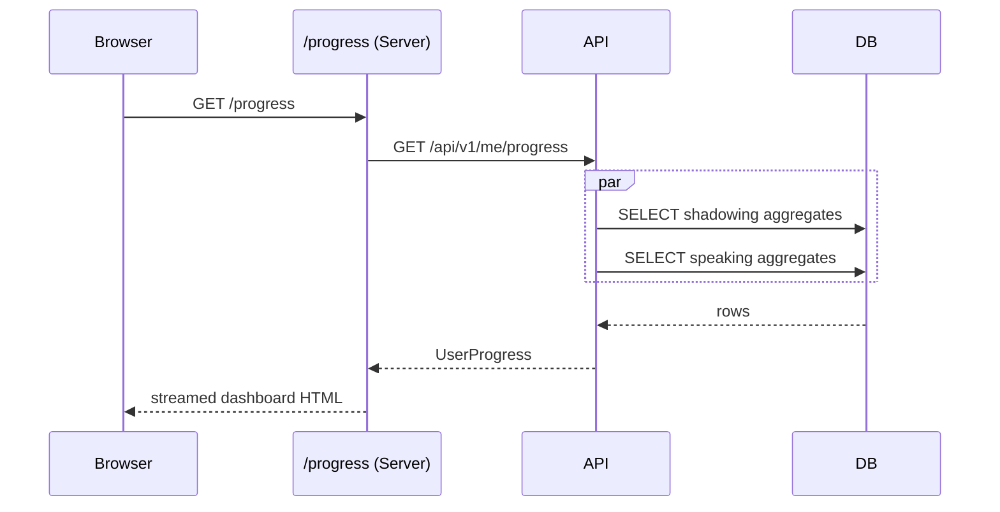

### Step 4 — Recommended Solution

- Single `ProgressService.getForUser(userId)` returns `UserProgress` matching the shared schema.
- Inside the service, `Promise.all` runs the two read queries in parallel.
- The dashboard route is a Server Component that calls the API (`async-parallel` is preserved end-to-end).

### Step 5 — Implementation Code

#### Service

```ts
// apps/api/src/progress/progress.service.ts

import { Injectable } from '@nestjs/common';
import { InjectRepository } from '@nestjs/typeorm';
import { Repository } from 'typeorm';
import { ShadowingProgress } from '../shadowing/entities/shadowing-progress.entity';
import { SpeakingSession } from '../speaking-sessions/entities/speaking-session.entity';
import type { UserProgress } from '@english-platform/shared';

@Injectable()
export class ProgressService {
  constructor(
    @InjectRepository(ShadowingProgress)
    private readonly shadowing: Repository<ShadowingProgress>,
    @InjectRepository(SpeakingSession)
    private readonly speaking: Repository<SpeakingSession>,
  ) {}

  async getForUser(userId: string): Promise<UserProgress> {
    const [shadowingRows, speakingRows] = await Promise.all([
      this.loadShadowing(userId),
      this.loadSpeaking(userId),
    ]);

    return {
      shadowing: {
        totalSentencesCompleted: shadowingRows.reduce((sum, r) => sum + r.completedSentences, 0),
        perVideo: shadowingRows,
      },
      speaking: {
        totalSessions: speakingRows.length,
        totalDurationSec: speakingRows.reduce((sum, r) => sum + r.totalDurationSec, 0),
        perScenario: this.groupByScenario(speakingRows),
      },
    };
  }

  private async loadShadowing(userId: string) {
    return this.shadowing
      .createQueryBuilder('sp')
      .innerJoin('sp.video', 'v')
      .leftJoin('subtitles', 'sub', 'sub.video_id = v.id')
      .select([
        'v.id AS "videoId"',
        'v.title AS title',
        'COUNT(sub.id)::int AS "totalSentences"',
        'sp.completed_sentences AS "completedSentences"',
      ])
      .where('sp.user_id = :userId', { userId })
      .groupBy('v.id, sp.completed_sentences')
      .getRawMany<{ videoId: string; title: string; totalSentences: number; completedSentences: number }>();
  }

  private async loadSpeaking(userId: string) {
    return this.speaking
      .createQueryBuilder('s')
      .innerJoin('s.scenario', 'sc')
      .select([
        's.id AS id',
        'sc.id AS "scenarioId"',
        'sc.title AS title',
        `EXTRACT(EPOCH FROM (s.ended_at - s.started_at))::int AS "totalDurationSec"`,
      ])
      .where('s.user_id = :userId AND s.ended_at IS NOT NULL', { userId })
      .getRawMany<{ id: string; scenarioId: string; title: string; totalDurationSec: number }>();
  }

  private groupByScenario(rows: { scenarioId: string; title: string; totalDurationSec: number }[]) {
    const map = new Map<string, { scenarioId: string; title: string; sessionCount: number; totalDurationSec: number }>();
    for (const row of rows) {
      const existing = map.get(row.scenarioId);
      if (existing) {
        existing.sessionCount += 1;
        existing.totalDurationSec += row.totalDurationSec;
      } else {
        map.set(row.scenarioId, {
          scenarioId: row.scenarioId,
          title: row.title,
          sessionCount: 1,
          totalDurationSec: row.totalDurationSec,
        });
      }
    }
    return Array.from(map.values()).sort((a, b) => b.sessionCount - a.sessionCount);
  }
}
```

> `js-set-map-lookups`: scenario aggregation uses a `Map` for O(1) grouping.
> `js-tosorted-immutable` analog: we sort the new array, not the input rows.

#### Controller

```ts
// apps/api/src/progress/progress.controller.ts

import { Controller, Get, UseGuards } from '@nestjs/common';
import { ApiBearerAuth, ApiOperation, ApiTags } from '@nestjs/swagger';
import { JwtAuthGuard } from '../auth/guards/jwt-auth.guard';
import { CurrentUser } from '../auth/decorators/current-user.decorator';
import type { JwtUser } from '../auth/types/jwt-user.type';
import { ProgressService } from './progress.service';

@ApiTags('Me')
@ApiBearerAuth()
@UseGuards(JwtAuthGuard)
@Controller('me')
export class ProgressController {
  constructor(private readonly progressService: ProgressService) {}

  @Get('progress')
  @ApiOperation({ summary: 'Aggregated progress for the authenticated user' })
  getProgress(@CurrentUser() user: JwtUser) {
    return this.progressService.getForUser(user.id);
  }
}
```

#### Dashboard page

```tsx
// apps/web/app/(dashboard)/progress/page.tsx

import { speakingApi } from '@/lib/speaking';
import { ProgressBar } from '@/components/ui/progress-bar';

export const dynamic = 'force-dynamic';

export default async function ProgressPage() {
  const progress = await speakingApi.getProgress();

  return (
    <div className="mx-auto max-w-5xl space-y-10 px-6 py-10">
      <header>
        <h1 className="text-3xl font-bold tracking-tight">Your progress</h1>
      </header>

      <section className="grid gap-4 sm:grid-cols-3">
        <Stat label="Shadowing sentences" value={progress.shadowing.totalSentencesCompleted} />
        <Stat label="Speaking sessions" value={progress.speaking.totalSessions} />
        <Stat
          label="Speaking time"
          value={formatDuration(progress.speaking.totalDurationSec)}
        />
      </section>

      <section>
        <h2 className="mb-4 text-xl font-semibold">Shadowing — per video</h2>
        <ul className="space-y-3">
          {progress.shadowing.perVideo.map((v) => {
            const pct = v.totalSentences === 0 ? 0 : Math.round((v.completedSentences / v.totalSentences) * 100);
            return (
              <li key={v.videoId} className="rounded-lg border p-3">
                <div className="flex items-center justify-between text-sm">
                  <span className="line-clamp-1">{v.title}</span>
                  <span className="text-xs text-muted-foreground">
                    {v.completedSentences} / {v.totalSentences}
                  </span>
                </div>
                <ProgressBar value={pct} className="mt-2" />
              </li>
            );
          })}
        </ul>
      </section>

      <section>
        <h2 className="mb-4 text-xl font-semibold">Speaking — per scenario</h2>
        <ul className="space-y-2">
          {progress.speaking.perScenario.map((s) => (
            <li key={s.scenarioId} className="flex items-center justify-between rounded-lg border p-3">
              <span className="line-clamp-1">{s.title}</span>
              <span className="text-xs text-muted-foreground">
                {s.sessionCount} session{s.sessionCount === 1 ? '' : 's'} · {formatDuration(s.totalDurationSec)}
              </span>
            </li>
          ))}
        </ul>
      </section>
    </div>
  );
}

function Stat({ label, value }: { label: string; value: string | number }) {
  return (
    <div className="rounded-lg border bg-card p-4">
      <p className="text-xs uppercase tracking-wide text-muted-foreground">{label}</p>
      <p className="mt-2 text-3xl font-bold">{value}</p>
    </div>
  );
}

function formatDuration(sec: number): string {
  const m = Math.floor(sec / 60);
  const s = sec % 60;
  return `${m}m ${s}s`;
}
```

> The dashboard is a Server Component — no client JS shipped beyond what the `ProgressBar` design needs. `server-cache-react` would help if multiple Server Components on the page also fetched progress; for now, one fetcher suffices.

---

## Accessibility & UX Constraints

| Constraint | Implementation |
|---|---|
| Mic state via `aria-label` | `MicButton` reads phase and sets `aria-label` to "Tap to speak", "Recording — tap to stop", "Processing", or "AI speaking". `aria-pressed` reflects recording state. |
| Audio autoplay blocked → fallback | `AudioPlayer` catches the rejected `play()` promise and renders a visible "Tap to play" button. |
| Auto-scroll to latest message | `ConversationArea` uses `requestAnimationFrame` + `scrollIntoView({ block: 'end' })` after each turn append. |
| No conversation/recorder overlap on mobile | `RecordingBar` sets a CSS variable `--recording-bar-h: 9rem`; `ConversationArea` consumes it as `padding-bottom`. iOS safe area added via `env(safe-area-inset-bottom)`. |
| Live region for incoming AI turns | `ConversationArea` wraps the bubble list in `aria-live="polite" aria-relevant="additions"` so screen readers announce new AI replies. |
| Suggestion chips are non-functional hints | `tabIndex={-1}` and `aria-hidden` keep them out of the focus order. The mic button is always the next focusable element. |
| Back-on-leave guard | `HeaderBar.handleBack` confirms before exiting if the user has at least one turn. |
| Voice selector is a real menu | Built on Radix `DropdownMenu` — keyboard navigation, `aria-haspopup`, `aria-expanded`, `aria-activedescendant` work out of the box. |
| Error state on mic | When `recorder.error` is set, the mic caption surfaces it with `role="alert"`. |

---

## Environment Variables

Add to `.env.example`:

```bash
# ─── Speech (Azure) ────────────────────────────────────────
AZURE_SPEECH_KEY=
AZURE_SPEECH_REGION=eastus

# ─── LLM master encryption key ─────────────────────────────
# 32 bytes, base64-encoded.  Generate with:  openssl rand -base64 32
LLM_CONFIG_MASTER_KEY=

# ─── TTS storage ───────────────────────────────────────────
TTS_STORAGE_DIR=apps/api/uploads/tts
PUBLIC_BASE_URL=http://localhost:4000

# ─── Frontend feature flags ────────────────────────────────
# NEXT_PUBLIC_SPEAKING_USE_MOCKS=1   # only when backend is in flight
```

`apps/api/src/config/env.validation.ts` must add validation for the new variables (use `Joi.string().required()` or equivalent — same pattern as the auth guide).

---

## File Index

### Backend (`apps/api/src/`)

```
speaking-sessions/
├── speaking-sessions.module.ts
├── speaking-sessions.controller.ts
├── speaking-sessions.service.ts
├── speaking-turns.repository.ts
├── turn-pipeline.service.ts
├── turn-prompt.template.ts
├── turn-output.parser.ts
├── dto/
│   ├── create-session.dto.ts
│   └── turn.dto.ts
└── entities/
    ├── speaking-session.entity.ts
    └── speaking-turn.entity.ts

llm/
├── llm.module.ts
├── llm.service.ts
├── tokens.ts
├── interfaces/illm-provider.interface.ts
└── providers/
    ├── azure-openai.provider.ts
    ├── openai.provider.ts
    └── anthropic.provider.ts

llm-configs/
├── llm-configs.module.ts
├── llm-configs.controller.ts
├── llm-configs.service.ts
├── encryption.service.ts
├── dto/
│   ├── create-llm-config.dto.ts
│   └── update-llm-config.dto.ts
└── entities/
    ├── llm-config.entity.ts
    └── llm-failure-log.entity.ts

speech/
├── speech.module.ts
├── stt.service.ts
├── tts.service.ts
└── voices.controller.ts

progress/
├── progress.module.ts
├── progress.controller.ts
└── progress.service.ts

scenarios/                                    (extended)
└── scenarios.controller.ts                   (+ public list/detail endpoints)
```

### Frontend (`apps/web/`)

```
app/(dashboard)/speaking/
├── page.tsx
├── _components/
│   ├── level-filter.tsx
│   ├── scenario-grid.tsx
│   ├── scenario-grid-skeleton.tsx
│   ├── scenario-card.tsx
│   └── empty-state.tsx
└── [scenarioId]/
    ├── page.tsx
    ├── loading.tsx
    ├── error.tsx
    └── _components/
        ├── conversation-shell.tsx
        ├── header-bar.tsx
        ├── voice-selector.tsx
        ├── end-session-button.tsx
        ├── conversation-area.tsx
        ├── scenario-context-card.tsx
        ├── ai-bubble.tsx
        ├── ai-bubble-toggles.tsx
        ├── audio-player.tsx
        ├── suggestion-chips.tsx
        ├── recording-bar.tsx
        └── mic-button.tsx

app/(dashboard)/progress/page.tsx

app/admin/(dashboard)/llm-configs/page.tsx

lib/speaking/
├── api.ts
├── real-api.ts
├── index.ts
├── store.ts
├── store.selectors.ts
├── audio-recorder.ts
├── types.ts
└── hooks/
    ├── use-start-session.ts
    └── use-audio-recorder.ts
```

### Shared (`packages/shared/src/`)

```
schemas/speaking.schema.ts
index.ts                           (re-export)
```

### Database migration

```
apps/api/src/migrations/<timestamp>-speaking-extensions.ts
```

The migration must:
- Add columns to `speaking_sessions`: `voice_id varchar(100) NOT NULL`.
- Add columns to `speaking_turns`: `client_turn_id uuid`, `audio_url varchar(500)`, `ipa text`, `translation text`, `suggestions jsonb`.
- Create `llm_configs` and `llm_failure_logs` tables.
- Add unique partial index `CREATE UNIQUE INDEX llm_configs_one_active ON llm_configs ((is_active)) WHERE is_active = true;` (Postgres only-one-active enforcement at DB level).

Update `docs/database.md` with the new columns and the two new tables in the same PR.

---

## Verification

Run after each feature lands:

```bash
# Backend
pnpm --filter api lint
pnpm --filter api test
pnpm --filter api start:dev

# Frontend
pnpm --filter web lint
pnpm --filter web build
```

Manual acceptance test (happy path):

1. Sign in as a regular user.
2. `/speaking` → see scenario cards filtered by level.
3. Click a scenario → conversation page loads, AI's opening line is rendered, audio autoplays (or "Tap to play" appears).
4. Tap mic → "Recording" → speak for ~3 s → tap mic (or stay silent for 1.5 s) → "Processing" → AI bubble appears with audio + suggestion chips.
5. Toggle IPA + Translate on the new bubble → values render below the text.
6. Switch voice from header → next AI reply uses the new voice.
7. Tap "End" → redirected to `/speaking`. `/progress` shows the new session under "Speaking — per scenario".
8. As an admin, navigate to `/admin/llm-configs` → add a second config → set its `priority` lower than the first → manually break the active provider's API key → next conversation should still get an AI reply (fallback engaged), and `llm_failure_logs` shows one new row.

Unit-test gates (per `apps/api/CLAUDE.md` § Testing):

- `LlmService.complete` with three mocked providers — primary fails with quota, secondary succeeds → returns secondary's text and writes one failure log.
- `EncryptionService.encrypt → decrypt` round-trips arbitrary UTF-8.
- `EncryptionService.mask` returns exactly four trailing characters.
- `SpeakingSessionsService.handleTurn` — second call with same `clientTurnId` returns cached AI text without calling the pipeline.
- `TurnPipelineService.process` — empty STT result throws `BadRequestException`.
- `parseLlmReply` — malformed JSON degrades to `{ reply: raw, suggestions: [] }`.
- `ProgressService.getForUser` — only counts `speaking_sessions` where `ended_at IS NOT NULL`.

---

> Once all 10 features are green and verified, this guide is complete. The next phase (Phase 4 — Polish & Dashboards) builds on top of `me/progress` to add streaks, weekly reports, and friend leaderboards.
